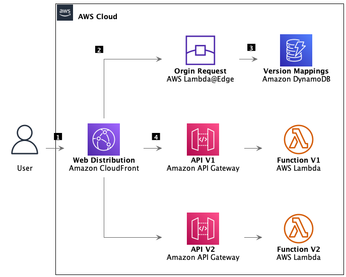
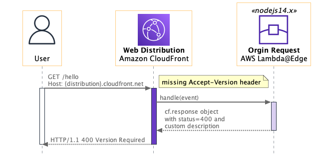
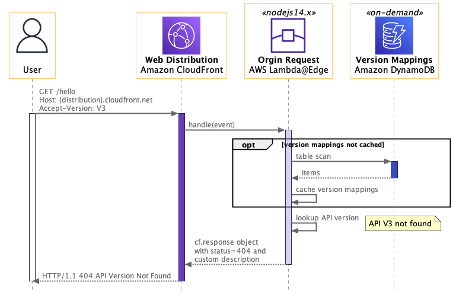
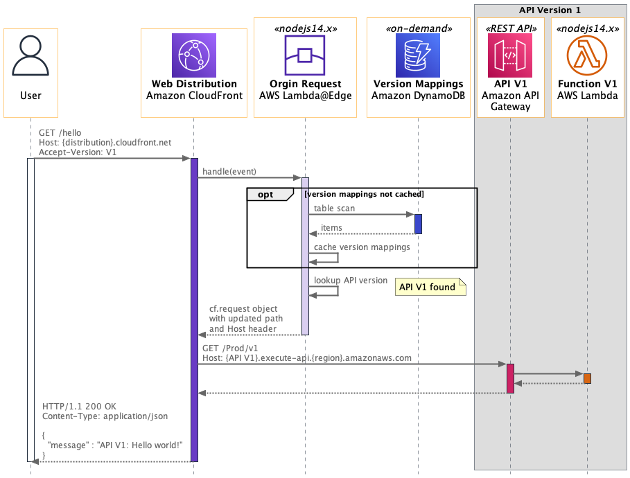
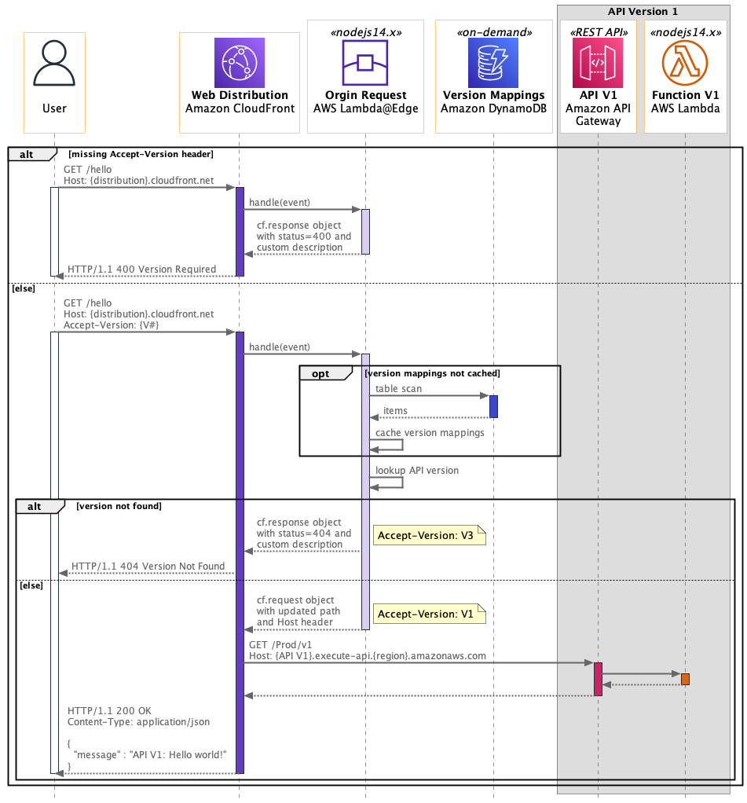

<h1>1. diagramming-tools</h1>

# Sequence diagram

- [PalntUML](https://github.com/plantuml/plantuml-server)
- Sample - https://gist.github.com/beabetterdevv/c42112773a5e852ac9b1b8175bbff49a

1. [Sequence Diagrams enrich your understanding of distributed architectures by Kevin Hakanson](https://aws.amazon.com/blogs/architecture/sequence-diagrams-enrich-your-understanding-of-distributed-architectures/)

1. [Enhancing Software Design with Diagrams as Code](https://cloudnativeengineer.substack.com/p/enhancing-software-design-with-diagrams)
1. [Mermaid vs PlantUml by ALEX XU](https://blog.bytebytego.com/p/diagram-as-code)
1. [AWS Icons for PlantUML](https://github.com/awslabs/aws-icons-for-plantuml)
1. https://real-world-plantuml.com/
1. https://www.youtube.com/watch?v=dqCOvezWptY
1. https://www.youtube.com/playlist?list=PLPPxJMwitEl0-J8xO_z7SzjI9UTYH7dvz
1. [How to Make Easy UML Sequence Diagrams and Flow Charts with PlantUML By BeBetterDev](https://www.youtube.com/watch?v=xObBUVDMbQs)
1. https://www.planttext.com/
1. https://liveuml.com.getstat.site/
1. https://github.com/SlavaVedernikov/C4InterFlow
1. https://c4interflow.github.io/architecture-as-code-samples-visualiser/
1. [How to Create a UML Sequence Diagram FOR FREE](https://www.youtube.com/watch?v=HK_gBzLHdQQ)