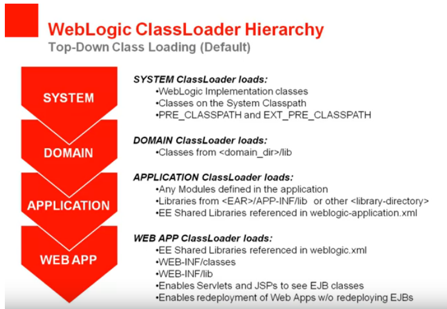

## ClassLoaders

## Shared Libraries in WebLogic
- http://docs.oracle.com/middleware/1212/wls/WLPRG/libraries.htm
- https://docs.oracle.com/cd/E24329_01/web.1211/e24368/libraries.htm#WLPRG342
- https://github.com/jeffreyawest/oracle-parcel-service
- https://www.youtube.com/watch?v=Kh8h_jQYScI
- https://blogs.oracle.com/jamesbayer/weblogic-server-shared-libraries-for-static-resources
- https://blogs.oracle.com/jamesbayer/weblogic-server-shared-libraries-ndash-including-jars
- https://www.igorkromin.net/index.php/2015/11/18/packaging-a-shared-library-using-maven-for-deployment-to-weblogic/
