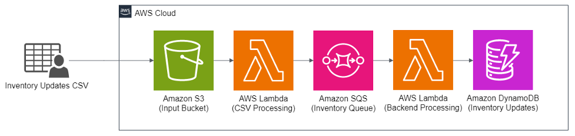
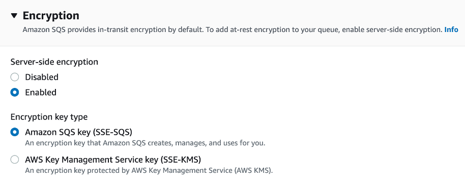

<!-- TOC -->

- [1. [CONCEPTS] Whats the difference between exactly-once vs at-least-once processing?](#1-concepts-whats-the-difference-between-exactly-once-vs-at-least-once-processing)
- [1. Architecture Used for FAQs](#1-architecture-used-for-faqs)
- [2. [Operational excellance] How to create a queue using CDK?](#2-operational-excellance-how-to-create-a-queue-using-cdk)
- [3. [Operational excellance] What alerts you should configure?](#3-operational-excellance-what-alerts-you-should-configure)
- [4. [Operational excellance] How can I setup X-Ray on a queue using CDK?](#4-operational-excellance-how-can-i-setup-x-ray-on-a-queue-using-cdk)
- [5. [Security Pillar] Why do you need to encrypt the messages](#5-security-pillar-why-do-you-need-to-encrypt-the-messages)
- [6. [Security Pillar] How does SQS provide encryption?](#6-security-pillar-how-does-sqs-provide-encryption)
- [7. [Security Pillar] How do you configure server side encryption (SSE)?](#7-security-pillar-how-do-you-configure-server-side-encryption-sse)
- [8. [Security Pillar] What are the different types of SSE possible?](#8-security-pillar-what-are-the-different-types-of-sse-possible)
- [9. [Security Pillar] How do you do the encryption setting using code?](#9-security-pillar-how-do-you-do-the-encryption-setting-using-code)
- [10. [Security Pillar] How do you control what Lamba can do on an SQS queues?](#10-security-pillar-how-do-you-control-what-lamba-can-do-on-an-sqs-queues)
- [11. [Security Pillar] How do you setup SQS to only allow HTTPs calls to it?](#11-security-pillar-how-do-you-setup-sqs-to-only-allow-https-calls-to-it)
- [12. [Security Pillar] How to do fine grain control using ABAC?](#12-security-pillar-how-to-do-fine-grain-control-using-abac)
- [13. [Reliability Pillar] How to configure DLQs using CDK?](#13-reliability-pillar-how-to-configure-dlqs-using-cdk)
- [14. [Reliability Pillar] How to setup visibility timeout using CDK?](#14-reliability-pillar-how-to-setup-visibility-timeout-using-cdk)
- [15. [Performance Efficiency Pillar] With SQS whats the difference between SQS standard and SQS FIFO?](#15-performance-efficiency-pillar-with-sqs-whats-the-difference-between-sqs-standard-and-sqs-fifo)
- [16. [Performance Efficiency Pillar] How would you handle high message volume?](#16-performance-efficiency-pillar-how-would-you-handle-high-message-volume)
  - [16.1. horizontal scaling](#161-horizontal-scaling)
  - [16.2. action batching](#162-action-batching)
- [17. [Cost Optimization Pillar] Why is it a best practice to create tags?](#17-cost-optimization-pillar-why-is-it-a-best-practice-to-create-tags)
- [18. [Cost Optimization Pillar] What are the different ways to do batching?](#18-cost-optimization-pillar-what-are-the-different-ways-to-do-batching)
- [19. [Cost Optimization Pillar] Can you write code to do long polling using CDK?](#19-cost-optimization-pillar-can-you-write-code-to-do-long-polling-using-cdk)
- [20. [Cost Optimization Pillar] Why should use long polling](#20-cost-optimization-pillar-why-should-use-long-polling)
- [21. [Sustainability Pillar] Whats the difference between long polling and short polling?](#21-sustainability-pillar-whats-the-difference-between-long-polling-and-short-polling)
- [22. [Sustainability Pillar] By default is it short or long polling?](#22-sustainability-pillar-by-default-is-it-short-or-long-polling)
- [23. [Sustainability Pillar] How do you change it to long polling?](#23-sustainability-pillar-how-do-you-change-it-to-long-polling)
- [24. [Sustainability Pillar] How do you send a batch of messages from lambda to a queue?](#24-sustainability-pillar-how-do-you-send-a-batch-of-messages-from-lambda-to-a-queue)
- [25. Material Used](#25-material-used)

<!-- /TOC -->

# 1. [CONCEPTS] Whats the difference between exactly-once vs at-least-once processing?

See aws fundamentals book

# 1. Architecture Used for FAQs



Code: /Volumes/Lexar/git-repos/aws-repo/my-aws-samples/app-integration/1-sqs/amazon-sqs-best-practices-cdk

# 2. [Operational excellance] How to create a queue using CDK?

```py
from aws_cdk import (
    Duration,
    Stack,
    aws_sqs as sqs,
)
from constructs import Construct


class SqsCdBlogStack(Stack):
    def __init__(self, scope: Construct, construct_id: str, **kwargs) -> None:
        super().__init__(scope, construct_id, **kwargs)

        # The code that defines your stack goes here

        # example resource
        queue = sqs.Queue(
            self,
            "InventoryUpdatesQueue",
            visibility_timeout=Duration.seconds(300), # set the visibility timeout
        )
```

# 3. [Operational excellance] What alerts you should configure?

**ApproximateAgeofOldestMessage:** you can detect processing delays

```py
# Create a CloudWatch alarm for ApproximateAgeOfOldestMessage metric
alarm = cloudwatch.Alarm(
	self,
	"OldInventoryUpdatesAlarm",
	alarm_name="OldInventoryUpdatesAlarm",
	metric=queue.metric_approximate_age_of_oldest_message(),
	threshold=600,  # Specify your desired threshold value in seconds
	evaluation_periods=1,
	comparison_operator=cloudwatch.ComparisonOperator.GREATER_THAN_OR_EQUAL_TO_THRESHOLD,
)
```

# 4. [Operational excellance] How can I setup X-Ray on a queue using CDK?

Add a tracing header while sending a message to the queue to provide distributed tracing capabilities for faster troubleshooting.

`AWSTraceHeader` System Attribute.

```py
# Create pre-processing Lambda function
csv_processing_to_sqs_function = _lambda.Function(
    self,
    "CSVProcessingToSQSFunction",
    runtime=_lambda.Runtime.PYTHON_3_8,
    code=_lambda.Code.from_asset("sqs_blog/lambda"),
    handler="CSVProcessingToSQSFunction.lambda_handler",
    role=role,
    tracing=Tracing.ACTIVE,  # Enable active tracing with X-Ray
)

# Create a post-processing Lambda function with the specified role
sqs_to_dynamodb_function = _lambda.Function(
    self,
    "SQSToDynamoDBFunction",
    runtime=_lambda.Runtime.PYTHON_3_8,
    code=_lambda.Code.from_asset("sqs_blog/lambda"),
    handler="SQSToDynamoDBFunction.lambda_handler",
    role=role,
    tracing=Tracing.ACTIVE,  # Enable active tracing with X-Ray
)
```

The Lambda function automatically receives the X-Ray `TraceId` from SQS.

# 5. [Security Pillar] Why do you need to encrypt the messages

To meetsome of the compliance requirements - **HIPAA, GDPR, or PCI-DSS**

# 6. [Security Pillar] How does SQS provide encryption?

**In-transit encryption** is provided by default by using **HTTPS** for API calls
**At rest encryption** is provided by **KMS**

# 7. [Security Pillar] How do you configure server side encryption (SSE)?



# 8. [Security Pillar] What are the different types of SSE possible?

1. **AmazonSQS Key (SSE-SQS):** An encryption key that Amazon **SQS creates**, manages and uses for you.

**Note:** This option on encypts the message body and not the message attributes

2. **AWS Key Management Service Key (SSE-KMS):** Here you create a key using KMS and make SQS use it to encrypt and decrypt the messages.

**Note:** `SSE-KMS` is the recommended choice

# 9. [Security Pillar] How do you do the encryption setting using code?

```py
# Create the SQS queue with encryption setting
queue = sqs.Queue(
    self,
    "InventoryUpdatesQueue",
    visibility_timeout=Duration.seconds(300),
    encryption=sqs.QueueEncryption.KMS_MANAGED,
)
```

# 10. [Security Pillar] How do you control what Lamba can do on an SQS queues?

By using IAM access policy attached to Lambda's execution role

```py
# Create pre-processing Lambda function
csv_processing_to_sqs_function = _lambda.Function(
    self,
    "CSVProcessingToSQSFunction",
    runtime=_lambda.Runtime.PYTHON_3_8,
    code=_lambda.Code.from_asset("sqs_blog/lambda"),
    handler="CSVProcessingToSQSFunction.lambda_handler",
    role=role,
    tracing=Tracing.ACTIVE,
)

# Create en execution role for the Lambda function
role = iam.Role(
    self, "InventoryFunctionRole",
    assumed_by=iam.ServicePrincipal("lambda.amazonaws.com"),
    role_name="InventoryFunctionRole",
    description="Role for Lambda functions"
)

Tags.of(role).add("department", "inventory")

# Create the Dead Letter Queue (DLQ)
dlq = sqs.Queue(self, 'InventoryUpdatesDlq',
    visibility_timeout=Duration.seconds(300)
)

Tags.of(dlq).add("department", "inventory")

# Create the SQS queue with DLQ setting
queue = sqs.Queue(
    self, "InventoryUpdatesQueue",
    visibility_timeout=Duration.seconds(300),
    #encryption=sqs.QueueEncryption.KMS_MANAGED,
    dead_letter_queue=sqs.DeadLetterQueue(
        max_receive_count=5,  # Number of retries before sending the message to the DLQ
        queue=dlq
    )
)

# Define the queue policy to allow messages from the Lambda function's role only
policy = iam.PolicyStatement(
    actions=["sqs:SendMessage"],
    effect=iam.Effect.ALLOW,
    principals=[iam.ArnPrincipal(role.role_arn)],
    resources=[queue.queue_arn],
)

queue.add_to_resource_policy(policy)
```

**Note:** For full code see `https://github.com/aws-samples/amazon-sqs-best-practices-cdk/blob/main/sqs_blog/sqs_blog_stack.py`

# 11. [Security Pillar] How do you setup SQS to only allow HTTPs calls to it?

Allow only encrypted connections over HTTPS using `aws:SecureTransport`

```py
# Create an IAM policy statement allowing only HTTPS access to the queue
secure_transport_policy = iam.PolicyStatement(
    effect=iam.Effect.DENY,
    actions=["sqs:*"],
    resources=[queue.queue_arn],
    conditions={
        "Bool": {
            "aws:SecureTransport": "false",
        },
    },
)
```

# 12. [Security Pillar] How to do fine grain control using ABAC?

**Attribute-based access controls (ABAC)** is an authorization strategy that defines permissions based on tags attached to users and AWS resources.

ABAC for SQS queues enables two key use cases:

1. **Tag-based access control:** use tags to control access to your SQS queues, including control plane and data plane API calls.
1. **Tag-on-create:** enforce tags at the time of creation of an SQS queues and deny the creation of SQS resources without tags.

# 13. [Reliability Pillar] How to configure DLQs using CDK?

```py
# Create the Dead Letter Queue (DLQ)
dlq = sqs.Queue(self, "InventoryUpdatesDlq", visibility_timeout=Duration.seconds(300))

# Create the SQS queue with DLQ setting
queue = sqs.Queue(
    self,
    "InventoryUpdatesQueue",
    visibility_timeout=Duration.seconds(300),
    dead_letter_queue=sqs.DeadLetterQueue(
        max_receive_count=3,  # Number of retries before sending the message to the DLQ
        queue=dlq,
    ),
)
# Create an SQS queue policy to allow source queue to send messages to the DLQ
policy = iam.PolicyStatement(
    effect=iam.Effect.ALLOW,
    actions=["sqs:SendMessage"],
    resources=[dlq.queue_arn],
    conditions={"ArnEquals": {"aws:SourceArn": queue.queue_arn}},
)
queue.queue_policy = iam.PolicyDocument(statements=[policy])
```

# 14. [Reliability Pillar] How to setup visibility timeout using CDK?

```py
queue = sqs.Queue(
    self,
    " InventoryUpdatesQueue",
    visibility_timeout=Duration.seconds(30),
)
```

**Best Practice:** visibility_timeout = (6 *Lambda Function Timeout) + MaximumBatchingWindowInSeconds

# 15. [Performance Efficiency Pillar] With SQS whats the difference between SQS standard and SQS FIFO?

**FIFO Throughput:** They can handle up to 3,000 transactions per second (TPS) per API method with batching, and 300 TPS without batching.
**Standard Queue ThroughPut:** Unlimited

# 16. [Performance Efficiency Pillar] How would you handle high message volume?

Do horizontal scaling and action batching

## 16.1. horizontal scaling
horizontally scaling the message producers and consumers by increasing the number of threads per client, by adding more clients, or both

## 16.2. action batching

Here you create batch requests.  Examples of APIs that allow you to create batching are `SendMessageBatch`, `DeleteMessageBatch`, and `ChangeMessageVisibilityBatch`

Because `ReceiveMessage` can process 10 messages at a time, there is **no ReceiveMessageBatch action**.

Batch requests along with horizontal scaling provides better throughputs

**Ref:** https://docs.aws.amazon.com/AWSSimpleQueueService/latest/SQSDeveloperGuide/sqs-throughput-horizontal-scaling-and-batching.html#request-batching

# 17. [Cost Optimization Pillar] Why is it a best practice to create tags?

To measure costs

```py
# Create the SQS queue with DLQ setting
queue = sqs.Queue(
    self,
    "InventoryUpdatesQueue",
    visibility_timeout=Duration.seconds(300),
)

Tags.of(queue).add("department", "inventory")
```

# 18. [Cost Optimization Pillar] What are the different ways to do batching?

Using batch size and batch window

# 19. [Cost Optimization Pillar] Can you write code to do long polling using CDK?

```py
# Add the SQS queue as a trigger to the Lambda function
sqs_to_dynamodb_function.add_event_source_mapping(
    "MyQueueTrigger", event_source_arn=queue.queue_arn, batch_size=10
)
```

# 20. [Cost Optimization Pillar] Why should use long polling

You make fewer calls to SQS hence lower cost

# 21. [Sustainability Pillar] Whats the difference between long polling and short polling?

# 22. [Sustainability Pillar] By default is it short or long polling?

short polling

# 23. [Sustainability Pillar] How do you change it to long polling?

By setting **batch size**

```py
# Add the SQS queue as a trigger to the Lambda function
sqs_to_dynamodb_function.add_event_source_mapping(
    "MyQueueTrigger", event_source_arn=queue.queue_arn, batch_size=10
)
```

**Note**: You should also indicate **batch window**.  So, its either **batch size** or **batch window** which ever comes first.

**ref**: https://aws.amazon.com/blogs/compute/implementing-aws-well-architected-best-practices-for-amazon-sqs-part-3/

# 24. [Sustainability Pillar] How do you send a batch of messages from lambda to a queue?

```py
# Parse the CSV records and send them to SQS as batch messages
csv_reader = csv.DictReader(csv_content.splitlines())
message_batch = []
for row in csv_reader:
    # Convert the row to JSON
    json_message = json.dumps(row)

    # Add the message to the batch
    message_batch.append(
        {"Id": str(len(message_batch) + 1), "MessageBody": json_message}
    )

    # Send the batch of messages when it reaches the maximum batch size (10 messages)
    if len(message_batch) == 10:
        sqs_client.send_message_batch(QueueUrl=queue_url, Entries=message_batch)
        message_batch = []
        print("Sent messages in batch")
```

# 25. Material Used

1. [Implementing Well-Architected Best Practices for Amazon SQS with CDK](https://github.com/aws-samples/amazon-sqs-best-practices-cdk)
1. [Implementing AWS Well-Architected best practices for Amazon SQS – Part 1 by Pascal Vogel](https://aws.amazon.com/blogs/compute/implementing-aws-well-architected-best-practices-for-amazon-sqs-part-1/)
1. [Implementing AWS Well-Architected best practices for Amazon SQS – Part 2 by Pascal Vogel](https://aws.amazon.com/blogs/compute/implementing-aws-well-architected-best-practices-for-amazon-sqs-part-2/)
1. [Implementing AWS Well-Architected best practices for Amazon SQS – Part 3 by Pascal Vogel](https://aws.amazon.com/blogs/compute/implementing-aws-well-architected-best-practices-for-amazon-sqs-part-3/)