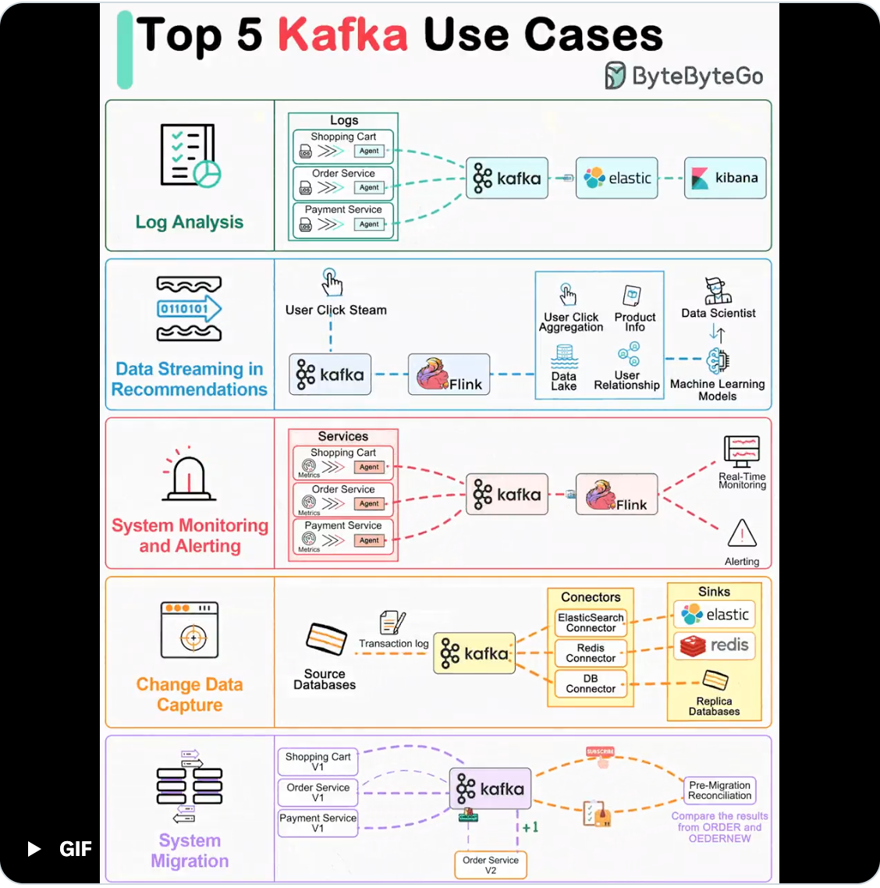

## Handling Large Messages

1. [Handling Large Messages with Apache Kafka (CSV, XML, Image, Video, Audio, Files)](https://www.kai-waehner.de/blog/2020/08/07/apache-kafka-handling-large-messages-and-files-for-image-video-audio-processing/)
2. [Large Message Handling with Kafka: Chunking vs. External Store](https://medium.com/workday-engineering/large-message-handling-with-kafka-chunking-vs-external-store-33b0fc4ccf14)