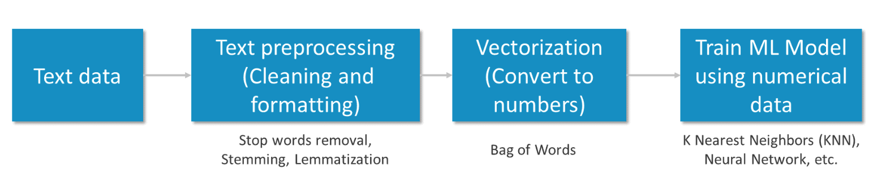

Natural Language Processing (NLP) is a method enabling computers to intelligently read, analyze, and extract meaning from textual input. You may quickly extract crucial sentiment, words, syntax, and key entities such as location, brand, date, and so on, as well as the language of the text, by using Natural Language Processing. A well-defined numerical data set was required for the ML model.

src: https://k21academy.com/amazon-web-services/aws-ml/amazon-comprehend/

## What are some of the different subsets of NLP?

Natural Language Processing (NLP) is a broad field encompassing various subfields and applications. Each subset addresses specific aspects of language understanding, generation, and interaction between humans and machines. Here are the key subsets of NLP:

### 1. **Text Classification**
   - **Definition**: The process of assigning predefined categories or labels to text data.
   - **Applications**: Spam detection, sentiment analysis, topic classification, intent detection.
   - **Techniques**: Bag-of-words models, TF-IDF, Naive Bayes, support vector machines (SVMs), and transformers like BERT.

### 2. **Named Entity Recognition (NER)**
   - **Definition**: Identifying and classifying entities (like people, organizations, dates, and locations) mentioned in text.
   - **Applications**: Information extraction, legal document analysis, and personal assistant systems.
   - **Techniques**: CRFs (Conditional Random Fields), BiLSTM, BERT, RoBERTa.

### 3. **Part-of-Speech (POS) Tagging**
   - **Definition**: Assigning parts of speech (nouns, verbs, adjectives, etc.) to each word in a sentence.
   - **Applications**: Syntactic parsing, grammar checking, and text preprocessing.
   - **Techniques**: HMM (Hidden Markov Models), neural networks, rule-based systems.

### 4. **Syntactic Parsing**
   - **Definition**: Analyzing the syntactic structure of a sentence to understand its grammatical composition.
   - **Applications**: Machine translation, question answering, and sentiment analysis.
   - **Techniques**: Dependency parsing, constituency parsing, transition-based parsing.

### 5. **Sentiment Analysis**
   - **Definition**: Determining the emotional tone (positive, negative, or neutral) within a body of text.
   - **Applications**: Product reviews, social media monitoring, customer feedback analysis.
   - **Techniques**: Lexicon-based methods, deep learning models (LSTM, CNN), transformers.

### 6. **Machine Translation (MT)**
   - **Definition**: Automatically translating text from one language to another.
   - **Applications**: Google Translate, multilingual communication, and content localization.
   - **Techniques**: Phrase-based models, neural machine translation (NMT), transformers (GPT, BERT, T5).

### 7. **Text Summarization**
   - **Definition**: Producing a concise summary from a longer piece of text.
   - **Applications**: News aggregation, legal document summarization, report generation.
   - **Techniques**: Extractive summarization, abstractive summarization (transformer models like BART, GPT).

### 8. **Question Answering (QA)**
   - **Definition**: Systems that can automatically answer questions posed in natural language.
   - **Applications**: Search engines, virtual assistants (Siri, Alexa), customer service bots.
   - **Techniques**: Span-based extraction (BERT), sequence-to-sequence models, attention mechanisms.

### 9. **Speech Recognition (Automatic Speech Recognition - ASR)**
   - **Definition**: Converting spoken language into text.
   - **Applications**: Voice assistants, transcription services, hands-free control systems.
   - **Techniques**: RNNs, LSTMs, transformers, attention-based models like wav2vec.

### 10. **Natural Language Generation (NLG)**
   - **Definition**: Automatically generating human-like text based on given input or context.
   - **Applications**: Chatbots, content creation, report generation.
   - **Techniques**: GPT-3, T5, reinforcement learning, text-to-text transformers.

### 11. **Coreference Resolution**
   - **Definition**: Determining which words in a text refer to the same entity (e.g., pronouns and their antecedents).
   - **Applications**: Text coherence, chatbot conversations, document understanding.
   - **Techniques**: Rule-based methods, neural networks, transformer models.

### 12. **Relation Extraction**
   - **Definition**: Identifying relationships between entities in a text.
   - **Applications**: Knowledge graph construction, entity linking in databases.
   - **Techniques**: Distant supervision, neural networks, transformers like BERT.

### 13. **Dialogue Systems and Chatbots**
   - **Definition**: Systems designed to converse with users using natural language.
   - **Applications**: Customer support bots, virtual assistants, interactive applications.
   - **Techniques**: Sequence-to-sequence models, retrieval-based models, transformers like GPT.

### 14. **Topic Modeling**
   - **Definition**: Discovering abstract topics in a collection of documents.
   - **Applications**: Content categorization, document clustering, recommendation systems.
   - **Techniques**: LDA (Latent Dirichlet Allocation), NMF (Non-negative Matrix Factorization), BERT for topic modeling.

### 15. **Text-to-Speech (TTS)**
   - **Definition**: Converting text into spoken voice.
   - **Applications**: Assistive technologies, voice assistants, audiobooks.
   - **Techniques**: Tacotron, WaveNet, FastSpeech models.

These subsets reflect the diversity of NLP, each with its own set of techniques and applications. Together, they power many AI-driven tools used in everyday life.

## Should LLM be listed as a subset of NLP?

You're right to point out that **Large Language Models (LLMs)** could be considered a subset of Natural Language Processing (NLP), given their increasingly important role. Here's why LLMs weren’t initially listed as a distinct subset:

### LLMs as a Subset of NLP
**Large Language Models (LLMs)** like GPT, BERT, and T5 are essentially sophisticated versions of NLP techniques. They are powerful because they generalize many of the tasks across the NLP spectrum, such as text generation, translation, summarization, and more. These models operate across multiple tasks rather than being limited to one specific area, which makes them both a tool for NLP applications and a paradigm shift in the field itself.

However, LLMs could indeed be considered a subset of NLP in these ways:
- **Text Generation (NLG)**: They are used for generating text, making them a natural fit in **Natural Language Generation (NLG)** tasks.
- **Machine Translation**: LLMs, particularly models like mT5, can perform translation tasks across multiple languages.
- **Question Answering**: LLMs excel at answering complex, open-ended questions based on large datasets, which enhances **Question Answering (QA)** capabilities.
- **Fine-tuning and Adaptation**: LLMs can be fine-tuned for specific domains (e.g., biomedical text processing), making them versatile across several NLP tasks.

### Distinction Between General NLP Subsets and LLMs
While subsets like **POS tagging** or **NER** focus on more traditional, rule-based NLP tasks, LLMs are fundamentally data-driven and rely on vast amounts of data and deep learning to achieve more general-purpose language understanding. They can perform multiple NLP tasks without being explicitly trained for them through techniques like **zero-shot learning**, blurring the lines between traditional subsets and new paradigms of NLP development.

### Why LLMs Weren't Listed
Many of the subsets listed earlier, such as **text classification**, **parsing**, or **translation**, can now be tackled with LLMs as a higher-level architecture. LLMs act more like platforms or models that encompass various NLP functionalities, which is why they weren’t initially categorized as a separate subset. But indeed, LLMs are rapidly redefining the landscape of NLP.