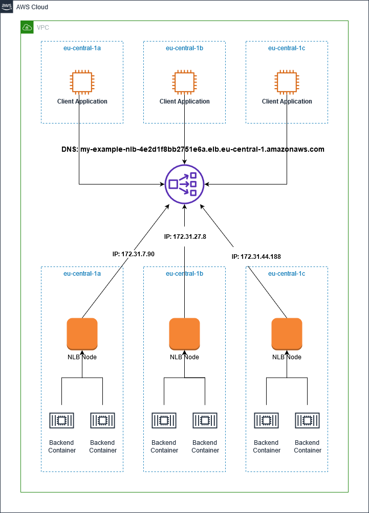

https://github.com/aws-samples/aws-networking-workshop-sample!

[alt text](images/Serverless-NLB-Domain-as-TG.png)

# NLB Architecture

NLB talks to NLB nodes running on each AZ

src: [Resolve DNS names of Network Load Balancer nodes to limit cross-Zone traffic by Ahmed Gamaleldin](https://aws.amazon.com/blogs/networking-and-content-delivery/resolve-dns-names-of-network-load-balancer-nodes-to-limit-cross-zone-traffic/)