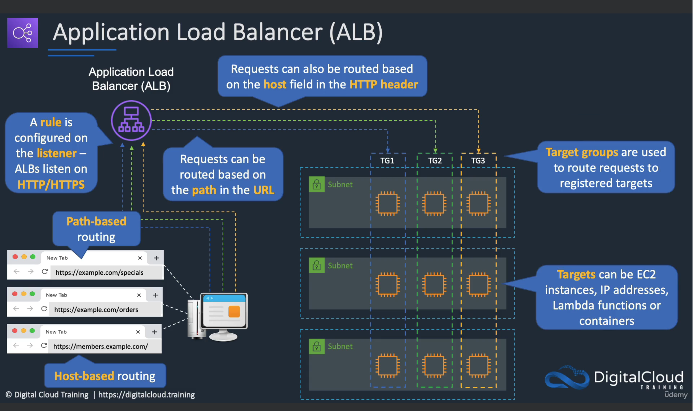
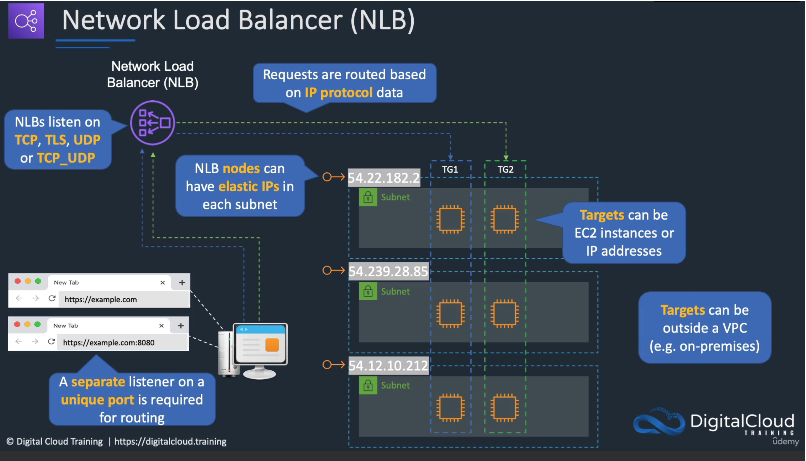

<h1> How does traffic routing work in ALB vs NLB <h1>

# ALB Routing

# NLB Routing

**sources:**

1. [77. Routing with ALB and NLB By Neil Davis](https://www.udemy.com/course/aws-certified-solutions-architect-professional-training/learn/lecture/25348236#overview)