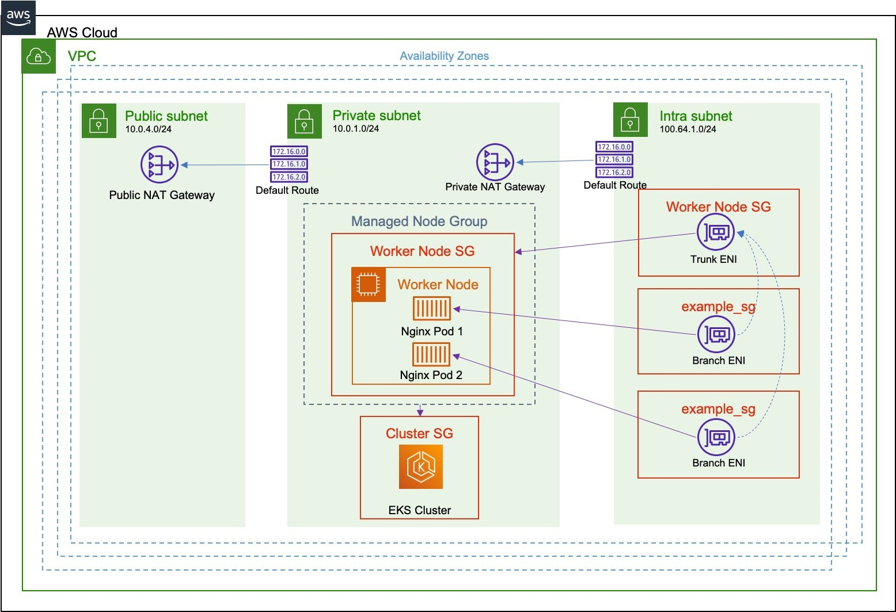

1. [How to check for IP exhausation](https://aws.plainenglish.io/configuring-eks-vpc-in-aws-tackling-ip-exhaustion-head-on-6c6204358568)

# 1. Custom Networking With CNI Plugin

1. [How custom networking solves IPV4 exhaustion problem](https://aws.github.io/aws-eks-best-practices/networking/custom-networking/)

1. [Leveraging CNI custom networking alongside security groups for pods in Amazon EKS by Bin Liu and Haofei Feng](https://aws.amazon.com/blogs/containers/leveraging-cni-custom-networking-alongside-security-groups-for-pods-in-amazon-eks/)
    - https://github.com/aws-samples/terraform-cni-custom-network-sample

  

1. [[CNI custom networking] Automating custom networking to solve IPv4 exhaustion in Amazon EKS by Elamaran Shanmugam, Ratnopam Chakrabarti, and Mikhail Shapirov](https://aws.amazon.com/blogs/containers/automating-custom-networking-to-solve-ipv4-exhaustion-in-amazon-eks/)

1. [Amazon VPC CNI plugin increases pods per node limits by Sheetal Joshi, Mike Stefaniak, and Jayanth Varavani](https://aws.amazon.com/blogs/containers/amazon-vpc-cni-increases-pods-per-node-limits/)

# 2. Migrate the instances and the pods to a secondary VPC CIDR Range (100.64.0.0/10)

1. [[Unique network for nodes and pods] Optimize IP addresses usage by pods in your Amazon EKS cluster by Umesh Ramesh](https://aws.amazon.com/blogs/containers/optimize-ip-addresses-usage-by-pods-in-your-amazon-eks-cluster/)

# 3. Using CDK

1. [Automating custom networking to solve IPv4 exhaustion in Amazon EKS by Elamaran Shanmugam, Ratnopam Chakrabarti, and Mikhail Shapirov](https://aws.amazon.com/blogs/containers/automating-custom-networking-to-solve-ipv4-exhaustion-in-amazon-eks/)

# 4. Using Private NAT

1. [How to solve Private IP exhaustion with Private NAT Solution by SaiJeevan Devireddy and Chandini Penmetsa](https://aws.amazon.com/blogs/networking-and-content-delivery/how-to-solve-private-ip-exhaustion-with-private-nat-solution/)
1. [Addressing IPv4 address exhaustion in Amazon EKS clusters using private NAT gateways by Viji Sarathy and Sheetal Joshi](https://aws.amazon.com/blogs/containers/addressing-ipv4-address-exhaustion-in-amazon-eks-clusters-using-private-nat-gateways/)