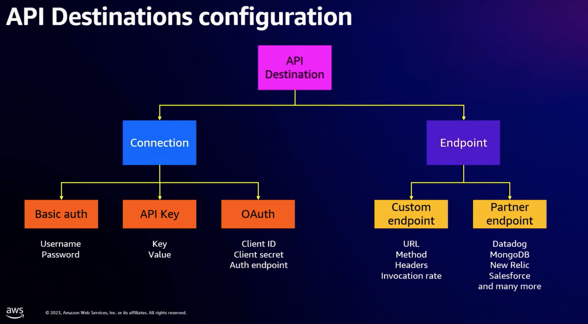

1. [[_**START-HERE**_] EventBridge API Destinations configuration](https://serverlessland.com/patterns/eventbridge-api-destinations)
1. [Amazon EventBridge: API Destinations Demystified-Part I By Sheen Brisals](https://sbrisals.medium.com/amazon-eventbridge-api-destinations-demystified-part-i-23fa70d9a04d)
1. [Amazon EventBridge: How To Manage API Connection Credentials With AWS Secrets Manager By Sheen Brisals](https://sbrisals.medium.com/amazon-eventbridge-how-to-manage-api-connection-credentials-with-aws-secrets-manager-f773f7d2aac5)
1. [Using API destinations with Amazon EventBridge by James Beswick](https://aws.amazon.com/blogs/compute/using-api-destinations-with-amazon-eventbridge/)
1. [Dev Guide - API destinations](https://docs.aws.amazon.com/eventbridge/latest/userguide/eb-api-destinations.html)
1. [Amazon EventBridge - Using API destinations with Amazon EventBridge](https://www.youtube.com/watch?v=2ayxa3AdiK0)
1. [Amazon EventBridge: API Destinations Demystified-Part I By Sheen Brisals](https://sbrisals.medium.com/amazon-eventbridge-api-destinations-demystified-part-i-23fa70d9a04d)
1. [Amazon EventBridge: How To Manage API Connection Credentials With AWS Secrets Manager By Sheen Brisals](https://sbrisals.medium.com/amazon-eventbridge-how-to-manage-api-connection-credentials-with-aws-secrets-manager-f773f7d2aac5)
1. [[EXAMPLE] EventBridge API Destinations configuration](https://serverlessland.com/patterns/eventbridge-api-destinations)

# Key Points [https://youtu.be/6X4lSPkn4ps?t=1712]
1. AWS Secrets Manager Integeration; cost absorbed by EventBridge
2. API rate limit support to configure between 1 and 300 invocations per second.
3. Built-in retry; configurable upto 24 hours and 185 times
4. 5 secs max timeout; retries after timeout
5. API response from target not handled