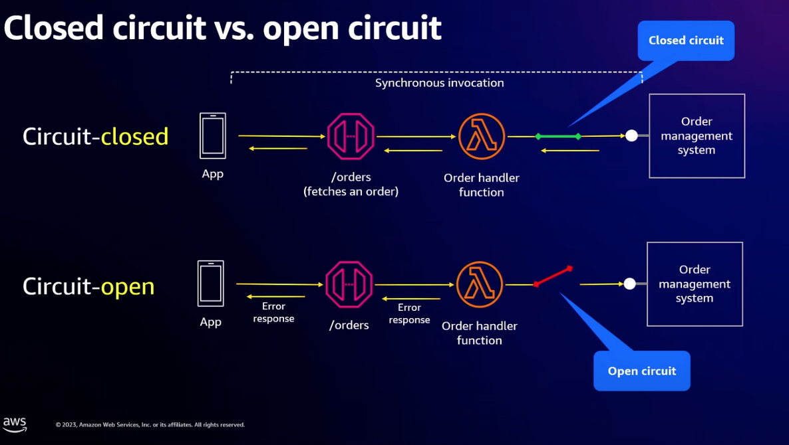
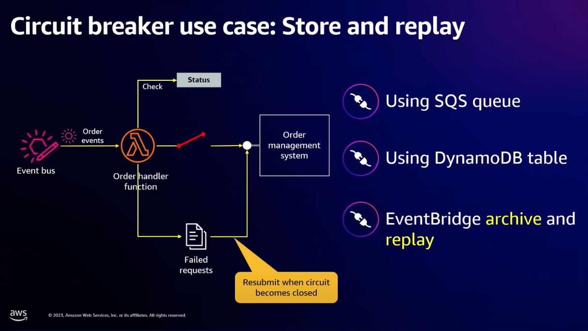

# Why do you need a circuit breaker?

src: https://youtu.be/6X4lSPkn4ps?t=1781

1. Broken ntwork connection between consumer and a provider of a service
2. The planned or unplanned downtime of an application that impacts users
3. More than expected volume of trffic that exhausts all available resources
4. Longer response duration of a service causing a gridlock across the system
5. Unsatisfactory customer experience that impacts business reputation

## Use Event bridge for archive and replay as a solution

https://youtu.be/6X4lSPkn4ps?t=2211

**Example**:

1. [Using the circuit breaker pattern with AWS Step Functions and Amazon DynamoDB by Anitha Deenadayalan](https://aws.amazon.com/blogs/compute/using-the-circuit-breaker-pattern-with-aws-step-functions-and-amazon-dynamodb)
1. [Circuit breaker workflow](https://serverlessland.com/workflows/circuit-breaker-workflow)

# Blogs for Archive and Replay

1. [New – Archive and Replay Events with Amazon EventBridge by Danilo Poccia |](https://aws.amazon.com/blogs/aws/new-archive-and-replay-events-with-amazon-eventbridge/)