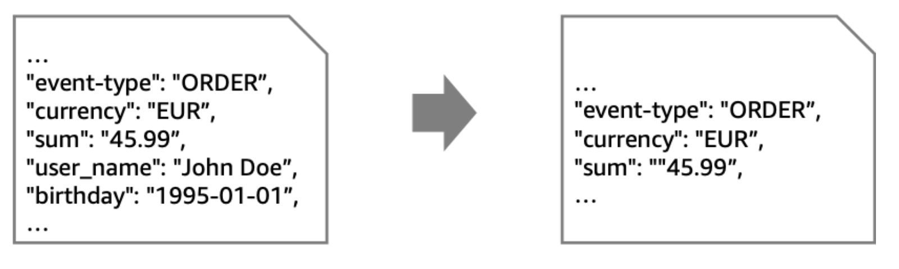
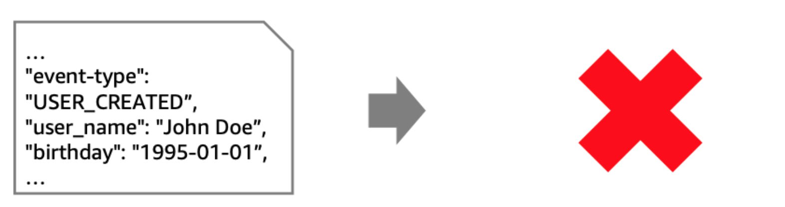

# Content filter

removes unwanted content from an individual message

# message filter pattern

discards entire messages

# Event Bridge

## As a Webhook Producer

1. Event generation: Use EventBridge Scheduler if you can pool for events and send in batches. Does AWS DocumentDB workshop have an example?
1. Filtering: EventBridge Pipes support filtering by matching event patterns.
1. Delivery: Use EventBridge if you want to deliver events outside of AWS using REST API
1. Delivery: EventBridge uses Invocation rate Limit to protect extenranl endpoints from surge in traffic. Example? [AWS re:Invent 2019: [REPEAT 2] I didn’t know Amazon API Gateway did that (SVS212-R2)](https://www.youtube.com/watch?v=yfJZc3sJZ8E)
1. Provides scalable and resilient delivery using SQS: Possible to setup Eventbridge to handle retries with exponential backoff and then send them off to SQS DLQs.

## As a WQebhook consumer

1. API Gateway can be n endpoint to receive messages
1. API Gateway can be configured for rate and burst limits

# References

1. [Sending and receiving webhooks on AWS: Innovate with event notifications by Daniel Wirjo](https://aws.amazon.com/blogs/compute/sending-and-receiving-webhooks-on-aws-innovate-with-event-notifications/)