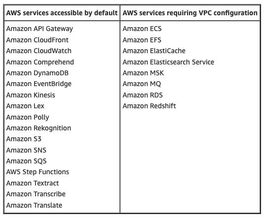
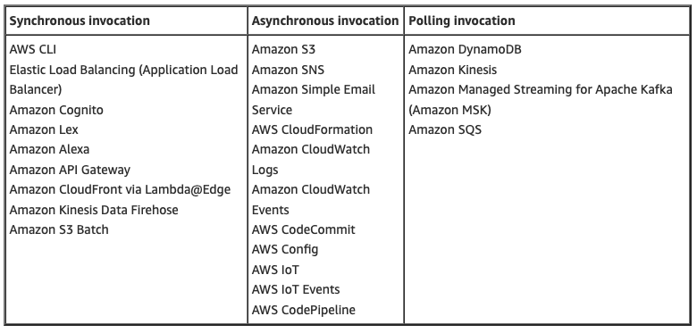
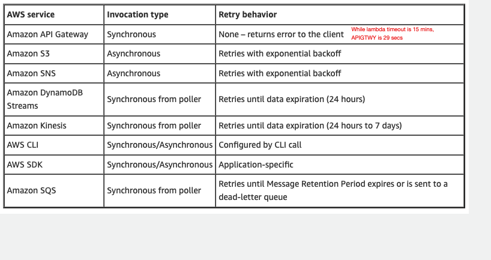

# 1. [Operating Lambda: Application design and Service Quotas – Part 1 by James Beswick ](https://aws.amazon.com/blogs/compute/operating-lambda-application-design-and-service-quotas-part-1/)

how to work with Service Quotas
Setting developer accounts for each developer - Why this is useful

# [Operating Lambda: Application design – Scaling and concurrency: Part 2 by James Beswick](https://aws.amazon.com/blogs/compute/operating-lambda-application-design-scaling-and-concurrency-part-2/)

How does scaling happen with On-Demand vs provisioned capacity
How is burst quota allocated

# 3. [Operating Lambda: Application design – Part 3 by James Beswick ](https://aws.amazon.com/blogs/compute/operating-lambda-application-design-part-3/)

there is a soft limit of 350 ENIs per Region

Devops: you should monitor elastic network interface usage if you are configuring Lambda functions for VPC access. Generally, if you increase concurrency limits in Lambda, you should evaluate if you need an elastic network interface increase. If the limit is reached, this causes invocations of VPC-enabled Lambda functions to be throttled.

