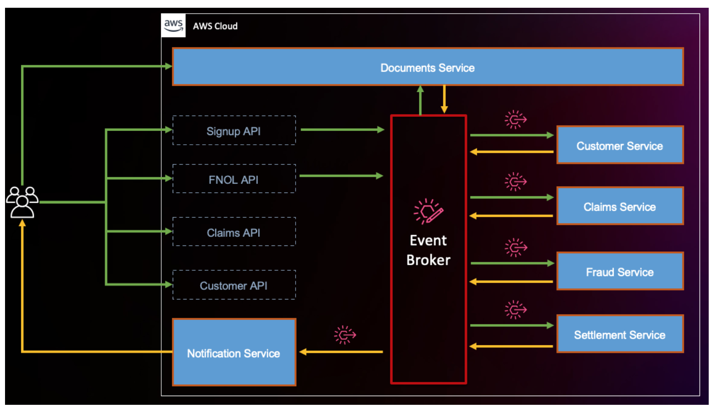
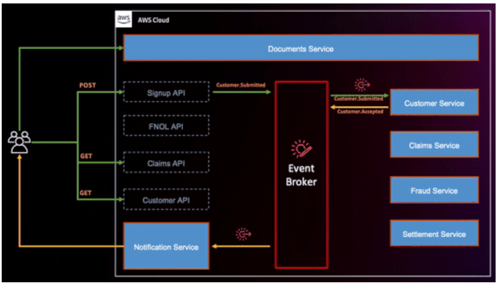
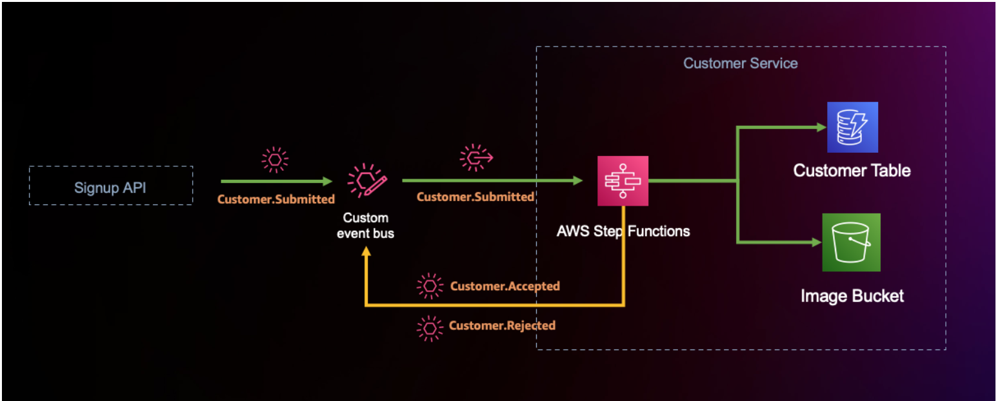
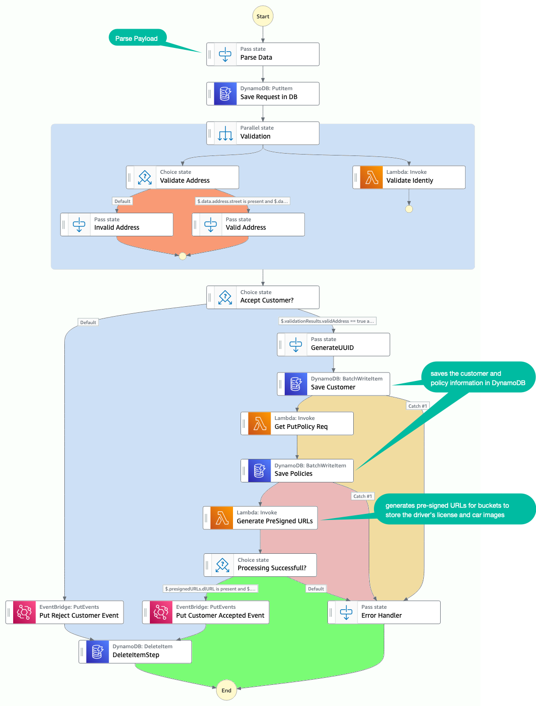
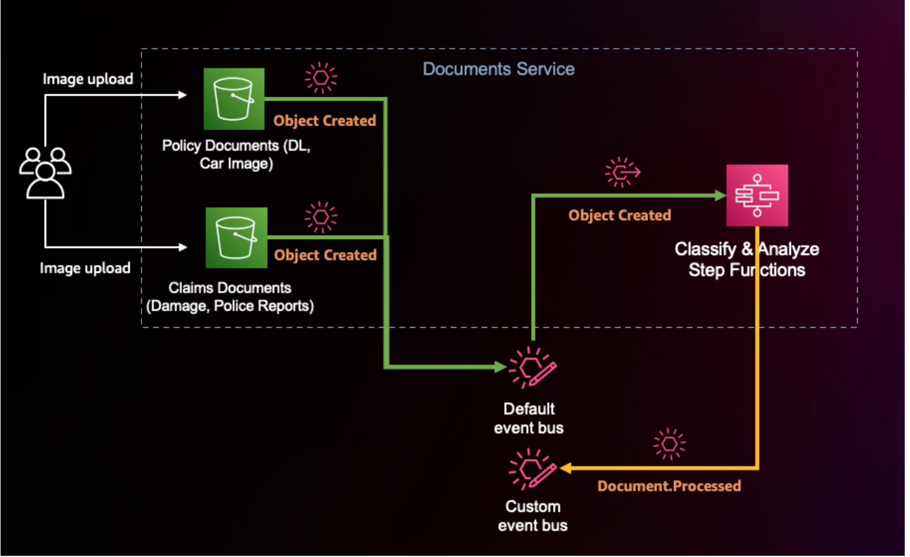
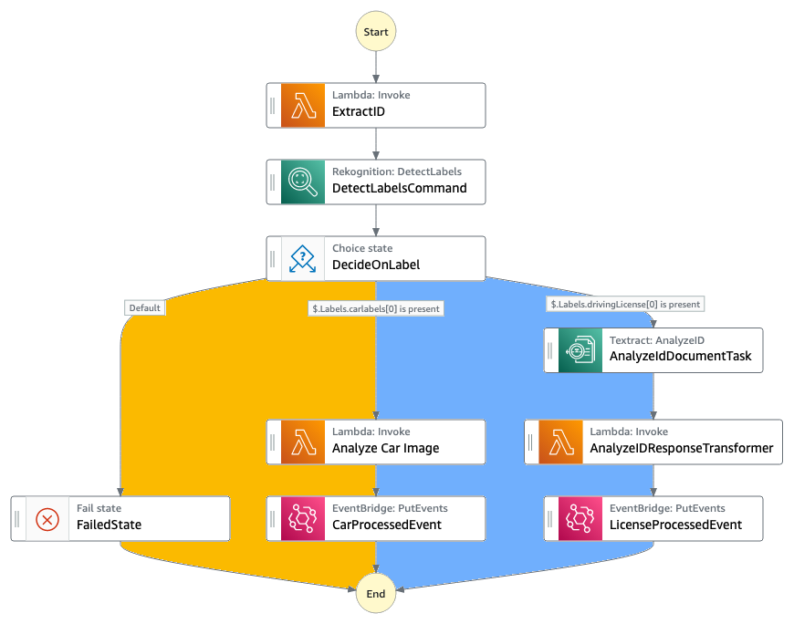

<h1>[Use Case] Building Insurance Claims Processing</h1>

# 1. High-Level Architecture

# 2. Solutions Demonstrated

1. Pre-signed URLs
1. Using Event Bridge to send

# 3. Step 1: Customer signs up using Sign-up API for Customer onboarding

Customer uses this API to provide information about their identity (email, SSN, and more) as well as the make and model of their car. The KYC (Know Your Customer) process uses this information to approve and onboard a customer or deny the on-boarding.

1. User invokes Sign-UP API using post.
2. Signup API submits event `Customer.Submitted` to the event bus.
3. Customer Service filters for `Customer.Submitted` event and then responds back as `Customer.Accepted` or `Customer.Rejected`

## 3.1. Customer Service

1. The Signup API emits a `Customer.Submitted` event to the EventBridge custom event bus.
2. We set up an EventBridge rule to route event payloads of the type `Customer.Submitted` to the Customer service domain.
3. Upon successful rule evaluation, EventBridge **asynchronously** invokes a Step Functions state machine in the Customer service domain.
4. The state machine orchestrates the signup process and emits `Customer.Accepted` or `Customer.Rejected` events back to the event broker based on the success or failure scenario.

## 3.2. Customer signup uses Express Workflow implementation

1. The workflow parses and validates the incoming payload data, and saves the customer and policy information in DynamoDB.
2. It then generates pre-signed URLs for buckets to store the driver’s license and car images as the next step for the customer.
3. For both successful and failed validations, the workflow emits events (`Customer.Accepted` or `Customer.Rejected`) back to the custom event bus.

# 4. Step 2: Customer Uploads documents for Document Processing

Once a customer successfully signs up, their next step is to upload a valid driver’s license image and the image of their car.

1. The customer uses the `pre-signed URLs` provided during the signup process to upload those two images (valid driver’s license image and the image of their car).
2. Once the images are uploaded to the policy documents S3 bucket, Amazon S3 triggers an `Object Created event` to the `default EventBridge event bus`.
3. An EventBridge rule **matches** the `Object Created event` type and invokes the document processing Step Functions workflow (`Classify and Analyze WF`) that is used to classify and analyze the image in the S3 bucket.
4. Once the document processing is complete, the Step Functions workflow emits a `Document.Processed` event to the custom event bus with `data from the analysis` added to the `event payload`.

## 4.1. Classify and Analyze Express Workflow

# 5. References

1. [How to create Pre-Signed URLs](https://serverlessland.com/patterns/s3-upload-presignedurl-api-cdk-ts?ref=search)
1. [Building a modern, event-driven application for insurance claims processing – Part 1 by Emily Shea and Dhiraj Mahapatro](https://aws.amazon.com/blogs/industries/building-a-modern-event-driven-application-for-insurance-claims-processing-part-1/)
2. [Building a modern, event-driven application for insurance claims processing – Part 2 by Emily Shea, Vaibhav Jain, and Dhiraj Mahapatro](https://aws.amazon.com/blogs/industries/building-a-modern-event-driven-application-for-insurance-claims-processing-part-2/)
3. [Extending a serverless, event-driven architecture to existing container workloads by Dhiraj Mahapatro and Sascha Moellering](https://aws.amazon.com/blogs/compute/extending-a-serverless-event-driven-architecture-to-existing-container-workloads/)

