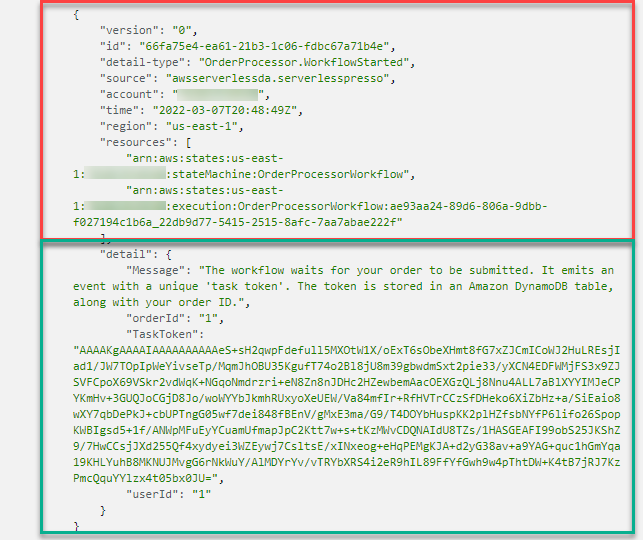

# 10-Routing using Event Bridge Rules

# Consolidate Notes from
1. /Volumes/Lexar/git-repos/aws-repo/my-aws-samples/eventbridge/amazon-eventbridge-producer-consumer-example/eventbridge-rule-patterns.md
1. https://aws.amazon.com/blogs/compute/reducing-custom-code-by-using-advanced-rules-in-amazon-eventbridge/
1. https://aws.amazon.com/blogs/compute/implementing-architectural-patterns-with-amazon-eventbridge-pipes/
1. Copy template.yaml to /Volumes/Lexar/git-repos/aws-repo/my-github/study-guide-repo/templates
1. Create my-aws-snippets also


# JSON structure of Eventbridge Payload

top-level envelope fields are Source, EventBusName, DetailType, Detail

## AWS Event

```json
{
  "Source": string,
  "EventBusName": string,
  "DetailType": string,
  "Detail": string      // body of the event.  This has to be a string
}
```

## Custom Events

```json
{
  "Source": "custom.myATMapp",
  "EventBusName": "default",
  "DetailType": "transaction",
  "Detail": "{\"action\":\"withdrawal”,\"amount\":300}"
}
```

# Custom Event Envelope Design



src: https://workshop.serverlesscoffee.com/2-events/1-overview.html

# References

1. https://aws.amazon.com/blogs/compute/integrating-amazon-eventbridge-into-your-serverless-applications/
1. https://aws.amazon.com/blogs/compute/reducing-custom-code-by-using-advanced-rules-in-amazon-eventbridge/
1. https://aws.amazon.com/blogs/compute/implementing-architectural-patterns-with-amazon-eventbridge-pipes/