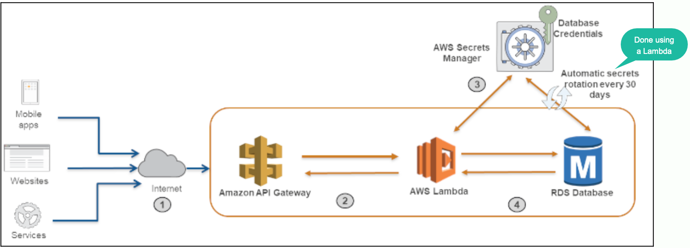

# 1. [How to securely provide database credentials to Lambda functions by using AWS Secrets Manager
by Ramesh Adabala, Anand Komandooru, and Noorul Hasan](https://aws.amazon.com/blogs/security/how-to-securely-provide-database-credentials-to-lambda-functions-by-using-aws-secrets-manager/)</h1>

# Code

1. https://github.com/aws-samples/aws-secrets-manager-secure-database-credentials
2. https://github.com/aws-samples/aws-secrets-manager-secure-database-credentials/blob/main/secretsmanager_IaC.yml
    - VPConfig
    - Parameters to Lambda
    - API gateway Private Integration to Lambda
    - Custom::LambdaRDS
    - SecretsManager
    - SecretsManager's RotationSchedule
    - mysql RDS
    - NatGateway for Lambda to talk to internet
    - LambdaRDS_ManageConnections runs outside customer VPC. NatGateway is used to talk to it from VPC

3. [How to create and retrieve secrets managed in AWS Secrets Manager using AWS CloudFormation templates by Apurv Awasthi](https://aws.amazon.com/blogs/security/how-to-create-and-retrieve-secrets-managed-in-aws-secrets-manager-using-aws-cloudformation-template/)