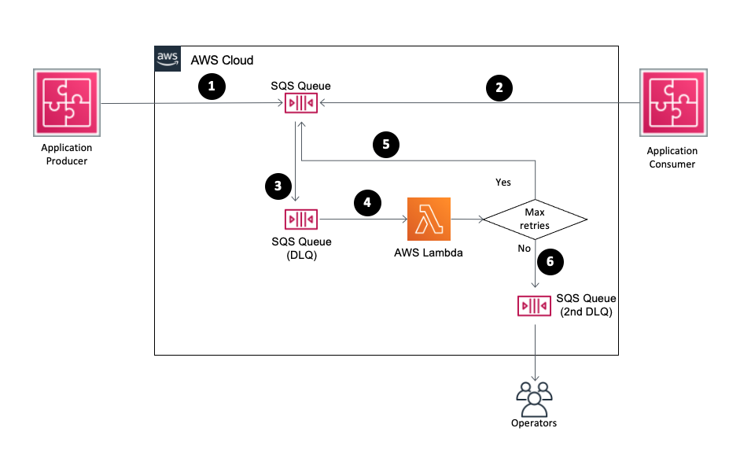

<h1> Topics for Lambda Notes</h1>

<!-- TOC -->

- [1. FIFO Queues (both SNS and SQS)](#1-fifo-queues-both-sns-and-sqs)
- [2. Exactly once processing](#2-exactly-once-processing)
- [3. Need for message groups in FIFO queue](#3-need-for-message-groups-in-fifo-queue)
- [4. For FIFO queue - How does Poller pull messages in order](#4-for-fifo-queue---how-does-poller-pull-messages-in-order)
- [5. Rate Limiting](#5-rate-limiting)
- [6. Concurrency with SQS and SNS](#6-concurrency-with-sqs-and-sns)
- [7. How Lambda works with SNS](#7-how-lambda-works-with-sns)
- [8. Error Handling](#8-error-handling)
- [9. Redrive](#9-redrive)
- [10. Message expiration](#10-message-expiration)
- [11. Best practices for Lamba](#11-best-practices-for-lamba)
- [12. Scaling](#12-scaling)
- [13. Permissions](#13-permissions)
- [14. Lambda design principles](#14-lambda-design-principles)
- [15. Other Material for Notes](#15-other-material-for-notes)
- [DLQ](#dlq)
- [How to setup exponential backoff](#how-to-setup-exponential-backoff)

<!-- /TOC -->

# 1. FIFO Queues (both SNS and SQS)

1. [[Deduplication Id] Deduplicating SNS and SQS messages using AWS’s new FIFO SNS Topics and a FIFO SQS Queue](https://medium.com/build-succeeded/deduplicating-sns-and-sqs-messages-using-awss-new-fifo-sns-topics-and-a-fifo-sqs-queue-df0e11fc2f0d)
- [Justin Pertle's example on how Deduplication Id works](https://youtu.be/8zysQqxgj0I?t=1053)

# 2. Exactly once processing

1. [Justin Pirtle's explanation of what's exactly once processing](https://youtu.be/8zysQqxgj0I?t=1004)

# 3. Need for message groups in FIFO queue

1. [Justin Pirtle's explanation on why message groups are needed](https://youtu.be/8zysQqxgj0I?t=914)

# 4. For FIFO queue - How does Poller pull messages in order

1. [Justin Pirtle's explanation on how pollers work with FIFO queue](https://youtu.be/8zysQqxgj0I?t=864)

# 5. Rate Limiting

2. [Why Rate Limiting is needed](https://youtu.be/8zysQqxgj0I?t=645)
1. [Justin Pirtle's explanation on how Rate Limiting is done with SQS](https://youtu.be/8zysQqxgj0I?t=677)

# 6. Concurrency with SQS and SNS

1. [Lambda function concurrency across SQS/SNS](https://youtu.be/8zysQqxgj0I?t=602)

# 7. How Lambda works with SNS

1. [](https://youtu.be/8zysQqxgj0I?t=366)

# 8. Error Handling

1. [How does SQS error handling take place in case of Function errors](https://youtu.be/8zysQqxgj0I?t=1263)
2. [Implementing AWS Lambda error handling patterns by Julian Wood, Jeff Chen, and Jeff Li](https://aws.amazon.com/blogs/compute/implementing-aws-lambda-error-handling-patterns/)

# 9. Redrive

1. [Where do you setup redrive Policy](https://aws.amazon.com/blogs/compute/introducing-amazon-simple-queue-service-dead-letter-queue-redrive-to-source-queues/)

# 10. Message expiration

1. Whats the message retention policy for SQS vs SNS?
2. https://blog.serverlessq.com/aws-sns-vs-sqs-what-are-the-main-differences

# 11. Best practices for Lamba

1. [Amazon SQS to Lambda: Best practices and tips Queue configuration](https://youtu.be/8zysQqxgj0I?t=1717)

# 12. Scaling

1. [Understanding AWS Lambda scaling and throughput by Julian Wood ](https://aws.amazon.com/blogs/compute/understanding-aws-lambda-scaling-and-throughput/)

# 13. Permissions

1. `/Volumes/Lexar/git-repos/aws-repo/my-aws-cookbook/lambda/security/lambda-security.md`

QQ: "When you invoke your function, Lambda automatically provides your function with temporary credentials by assuming this role. You don't have to call sts:AssumeRole in your function code" from https://docs.aws.amazon.com/lambda/latest/dg/lambda-intro-execution-role.html - Whose credentials are provided here to the function

How to create a Role withTrust policy?

aws iam create-role --role-name lambda-ex --assume-role-policy-document file://trust-policy.json

```json
{
  "Version": "2012-10-17",
  "Statement": [
    {
      "Effect": "Allow",
      "Principal": {
        "Service": "lambda.amazonaws.com"
      },
      "Action": "sts:AssumeRole"
    }
  ]
}
```

> QQ: When do you need to create a role to assume itself? Mentioned here https://docs.aws.amazon.com/lambda/latest/dg/lambda-intro-execution-role.html

> Find demo: "Lambda assumes the execution role associated with your function to fetch temporary security credentials which are then available as environment variables during a function's invocation. If you use these temporary credentials outside of Lambda, such as to create a presigned Amazon S3 URL, you can't control the session duration. The IAM maximum session duration setting doesn't apply to sessions that are assumed by AWS services such as Lambda. Use the sts:AssumeRole action if you need control over session duration"

# 14. Lambda design principles

1. [Operating Lambda: Understanding event-driven architecture – Part 1 by James Beswick](https://aws.amazon.com/blogs/compute/operating-lambda-understanding-event-driven-architecture-part-1/)
2. [Operating Lambda: Design principles in event-driven architectures – Part 2 by James Beswick](https://aws.amazon.com/blogs/compute/operating-lambda-design-principles-in-event-driven-architectures-part-2/)
3. [Operating Lambda: Anti-patterns in event-driven architectures – Part 3 by James Beswick](https://aws.amazon.com/blogs/compute/operating-lambda-anti-patterns-in-event-driven-architectures-part-3/)

# 15. Other Material for Notes

1. [AWS Lambda Fundamentals - Justin Wood](https://www.youtube.com/watch?v=jaJIpTg81iA&list=PLJo-rJlep0ECLtDhRKYWZsJRFBf9STccV)

# DLQ

1. Should this be in notes for SQS?

# How to setup exponential backoff

1. [Using Amazon SQS dead-letter queues to replay messages](https://aws.amazon.com/blogs/compute/using-amazon-sqs-dead-letter-queues-to-replay-messages/)

