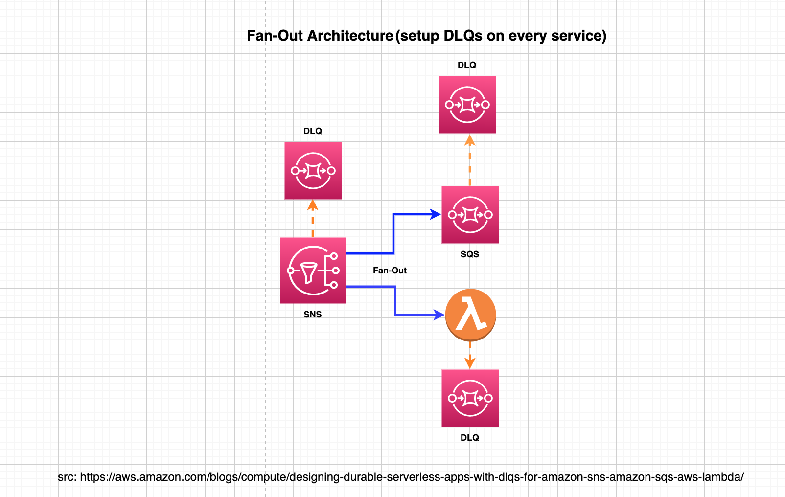
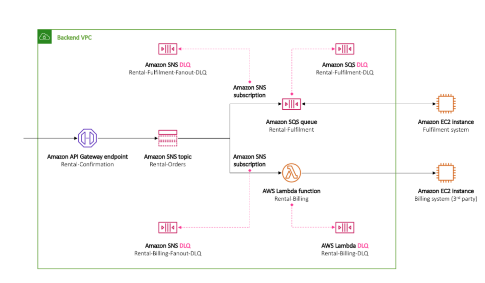

# 1. Difference between client errors vs server errors

Ref: https://aws.amazon.com/blogs/compute/designing-durable-serverless-apps-with-dlqs-for-amazon-sns-amazon-sqs-aws-lambda/

## 1.1. Client Error

- you might have deleted the SQS queue that is subscribed to your SNS topic, without also deleting the SNS subscription corresponding to the queue
- you changed the resource policy attached to your endpoint in a way that prevents SNS from delivering messages to that endpoint

### 1.1.1. How does SNS Handle client errors?

SNS **does not retry** the delivery of messages that failed as the result of client errors.

## 1.2. Server error

- the system that powers the subscribed endpoint is unavailable
- when it returns an exception response indicating that it failed to process a valid request from SNS

### 1.2.1. How does SNS Handle Server error?

When a server error occurs for an AWS managed endpoint, backed by either SQS or Lambda, then SNS retries the delivery for up to 100,015 times, **over 23 days**

# 2. When does Lambda service attempt retry

If the function raises an exception, times out, runs out of memory or the function may reach the concurrency limit and gets throttled

# 3. Lambda service Retries

By default, Lambda retries an asynchronous execution **twice**.

# 4. Best practice: Setup DLQs on each service in a Fan-out architecture

If yoy have SNS fanning out to SQS and Lambda, have DLQs for SNS, SQS and Lambda



# 5. How to setup DLQs for each subscription?




```yaml
Resources:
  mySubscription:
    Type: AWS::SNS::Subscription
    Properties:
      Protocol: sqs
      Endpoint: arn:aws:sqs:us-east-1:123456789012:Rental-Fulfilment
      TopicArn: arn:aws:sns:us-east-1:123456789012:Rental-Orders
      RedrivePolicy:
        deadLetterTargetArn: arn:aws:sqs:us-east-1:123456789012:Rental-Fulfilment-Fanout-DLQ
      FilterPolicy:
        order-status:
          - confirmed
          - canceled
```

The above snippet makes SQS queue `Rental-Fulfilment` subscribe to the SNS topic `Rental-Orders`.

The template also sets a RedrivePolicy that targets `Rental-Fulfilment-Fanout-DLQ` as a DLQ

As Amazon SNS Message Filtering happens before message delivery, messages that are filtered out aren’t sent to that subscription’s DLQ.

# How to attach a DLQ after SNS topic and subscription are already deployed

1. Attaching using CLI

```bash
aws sns set-subscription-attributes
   --region us-east-1
   --subscription-arn arn:aws:sns:us-east-1:123456789012:Rental-Orders:44019880-ffa0-4067-9cb4-b974443bcck2
   --attribute-name RedrivePolicy
   --attribute-value '{"deadLetterTargetArn":"arn:aws:sqs:us-east-1:123456789012:Rental-Fulfilment-Fanout-DLQ"}'
```

2. Attaching using SDK

```java
AmazonSNS sns = AmazonSNSClientBuilder.defaultClient();

String subscriptionArn = "arn:aws:sns:us-east-1:123456789012:Rental-Orders:44019880-ffa0-4067-9cb4-b974443bcck2";

String redrivePolicy = "{\"deadLetterTargetArn\":\"arn:aws:sqs:us-east-1:123456789012:Rental-Fulfilment-Fanout-DLQ\"}";

SetSubscriptionAttributesRequest request = new SetSubscriptionAttributesRequest(
  subscriptionArn,
  "RedrivePolicy",
  redrivePolicy
);

sns.setSubscriptionAttributes(request);
```


# [EXERCISE] DLQs for SNS emit following cloudwatch metrics

**NumberOfMessagesSent**, **NumberOfMessagesReceived** and **NumberOfMessagesDeleted**

**Build this:** You might have a case where you expect the DLQ to be always empty. In that case, create an CloudWatch alarm on NumberOfMessagesSent, set the alarm threshold to zero, and provide a separate SNS topic to be notified when the alarm goes off. The SNS topic, in its turn, can delivery your alarm notification to any endpoint type that you choose, such as email address, phone number, or mobile pager app.

# [EXERCISE] Check these SNS metrics

**NumberOfNotificationsRedrivenToDlq** – Used when sending the message to the DLQ succeeds.
**NumberOfNotificationsFailedToRedriveToDlq** – Used when sending the message to the DLQ fails. This can happen because the DLQ either doesn’t exist anymore or doesn’t have the required access permissions to allow SNS to send messages to it. For more information about setting up the required access policy, see Giving Permissions for Amazon SNS to Send Messages to Amazon SQS.


git clone https://github.com/aws-samples/serverless-patterns/
cd serverless-patterns/s3-sns-sqs-lambda-sam-java
https://github.com/aws-samples/amazon-sqs-best-practices-cdk
https://github.com/aws-samples/aws-lambda-error-handling-pattern
[AWS Serverless Amazon SNS Fanout Sample](https://github.com/aws-samples/aws-serverless-sns-fanout)