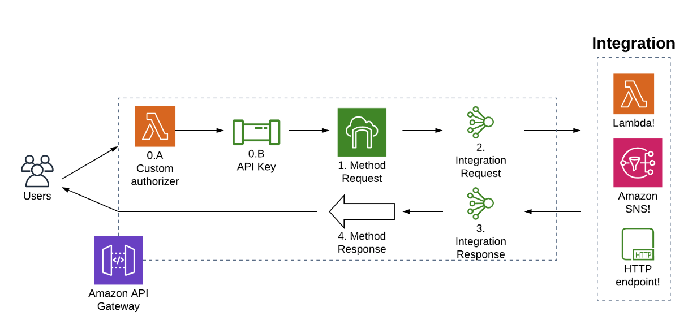
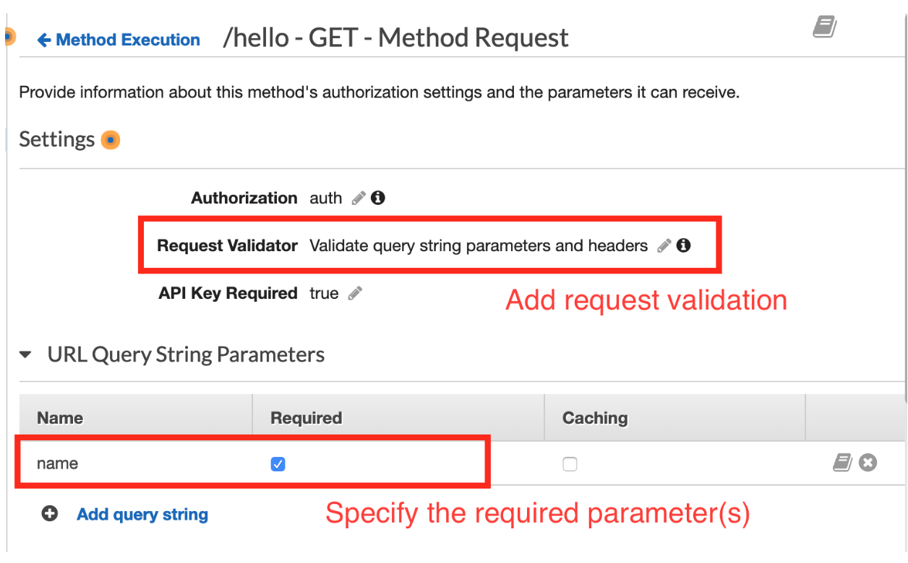

<!-- TOC -->

- [1. How API Gateway works?](#1-how-api-gateway-works)
- [2. Step 0. Authorization](#2-step-0-authorization)
  - [2.1. A Custom authorizer:](#21-a-custom-authorizer)
  - [2.2. B API check:](#22-b-api-check)
    - [2.2.1. Usage Plan](#221-usage-plan)
- [3. Step 1: Validation with Method Requests](#3-step-1-validation-with-method-requests)
  - [3.1. Validating Parameters](#31-validating-parameters)
    - [3.1.1. thru' console](#311-thru-console)
    - [3.1.2. thru' CFN](#312-thru-cfn)
  - [3.2. Validating the Request Body using Request Models](#32-validating-the-request-body-using-request-models)
- [4. Vocabulary: The Meaning of Proxy in API Gateway](#4-vocabulary-the-meaning-of-proxy-in-api-gateway)
  - [4.1. Proxy resources /{proxy+} or Proxy methods](#41-proxy-resources-proxy-or-proxy-methods)
  - [4.2. Proxy Integrations](#42-proxy-integrations)
  - [4.3. AWS Service Proxy integrations](#43-aws-service-proxy-integrations)
- [Step 2: Transforming the request with the Integration Request](#step-2-transforming-the-request-with-the-integration-request)
  - [Writing Mapping Templates with VTL](#writing-mapping-templates-with-vtl)
- [NextSteps](#nextsteps)

<!-- /TOC -->

# 1. How API Gateway works?



# 2. Step 0. Authorization

## 2.1. A Custom authorizer:

3 ways:

1. Using **IAM permissions** via signed HTTP requests
2. Using tokens from a **Cognito User Pool**
3. Writing your own custom logic in a Lambda **custom authorizer**.

## 2.2. B API check:

1. You can configure API Gateway to provision API keys.
2. These keys are then passed by the client using the `x-api-key` header
3. Should not be used as primary mode of authorization
4. API keys are used for **Rate limiting and throttling users**.
5. Can configure API Gateway for **Usage Plans**. You associate API keys with a particular usage plan.

### 2.2.1. Usage Plan

With a usage plan, you can configure two things: **throttling limits** and **quota limits**.

**Throttling limits** specify how many requests per second are allowed for a particular usage plan. You can use this to prevent a caller from overwhelming your downstream resources.

**Quota limits** allow you to set a maximum number of requests over a particular time period, such as a day, a week, or a month. This allows you to enforce limits on a particular client. For example, if you are providing a paid API where a user gets a certain number of calls per month, you can use quota limits to enforce that limit.

Note that usage plans are limited to 300 per account per region by default, though you can request a limit increase if needed.

# 3. Step 1: Validation with Method Requests

## 3.1. Validating Parameters

### 3.1.1. thru' console

You can indicate in console which request parameters are mandatory



APIGateway will generate following `400 Bad Request` error if missing

```json
{
  "message": "Missing required request parameters: [<parameter>]"
}
```

### 3.1.2. thru' CFN

Use `AWS::ApiGateway::RequestValidator` and `AWS::ApiGateway::Method`.

For complete example see `https://docs.aws.amazon.com/apigateway/latest/developerguide/api-gateway-request-validation-sample-cloudformation.html`

## 3.2. Validating the Request Body using Request Models

1. To validate the request body, you need to need to create a request model (which is a JSON schema) that you need to register as follows

```yaml
UserModel:
  Type: AWS::ApiGateway::Model
  Properties:
    RestApiId:
      Ref: RestApi
    ContentType: "application/json"
    Description: "User Model"
    Name: UserModel
    Schema:
      "$schema": "http://json-schema.org/draft-04/schema#"
      title: UserModel
      type: object
      properties:
        name:
          type: string
        age:
          type: integer
        username:
          type: string
```

For complete example see: `https://docs.aws.amazon.com/apigateway/latest/developerguide/api-gateway-request-validation-sample-cloudformation.html`

```yaml
AWSTemplateFormatVersion: 2010-09-09
Parameters:
  StageName:
    Type: String
    Default: v1
    Description: Name of API stage.
Resources:
  Api:
    Type: 'AWS::ApiGateway::RestApi'
    Properties:
      Name: ReqValidatorsSample
  RequestBodyModelId:
    Type: 'AWS::ApiGateway::Model'
    Properties:
      RestApiId: !Ref Api
      ContentType: application/json
      Description: Request body model for Pet ID.
      Schema:
        $schema: 'http://json-schema.org/draft-04/schema#'
        title: RequestBodyModelId
        properties:
            id:
              type: integer
  RequestBodyModel:
    Type: 'AWS::ApiGateway::Model'
    Properties:
      RestApiId: !Ref Api
      ContentType: application/json
      Description: Request body model for Pet type, name, price, and ID.
      Schema:
        $schema: 'http://json-schema.org/draft-04/schema#'
        title: RequestBodyModel
        required:
          - price
          - name
          - type
        type: object
        properties:
            id:
              "$ref": !Sub
                - 'https://apigateway.amazonaws.com/restapis/${Api}/models/${RequestBodyModelId}'
                - Api: !Ref Api
                  RequestBodyModelId: !Ref RequestBodyModelId
            price:
              type: number
              minimum: 25
              maximum: 500
            name:
              type: string
            type:
              type: string
              enum:
                - "dog"
                - "cat"
                - "fish"

  GETValidator:
    Type: AWS::ApiGateway::RequestValidator
    Properties:
      Name: params-only
      RestApiId: !Ref Api
      ValidateRequestBody: False
      ValidateRequestParameters: True

  POSTValidator:
    Type: AWS::ApiGateway::RequestValidator
    Properties:
      Name: body-only
      RestApiId: !Ref Api
      ValidateRequestBody: True
      ValidateRequestParameters: False

  ValidationResource:
    Type: 'AWS::ApiGateway::Resource'
    Properties:
      RestApiId: !Ref Api
      ParentId: !GetAtt Api.RootResourceId
      PathPart: 'validation'

  ValidationMethodGet:
    Type: 'AWS::ApiGateway::Method'
    Properties:
      RestApiId: !Ref Api
      ResourceId: !Ref ValidationResource
      HttpMethod: GET
      AuthorizationType: NONE
      RequestValidatorId: !Ref GETValidator
      RequestParameters:
        method.request.querystring.q1: true
      Integration:
        Type: HTTP_PROXY
        IntegrationHttpMethod: GET
        Uri: http://petstore-demo-endpoint.execute-api.com/petstore/pets/

  ValidationMethodPost:
    Type: 'AWS::ApiGateway::Method'
    Properties:
      RestApiId: !Ref Api
      ResourceId: !Ref ValidationResource
      HttpMethod: POST
      AuthorizationType: NONE
      RequestValidatorId: !Ref POSTValidator
      RequestModels:
        application/json : !Ref RequestBodyModel
      Integration:
        Type: HTTP_PROXY
        IntegrationHttpMethod: POST
        Uri: http://petstore-demo-endpoint.execute-api.com/petstore/pets/

  ApiDeployment:
    Type: 'AWS::ApiGateway::Deployment'
    DependsOn:
      - ValidationMethodGet
      - RequestBodyModel
    Properties:
      RestApiId: !Ref Api
      StageName: !Sub '${StageName}'

Outputs:
  ApiRootUrl:
    Description: Root Url of the API
    Value: !Sub 'https://${Api}.execute-api.${AWS::Region}.amazonaws.com/${StageName}'

```

# 4. Vocabulary: The Meaning of Proxy in API Gateway

3 forms of **proxy**

1. Proxy resources or Proxy methods
2. Proxy integrations
3. AWS service proxies

## 4.1. Proxy resources /{proxy+} or Proxy methods

1. This is a **catch-all** HTTP path to handle a number of different HTTP requests. These help you greedily grab HTTP paths to send to your backend integration.
1. In path /users/**{userId}** {userId} is known as proxy resource. Other examples - /users/**{userId}**/orders/**{orderId}**
1. Greedy proxy resource **/{proxy+}** - lets you capture all path values after the proxy indicator. This is used when all the routing is done in your backend application.  API Gateway just forwards as is and your backend application handles it.

Good example can be found here -

1. [Handling arbitrary HTTP requests in Amazon API Gateway by Steve Engledow](https://aws.amazon.com/blogs/developer/handling-arbitrary-http-requests-in-amazon-api-gateway/)

## 4.2. Proxy Integrations

1. Proxy integrations forward requests to your backend integration **without writing a mapping template**

2. API Gateway tranforms the request using **Velocity Template Language (VTL)** before sending to backend application. However, if you don't want API Gateway to tranform but just forward it to the backend you use a proxy integration to skip the integration step altogether.

4. 2 types of proxy integrations -  Lambda proxy and HTTP proxy:

    * **Lambda proxy Integration:** This forwards your HTTP request to your Lambda function using a d**efault mapping template**.

    * **HTTP proxy Integration**: This forwards the entire request to your backing HTTP endpoint. It adds some features of API Gateway -- such as custom authorizers, usage plans, or input validation. For an example see: https://serverlessland.com/patterns/apigateway-rest-http-sam

## 4.3. AWS Service Proxy integrations

1. This is used when you want AWS API Gateway to forward a request directly to another AWS service.

2. For example, you may use a service proxy to send HTTP payloads directly to an SNS topic or to insert items directly to DynamoDB.

3. This is useful when you want to avoid intermediary AWS services like Lambda when all it does is receive data and dump to dynamodb.

4. For an example see `/Volumes/Lexar/git-repos/aws-repo/my-aws-samples/apigtwy/serviceproxy/2-Using an API Gateway service proxy integration to SNS.md` AND `https://www.alexdebrie.com/posts/aws-api-gateway-service-proxy/`

# Step 2: Transforming the request with the Integration Request

This `integration request step` is about **transformation**

This step does not apply to `Lambda Proxy Integration` and `Http Proxy Integration` as they will just forward using **basic default templates**

Reasons why you need to do transformation:

* You have an older backend that accepts `application/xml` payload but your client is only able to send `application/json`
* The client may not know information needed for the integration request. For example, if you're using API Gateway as a service proxy to another AWS resource, the client may not know the SNS topic or Kinesis stream to which you're proxying requests.
* You want to remove certain information, like `Authorization header`, before forwarding the request to backend

## Writing Mapping Templates with VTL

1. The template is associated with a particular `Content-Type` of an HTTP request.
2. Example of declarative style of template

```bash
"Action=Publish
&TopicArn=$util.urlEncode('<yourTopicArn>')
&Message=$util.urlEncode($input.body)"
```

3. Example of imperative stype of temlate

```bash
#set($inputRoot = $input.path('$'))
{
  "DueDate": "$inputRoot.DueDate",
  "Balance": $inputRoot.Balance,
  "DocNumber": "$inputRoot.DocNumber",
  "Status": "$inputRoot.Status",
  "Line": [
#foreach($elem in $inputRoot.Line)
    {
      "Description": "$elem.Description",
      "Amount": $elem.Amount,
      "DetailType": "$elem.DetailType",
      "ExpenseDetail": {
        "Customer": {
          "value": "$elem.ExpenseDetail.Customer.value",
          "name": "$elem.ExpenseDetail.Customer.name"
        },
        "Ref": {
          "value": "$elem.ExpenseDetail.Ref.value",
          "name": "$elem.ExpenseDetail.Ref.name"
        },
        "Account": {
          "value": "$elem.ExpenseDetail.Account.value",
          "name": "$elem.ExpenseDetail.Account.name"
        },
        "LineStatus": "$elem.ExpenseDetail.LineStatus"
      }
    }#if($foreach.hasNext),#end

#end
  ],
  "Vendor": {
    "value": "$inputRoot.Vendor.value",
    "name": "$inputRoot.Vendor.name"
  },
  "APRef": {
    "value": "$inputRoot.APRef.value",
    "name": "$inputRoot.APRef.name"
  },
  "TotalAmt": $inputRoot.TotalAmt
}
```

For complete examples of VTL templates see -

[Sales invoice example (API Gateway models and mapping templates)](https://docs.aws.amazon.com/apigateway/latest/developerguide/example-invoice.html#example-invoice-input-mapping#example-invoice-input-mapping)

Also see

[Using API Gateway mapping templates to handle changes in your back-end APIs by Stefano Buliani](https://aws.amazon.com/blogs/compute/using-api-gateway-mapping-templates-to-handle-changes-in-your-back-end-apis/)

# NextSteps

1. [The Missing Guide to AWS API Gateway Access Logs By Alex Debrie](https://www.alexdebrie.com/posts/api-gateway-access-logs/)
1. [Amazon API Gateway with a mock integration](https://serverlessland.com/patterns/apigateway-rest-mock-sam)
1. [Amazon API Gateway with an HTTP integration](https://serverlessland.com/patterns/apigateway-rest-http-sam)
1. [Amazon API Gateway with a VPC Link integration](https://serverlessland.com/patterns/apigateway-rest-vpclink-sam)
1. [Amazon API Gateway with an API Key](https://serverlessland.com/patterns/apigw-api-key-sam)
1. [Amazon API Gateway with cache enabled](https://serverlessland.com/patterns/apigw-caching-sam)
1. [Amazon API Gateway canary deployment](https://serverlessland.com/patterns/apigw-canary-deployment-cdk-java)
1. [API Gateway REST API with a Cognito User Pools Authorizer](https://serverlessland.com/patterns/apigw-cognito-authorizer-sam-nodejs)
1. [Amazon API Gateway CORS allowlist](https://serverlessland.com/patterns/apigw-cors-allowlist)
1. [Amazon API Gateway Edge Custom Domain](https://serverlessland.com/patterns/apigw-edge-custom-domain-sam)
1. [Deploy a NGINX server on private EC2 server and proxy it via REST API](https://serverlessland.com/patterns/apigw-ec2)
1. [Amazon API Gateway REST edge-optimized API to AWS Lambda](https://serverlessland.com/patterns/apigw-edge-optimized-lambda-sam)
1. [Configuring CORS on Amazon API Gateway APIs by Eric Johnson ](https://aws.amazon.com/blogs/compute/configuring-cors-on-amazon-api-gateway-apis/)
