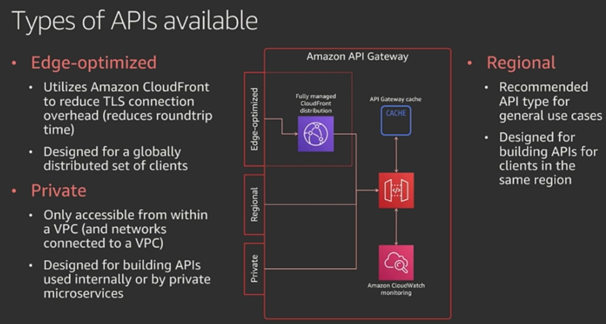
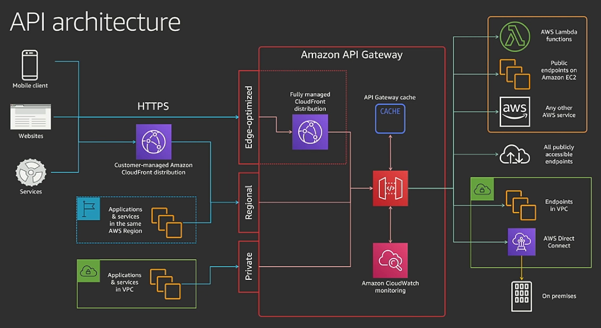
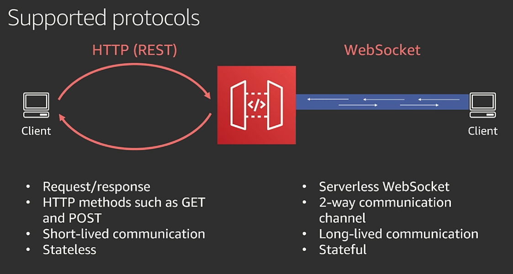
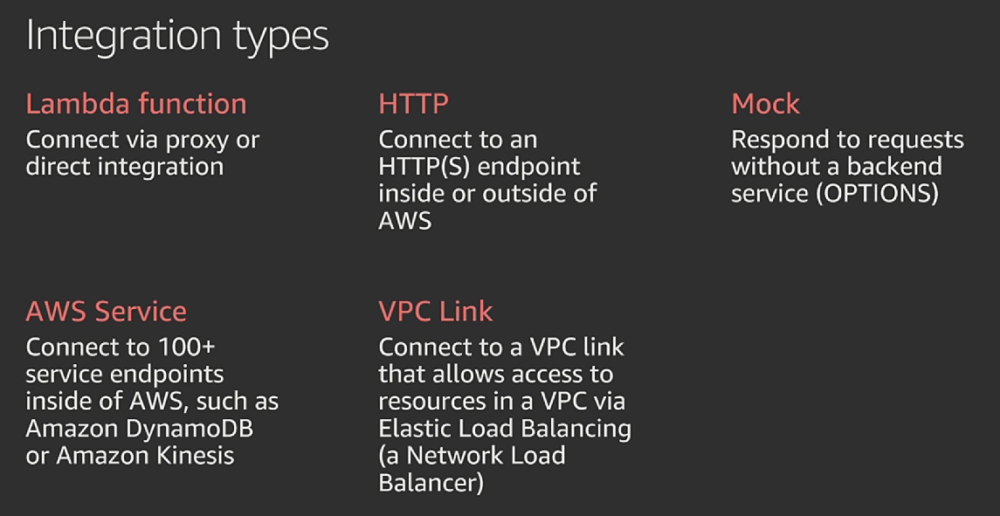
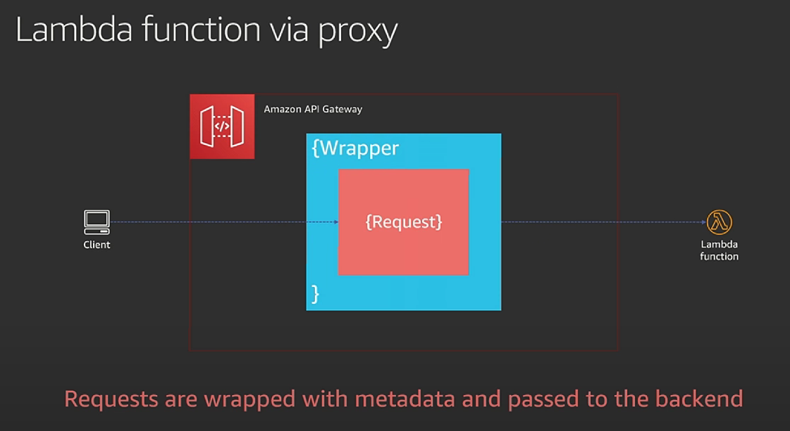
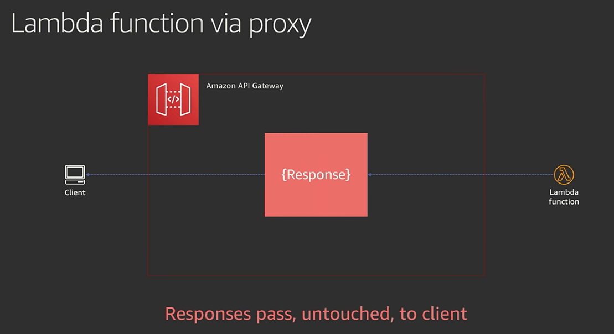
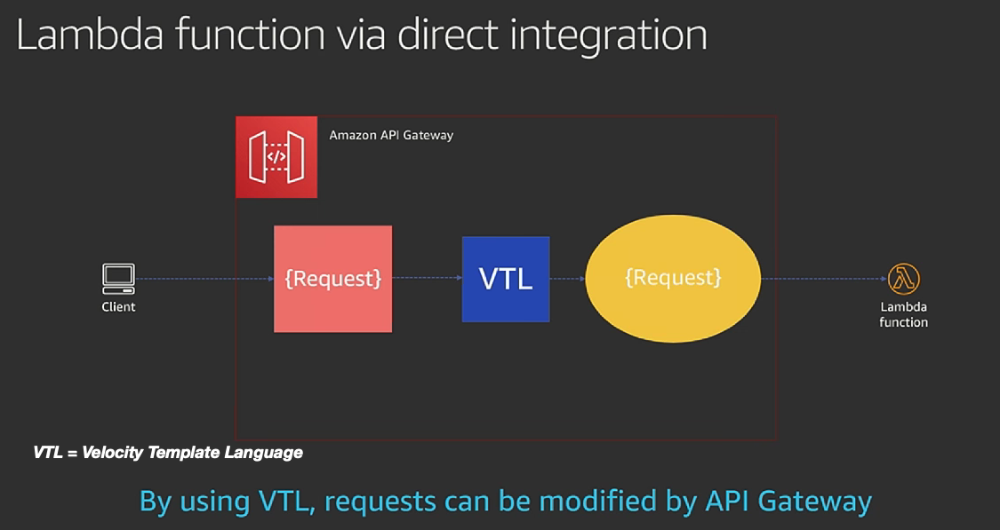
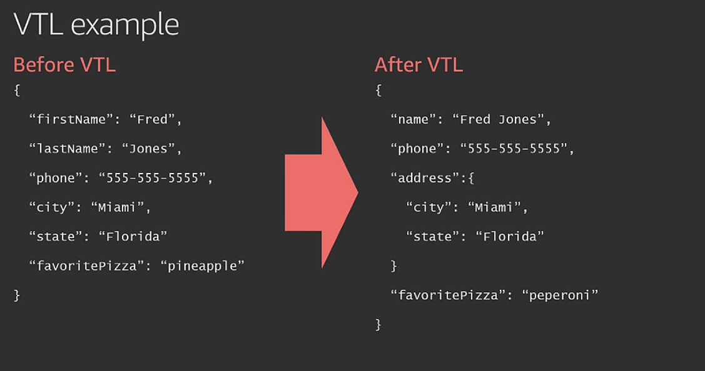

1. [CHATGPT] whats the benefit of fronting an application load balancer with api gateway

Fronting an application load balancer with an API Gateway can offer several benefits, depending on your specific use case and requirements. Here are some of the potential benefits:

**API Management Features:** API Gateways are designed to provide a layer of management and control over your APIs. They offer features like request/response transformation, rate limiting, caching, security (authentication and authorization), monitoring, and analytics. By using an API Gateway, you can centralize these management and security features for your APIs.

**Security:** API Gateways can provide enhanced security features like authentication and authorization mechanisms. You can implement token-based authentication, OAuth, API keys, and more to secure your APIs. This adds an extra layer of protection for your application load balancer and backend services.

**Simplified Client Access:** An API Gateway can consolidate multiple backend services and expose a unified API. This can simplify client-side code by reducing the number of endpoints and making it easier to consume different services.

**Traffic Routing and Load Balancing:** Even though you're fronting your load balancer, an API Gateway can still handle initial traffic routing. This can be useful for A/B testing, canary deployments, blue-green deployments, and other traffic management strategies.

**Request/Response Transformation:** API Gateways can perform transformations on the incoming requests and outgoing responses. This is useful for aggregating data from multiple backend services or formatting data in a way that's optimal for the client.

**Caching:** API Gateways can cache responses to improve performance and reduce the load on backend services. This can be particularly effective for read-heavy APIs.

**Analytics and Monitoring:** API Gateways often provide detailed analytics and monitoring features, giving you insights into how your APIs are being used, where bottlenecks might occur, and how to optimize performance.

**Versioning and Lifecycle Management:** API Gateways can help manage API versioning and the lifecycle of APIs. This can make it easier to introduce new versions without disrupting existing clients.

**Scalability:** API Gateways can handle scaling independently from your backend services. This means you can optimize the scaling strategy for the gateway separately from your load balancer and backend services.

**Developer Experience:** API Gateways can improve the developer experience by offering features like interactive documentation, SDK generation, and client code samples.

**Global Distribution and Content Delivery:** If your API needs to be accessed from various regions around the world, an API Gateway can work with content delivery networks (CDNs) to optimize response times and reduce latency.

It's important to note that while using an API Gateway can bring these benefits, it also introduces an additional layer of complexity to your architecture. This can impact latency and increase points of failure. Therefore, the decision to use an API Gateway should be based on your specific requirements and trade-offs.

# When should I consider using HTTP over REST API in API Gateway?

1. When you don't need throttling, caching and just want it to proxying a Lambda
https://youtu.be/yfJZc3sJZ8E?t=464

# References

1. [Building a serverless URL shortener app without AWS Lambda – part 1 by Eric Johnson ](https://aws.amazon.com/blogs/compute/building-a-serverless-url-shortener-app-without-lambda-part-1/)

https://youtu.be/yfJZc3sJZ8E?t=1902
https://youtu.be/yfJZc3sJZ8E?t=1965
https://youtu.be/yfJZc3sJZ8E?t=2005
https://youtu.be/yfJZc3sJZ8E?t=2192
https://github.com/aws-samples/api-gateway-auth
https://repost.aws/it/questions/QU4Pu8S9R6TZSpGBH8bxbe9w/what-is-the-correct-way-of-setting-up-authorization-for-api-gateway-using-aws-sam

https://www.youtube.com/watch?v=klOScYEojzY
https://github.com/aws-samples/sessions-with-aws-sam

https://youtu.be/yfJZc3sJZ8E?t=2272

https://youtu.be/yfJZc3sJZ8E?t=2434

https://youtu.be/yfJZc3sJZ8E?t=2659

https://youtu.be/yfJZc3sJZ8E?t=2773

https://youtu.be/yfJZc3sJZ8E?t=3167

https://youtu.be/yfJZc3sJZ8E?t=3184

https://youtu.be/yfJZc3sJZ8E?t=3235

# Custom domains
https://aws.amazon.com/blogs/compute/implementing-custom-domain-names-for-amazon-api-gateway-private-endpoints-using-a-reverse-proxy/
https://www.readysetcloud.io/blog/allen.helton/adding-a-custom-domain-to-aws-api-gateway/
https://www.youtube.com/watch?v=Ro0rgeLDkO4
https://www.youtube.com/watch?v=lOLRAipYiVg
https://www.youtube.com/watch?v=ESei6XQ7dMg

# How to restrict based on usage plan?
https://aws.amazon.com/blogs/compute/building-well-architected-serverless-applications-regulating-inbound-request-rates-part-2/

# How to protecct non-scalable resources?
https://aws.amazon.com/blogs/compute/building-well-architected-serverless-applications-regulating-inbound-request-rates-part-2/#Best practice: Use mechanisms to protect non-scalable resources

# Direct Integration

Direct Integration possible with AWS Lambda, Event brdige, Kinesis, SQS, App Config, AWS Step Functions

# Private Integrations

1. https://aws.amazon.com/blogs/compute/architecting-for-scale-with-amazon-api-gateway-private-integrations/

# Authorizations

1. [Sessions With SAM (S1E1): Simple HTTP API with JWT Authorizer By Serverless Land](https://www.youtube.com/watch?v=klOScYEojzY&list=PLJo-rJlep0ED198FJnTzhIB5Aut_1vDAd&index=1&pp=iAQB)
2. [Sessions With SAM (S1E2): Cognito and HTTP API By Serverless Land](https://www.youtube.com/watch?v=klOScYEojzY&list=PLJo-rJlep0ED198FJnTzhIB5Aut_1vDAd&index=1&pp=iAQB)
https://www.youtube.com/watch?v=73R02KufLac&list=PLJo-rJlep0ED198FJnTzhIB5Aut_1vDAd&index=3&pp=iAQB
3. [Introducing IAM and Lambda authorizers for Amazon API Gateway HTTP APIs by Julian Wood](https://aws.amazon.com/blogs/compute/introducing-iam-and-lambda-authorizers-for-amazon-api-gateway-http-apis/)

# Videos

1. [Sessions with SAM](https://www.youtube.com/playlist?list=PLJo-rJlep0ED198FJnTzhIB5Aut_1vDAd)

