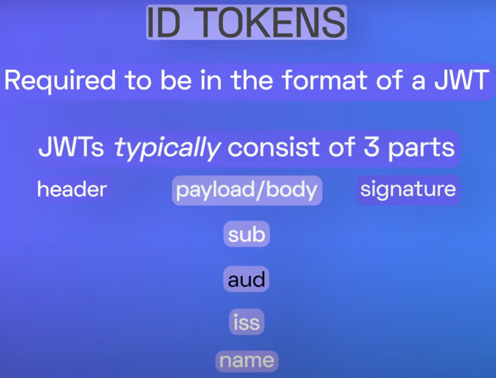

1. [OAuth 2.0 and OpenID Connect (in plain English) By Nate Barbettini](https://www.youtube.com/watch?v=996OiexHze0)
2. [OAuth and OpenID Connect Clearly Explained By Nate Barbettini](https://www.youtube.com/watch?app=desktop&v=NkdKZzlzyCk)

# 1. ID Token vs Access Token

src: https://auth0.com/blog/id-token-access-token-what-is-the-difference/

## 1.1. ID Token (Used by OIDC)

ID Token is a JWT which consists of:

- Header
- Payload
- Signature

Payload has several pieces of **claims** or information:

- **sub**: unique identifier for a user
- **aud**: which application is meant to be the final recipient of this ID token
- **iss**: the issuer (identity provider) who created the token
- **name**: name of the user
- **profile picture**: photo of the user
- **email**: user's email

ID Tokens are **NOT** meant for **authorization**.

It is meant to indicate that users have logged in and authenticated themselves.

They do have any authorization information inside of them and therefore ID Tokens should not be sent to an API

## 1.2. Access Token (used OAuth 2.0)

Access tokes signal to the server that client is allowed to perform certain tasks, or access certain resources.

Access tokens can be any string and therefore need not be JWT token (ie not a requirement)

Access tokens are **NOT** used for authentication

When using the Access token it's **NOT** required the user is still logged in.

### 1.2.1. Problems

Anyone having a access token can impersonate as the user.  One solution is to create access token with short lifespan.

## 1.3. Refresh Tokens

when the access token expires, applications can use a refresh token to get a new access token without asking the user to login again

# 2. Other

1. https://www.youtube.com/watch?v=o_MuvVF9pY4
1. [ID Tokens VS Access Tokens: What's the Difference?](https://www.youtube.com/watch?v=vVM1Tpu9QB4)