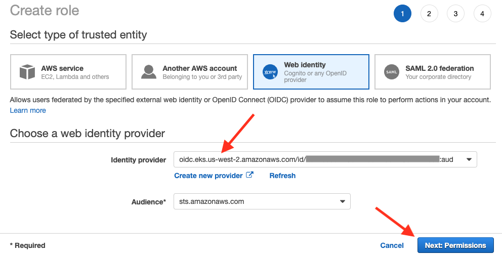

<h1>EKS Add-ons</h1>

1. What are add-ons?

Add-ons are Kubernetes applications that are running on your cluster. These are daemonSets that you can monitorIn

2. Some common add-ons

- VPC CNI plugin (aws-node)

3. Where to add or update an add-on?

# IAM Roles for service accounts

1. What is this used for?

IAM for service accounts allows you to assign IAM permissions directly to the Kubernetes applications, instead of granting broad IAM permissions that applications share when they run on the cluster’s nodes.

2. How are these assigned?
When a cluster is first created, add-on software that requires IAM permissions (like the **VPC CNI plugin**) will inherit permissions from the Amazon EC2 instances (or nodes) where it runs.

Because your cluster must be active to configure IAM for service accounts, add-ons enabled **during cluster creation** will always start **using the node role**

# Example

1. create an OpenID Connect (OIDC) provider for a service account to use.

To do so get the OIDC URL as follows:

2. Create an IAM role that uses it.

This is the IAM role that will give permissions to the add-on (such as **VPC-CNI’s ‘aws-node’ pods**).

Note: While this role is for a single cluster, you could use the same role for this application across multiple clusters by adding conditions to the trust relationship policy.

3. attach the managed **AmazonEKS_CNI_Policy**

4. Modify the trust policy of the role

to include your cluster and the Amazon VPC CNI’s service account (aws-node).

The correct format of the entity is

`oidc.eks.<region>.amazonaws.com/id/<oidc provider ID>:sub": "system:serviceaccount:kube-system:aws-node`

5. update the add-on to use the new IAM role.

6. Remove `VPC CNI policy from any node roles`

Once this role is applied, you can remove the VPC CNI policy from any node roles you have defined

How?

7. Use server side apply to prevent accidental override of configuration changes

1. [Amazon EKS add-ons preserve customer edits
by Jimmy Ray ](https://aws.amazon.com/blogs/containers/amazon-eks-add-ons-preserve-customer-edits/)

# References
1. https://aws.amazon.com/blogs/containers/introducing-amazon-eks-add-ons/

# More
1. [Amazon EKS add-ons preserve customer edits by Jimmy Ray ](https://aws.amazon.com/blogs/containers/amazon-eks-add-ons-preserve-customer-edits/)