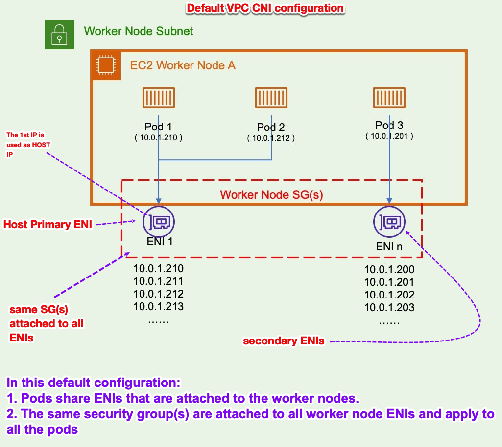
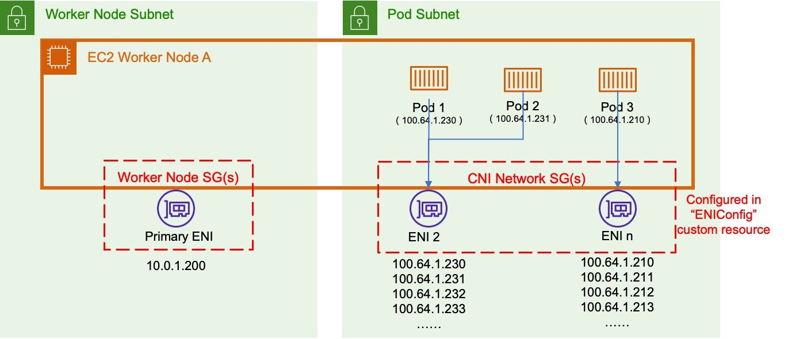
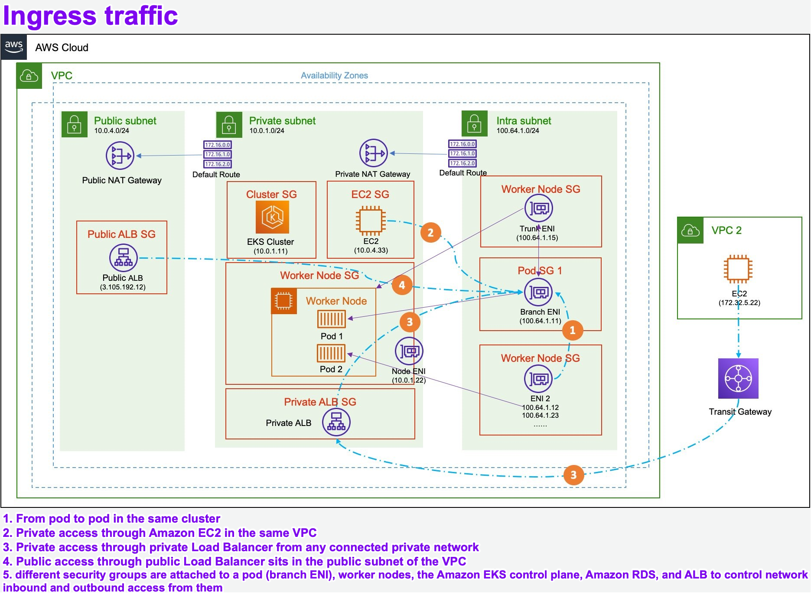
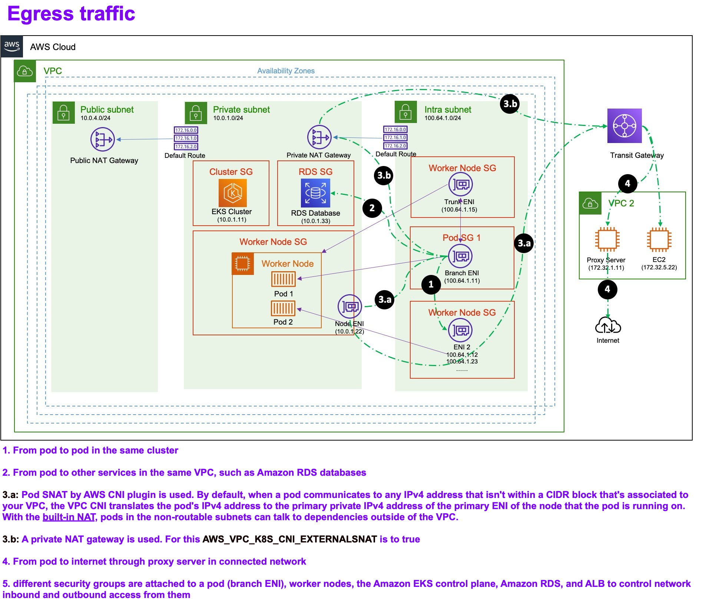

<h1>EKS Networking</h1>

# 1. Default CNI behavior without enabling <u>CNI custom networking</u>

1. When an Amazon EC2 instance is provisioned, one ENI attached to an underlying subnet with the **Worker Node Security Group** attached.
2. A **primary IP** that is attached to the ENI is used to access the host.
3. As more pods are deployed on the EC2 instance, the VPC CNI attaches secondary IPs from the VPC to the same ENI until the limit on that ENI is reached.
4. When the 1st ENI runs out of IPs it can support, the VPC CNI provisions a secondary ENI on the same subnet and fills it with the secondary IPs.
5. This process continues until the ENI and secondary IP **limits of an EC2 instance** are reached.  Different EC2 instance type support different number of ENIs and secondary IPs [limits of each instance](https://docs.aws.amazon.com/AWSEC2/latest/UserGuide/using-eni.html)
6. **Same Security group is shared across all ENIs**: The same security group(s) are attached to all worker node ENIs and <u>apply to all the pods</u>.

# 2. Enabling <u>custom networking</u> <u>without security groups</u> for pods

When we enable CNI custom networking, the pods won’t be provisioned on the first ENI. Instead, a second ENI with an IP address from the custom CNI CIDR range attaches to the node and the pods attach to this ENI with addresses from the non-routable CIDR range. The number of ENIs and secondary IPs consumed from this non-routable CIDR range are restricted by the [limits of each instance](https://docs.aws.amazon.com/AWSEC2/latest/UserGuide/using-eni.html)

1. The worker node uses one ENI and one IP address from the primary subnet.
2. The additional ENIs attached to the worker nodes are provisioned in a different subnet (`100.64 CIDR block`).
3. Pods no longer consume IP address from the worker nodes subnet. Pods consume IPs from the non-routable block instead.
4. The additional ENIs have their own security group(s) defined within the ENIConfig custom resource for each non-routable subnet.
5. Custom networking supports Kubernetes Network Policy engines (such as Calico Network Policy) for network segmentation.

# 3. Enabling custom networking with security groups for pods

# 4. Ingress

# 5. Egress

**Write diagrams from following:**
https://catalog.us-east-1.prod.workshops.aws/workshops/afee4679-89af-408b-8108-44f5b1065cc7/en-US/500-eks-terraform-workshop/510-scenario/intro

https://aws.amazon.com/blogs/containers/leveraging-cni-custom-networking-alongside-security-groups-for-pods-in-amazon-eks/
https://jicowan.medium.com/custom-networking-with-the-aws-vpc-cni-plug-in-c6eebb105220
https://jicowan.medium.com/the-impacts-of-using-custom-networking-with-the-aws-vpc-cni-65f109d245be
https://blog.sivamuthukumar.com/eks-high-pod-density

# 6. What is Trunking
1. https://docs.aws.amazon.com/AmazonECS/latest/developerguide/container-instance-eni.html#eni-trunking-considerations
1. https://aws.amazon.com/blogs/containers/leveraging-cni-custom-networking-alongside-security-groups-for-pods-in-amazon-eks/
1. [Increasing task density with ENI Trunking](https://docs.aws.amazon.com/AmazonECS/latest/bestpracticesguide/networking-networkmode-awsvpc.html)

# 7. Using custom CNI

1. To use a new CIDR range for the pods update `aws-node daemonset` by setting following varaible:
`AWS_VPC_K8S_CNI_CUSTOM_NETWORK_CFG=TRUE`

When this variable is set to true, the CNI will allocate IP addresses from the subnet specified in the `ENIConfig` assigned to the worker node.

**ENIConfig (aka custom resource definition CRD)**: This lets you specify the subnet and security groups you want to use for the pods running on a particular worker node

# 8. How does Prefix Delegation allow more pods (density) per node instance

[See here](../../amazon-eks-networking.md#5-prefix-delegation)

## 8.1. How to enable prefix delegation

# 9. CNI custom networking

src: https://aws.amazon.com/blogs/containers/leveraging-cni-custom-networking-alongside-security-groups-for-pods-in-amazon-eks/

You can attach a CIDR range from the `100.64.0.0/10` or `198.19.0.0/16` ranges to your VPC and then use CNI custom networking to provide additional IP space for Kubernetes pods.

# 10. VPC CNI and POD Security

To provide POD level security, the VPC CNI creates a separate elastic network interface (ENI) for each pod, instead of the default configuration where multiple pods share an ENI.

Different security groups can be attached to each Kubernetes pod because each pod has its own ENI

A common example is limiting access to Amazon Relational Database Service (Amazon RDS) databases to pods with a certain a security group

