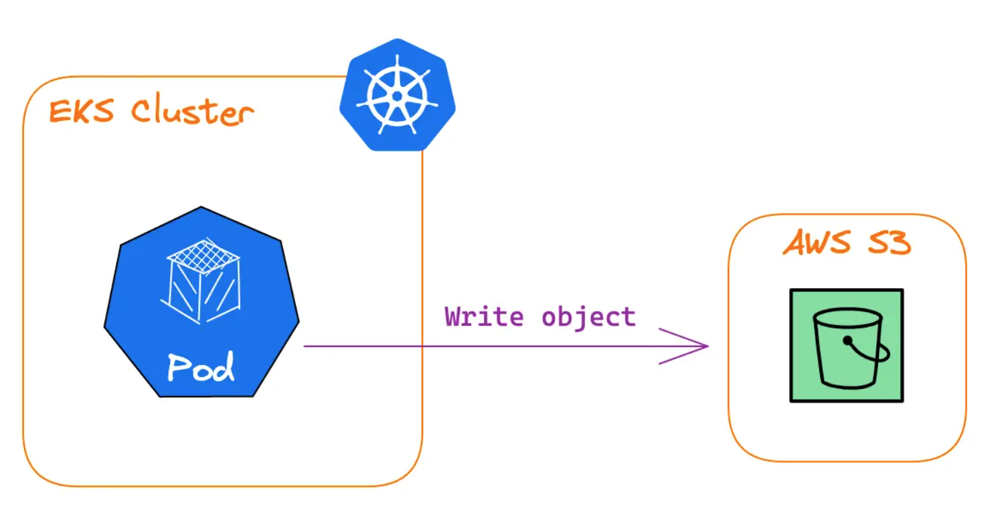

1. How to allow Pods to write to S3 bucket

* Create An **IAM Role** with permissions to write objects to your S3 bucket
* Create an **IAM OpenID Connect (OIDC) provider** for your cluster
* Configure a Kubernetes **ServiceAccount** to **assume an IAM Role**
* Configure your workloads to use this **ServiceAccount**

# References
1. https://www.padok.fr/en/blog/aws-eks-iam
1. Read thru' ServiceAccounts@Chapter 12 of KIA-ed1