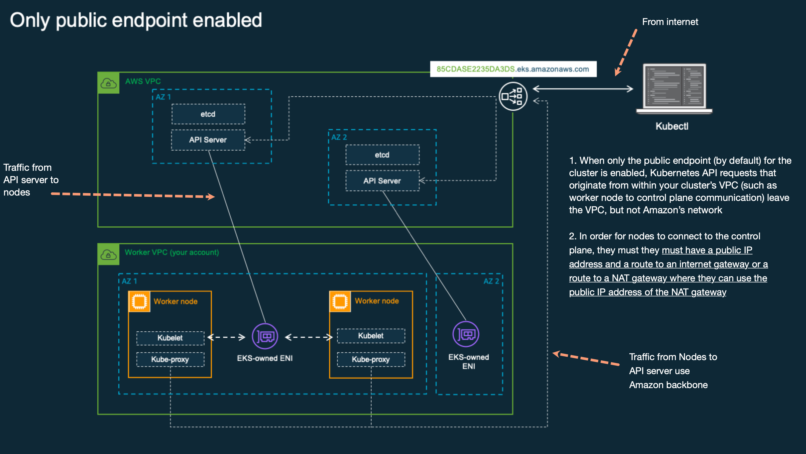
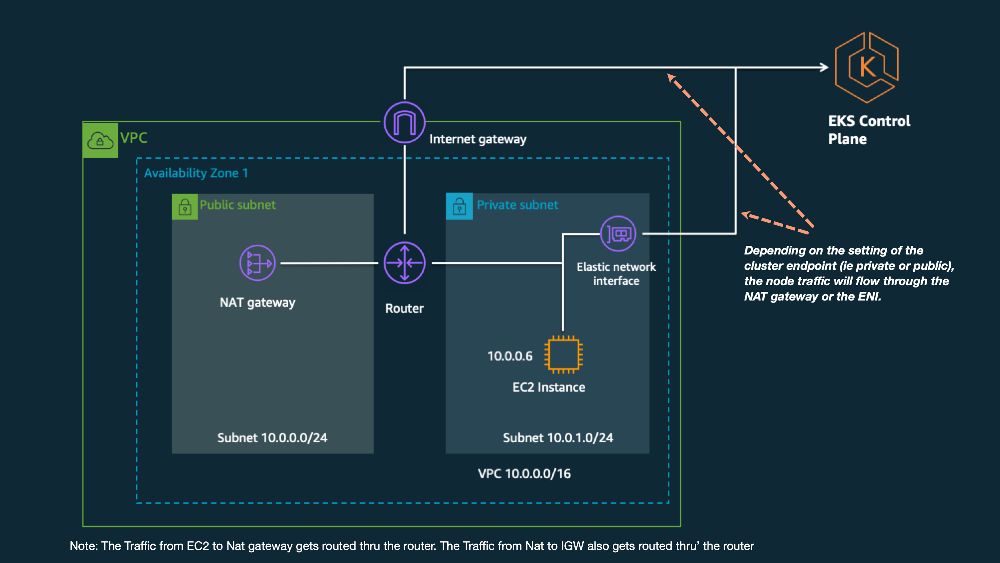

1. An EKS cluster consists of two VPCs

one VPC managed by AWS that hosts the Kubernetes control plane and a second VPC managed by customers that hosts the Kubernetes worker nodes (EC2 instances) where containers run, as well as other AWS infrastructure (like load balancers) used by the cluster

2. How do worker nodes talk to API server endpint

- either thru' public endpoint
- or through the EKS-managed elastic network interfaces (ENIs) that are placed in the subnets that you provide when you create the cluster.

3. How does the worker node which route to take - public or private ENI?

The route that worker nodes take to connect is determined by whether you have enabled or disabled the private endpoint for your cluster.

4. Does EKS provision the ENIs even when private endpoint is disabled?

Yes, since the ENI is used by the API server to run `kubectl exec` and logs

# EKS managed ENI provisioned in customer VPC

sequence of events -

1. EC2 instance starts. Kubelet and the Kubernetes node agent are started as part of the boot process on each instance.
2. Kubelet reaches out to the Kubernetes cluster endpoint to register the node. It connects to the public endpoint outside of the VPC or to the private endpoint within the VPC.
3. Kubelet receives API commands and sends regular status and heartbeats to the endpoint. When you query the API server (`kubectl get nodes`), you see the latest status that each node’s Kubelet has reported back to the API server.

NOTE: If the node is unable to reach the cluster endpoint, it’s unable to register with the control plane and thus unable to receive commands to start or stop pods

# Different ways to control access to API server endpoint

1. Thru' CIDR restrictions: This allow you to limit the client IP addresses that can connect to the public endpoint.
2. Access can be controlled via the console or API.

# [FAQ/VPC] Difference between Private and Public subnets

If a subnet is associated with a route table that has a route to an internet gateway, it’s known as a public subnet. If a subnet is associated with a route table that does not have a route to an internet gateway, it’s known as a private subnet.

# [FAQ/VPC] Ingress vs Egress

The ability for traffic that originates somewhere else to reach your nodes is called **ingress**. Traffic that originates from the nodes and leaves the network is called **egress**

# [FAQ/VPC/EC2] AssociatePublicIpAddress vs MapPublicIpOnLaunch

**AssociatePublicIpAddress** controls whether a specific ENI associated with an instance should have a **public IP address**, while **MapPublicIpOnLaunch** controls whether **all instances** launched within a subnet **should be assigned public IP** addresses b**y default**.

**1. AssociatePublicIpAddress**:

- This attribute is associated with an individual Elastic Network Interface (ENI).
- When you launch an EC2 instance within a subnet, if **AssociatePublicIpAddress** is set to **true** for the **specific ENI attached to that instance**, AWS will automatically assign a public IP address from the subnet's range to that ENI.
- **Why useful?** This setting is useful when you need specific instances to have direct access to the internet without the need for a NAT gateway or a NAT instance.

**2. MapPublicIpOnLaunch**:

- This attribute is associated with a subnet.
- When set to true, it indicates that any new EC2 instance launched within that subnet should automatically receive a public IP address.
- Unlike **AssociatePublicIpAddress**, which is **specific to an ENI**, **MapPublicIpOnLaunch** is a setting **applied to the entire subnet** and affects all instances launched within it.

# 3 ways configure the VPC for your Amazon EKS cluster

## 1. Public only subnets

- Every subnet should be configured with **mapPublicIpOnLaunch** set to **TRUE** and have a route to an internet gateway.
- Nodes do not need a value for **AssociatePublicIpAddress** (do not include this value in the CFN template or API call)
- The cluster endpoint can be set (somewhere in the console) to enable public, private, or both (public + private)

See `amazon-eks-vpc-sample.yaml`

## 2. Public + Private subnets

1. Because you are not launching nodes in the public subnets, it’s not required to set `mapPublicIpOnLaunch` for public subnets.
2. `mapPublicIpOnLaunch` should be set to **FALSE** for the private subnets.
3. Nodes do not need a value for `AssociatePublicIpAddress` (do not include this value in the CFN template or API call)
4. The cluster endpoint can be set to enable public, private, or both (public + private). Depending on the setting of the cluster endpoint, the node traffic will flow through the NAT gateway or the ENI.

See: `amazon-eks-vpc-private-subnets.yaml`

## 3. Private only subnets

1. `mapPublicIpOnLaunch` should be set to FALSE for the private subnets.
2. Nodes do not need a value for `AssociatePublicIpAddress` (do not include this value in the CFN template or API call)
3. Only the private cluster endpoint should be enabled (disable public endpoint). You will need a VPN connection to access your cluster endpoint.
4. Enable AWS PrivateLink for EC2 and all of your Amazon ECR and S3 repositories.
5. You must set up PrivateLink interface and/or gateway endpoints for your Kubernetes application to be able to reach other AWS services.
6. All container images you launch on the cluster must come from ECR repositories with endpoints configured for your VPC. This includes container images for operational tooling such as ClusterAutoscaler and Metrics Server.

# References

1. https://aws.amazon.com/blogs/containers/de-mystifying-cluster-networking-for-amazon-eks-worker-nodes/
1. https://aws.amazon.com/blogs/containers/upcoming-changes-to-ip-assignment-for-eks-managed-node-groups/