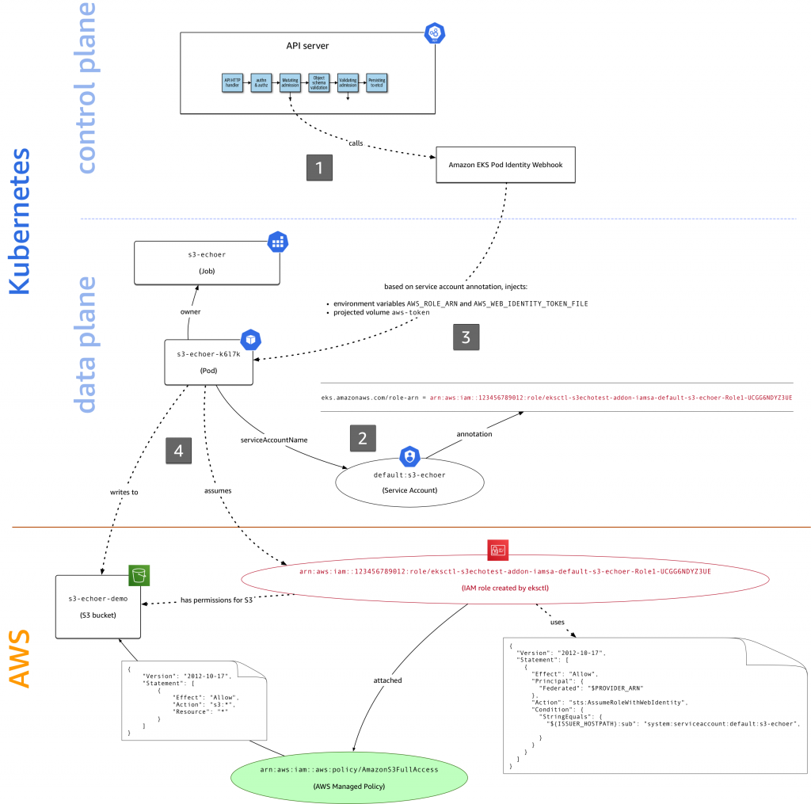
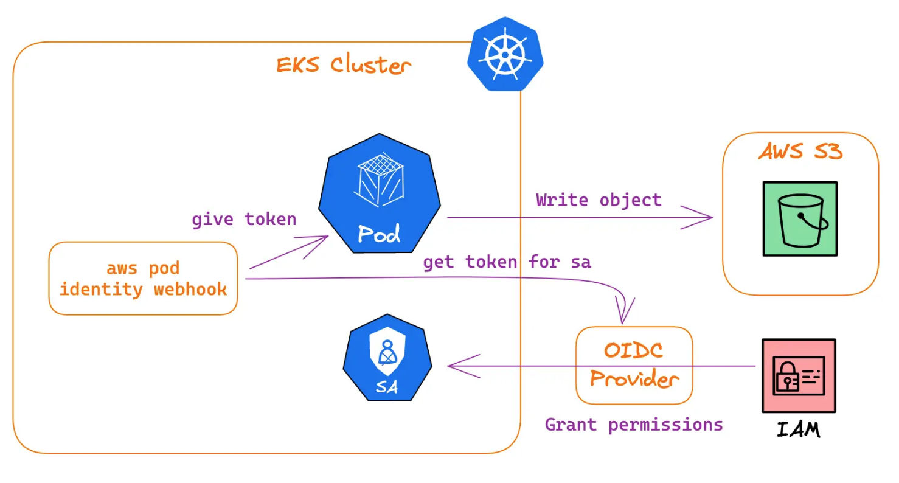
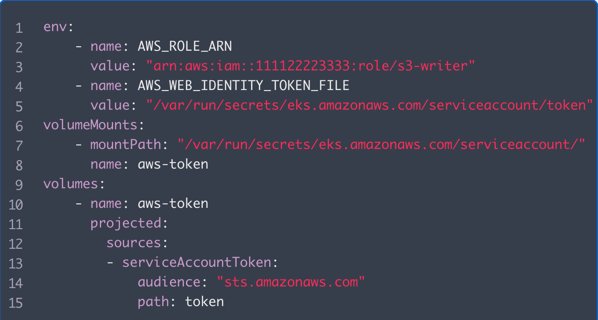

1. [EKS provisioning — VPC, OIDC, MNG, IAM by Yassine Essadraoui](https://medium.com/@yassine.essadraoui_78000/eks-provisioning-vpc-oidc-mng-iam-8d9cef7fcdcd)
1. [OpenID Connect (OIDC): — AWS EKS use case by Yassine Essadraoui](https://medium.com/@yassine.essadraoui_78000/openid-connect-oidc-aws-eks-use-case-a94af59be42b)
1. [Implementing and Understanding IAM Roles for Service Accounts in AWS EKS By Anil Goyal](https://medium.com/@anil.goyal0057/implementing-and-understanding-iam-roles-for-service-accounts-in-aws-eks-00e8fd2a0262)
1. [Introducing OIDC identity provider authentication for Amazon EKS by Rashmi Dwaraka, Mike Stefaniak, and Paavan Mistry ](https://aws.amazon.com/blogs/containers/introducing-oidc-identity-provider-authentication-amazon-eks/)
1. [Introducing fine-grained IAM roles for service accounts by Micah Hausler and Michael Hausenblas](https://aws.amazon.com/blogs/opensource/introducing-fine-grained-iam-roles-service-accounts/)
1. [Diving into IAM Roles for Service Accounts by Gaurav Pilay](https://aws.amazon.com/blogs/containers/diving-into-iam-roles-for-service-accounts/)

# 1. ChatGPT

In AWS EKS (Amazon Elastic Kubernetes Service) OIDC (OpenID Connect), both "issuer" and "provider" play crucial roles in enabling Kubernetes clusters running on AWS to authenticate users via OIDC tokens.

**Issuer**: In the context of AWS EKS OIDC, the issuer refers to the identity provider (IDP) that issues the OIDC tokens used for authentication. In other words, the issuer is responsible for generating tokens that Kubernetes clusters can use to verify the identity of users or services attempting to access the cluster. The issuer typically identifies itself using a URL, often the URL of the OIDC provider.

**Provider**: The provider, on the other hand, refers to the service that verifies the tokens issued by the issuer. In AWS EKS OIDC, Amazon Cognito Identity Pools or any other OIDC-compatible identity provider can act as the provider. The provider validates the tokens presented by users or services to ensure that they are genuine and have not been tampered with.

In summary, the issuer generates the OIDC tokens, while the provider verifies these tokens. Together, they establish a secure authentication mechanism for users and services to access Kubernetes clusters in AWS EKS.

# 2. Difference between Issuer and Provider

The **identity provider in IAM** and the **OIDC provider in EKS** are essentially the same entity. They both represent the same **OIDC issuer**, and they use the same public and private keys to sign and verify JWTs.

> The role of the OIDC provider in IAM is to allow AWS STS to trust JWTs that are issued by the OIDC provider in EKS.

src: https://medium.com/@anil.goyal0057/implementing-and-understanding-iam-roles-for-service-accounts-in-aws-eks-00e8fd2a0262

# 3. Example: Trust Policy

This policy grants **great-serviceaccount** permissions to assume a Role. The Role has permissions to access AWS services

src: https://www.padok.fr/en/blog/aws-eks-iam

This policy statement allows users authenticated by the OIDC provider "**server.example.com**", with specific subject and audience claims in their OIDC tokens, to assume the specified IAM role in AWS.

This policy applies to identities federated by your OIDC provider

```json
{
    "Effect": "Allow",
    "Principal": {
        // users authenticated by the OIDC provider "server.example.com" are allowed to assume the role
        "Federated": "arn:aws:iam::111122223333:oidc-provider/server.example.com"
    },
    // it allows the federated identity to assume an IAM role using web identity federation
    "Action": "sts:AssumeRoleWithWebIdentity",

    // You want this policy to apply only when the sub (subject) of your identity is the
    // great-serviceaccount ServiceAccount in the great-namespace namespace.
    // Also, it should only apply when the token used for this identity has been generated
    // for talking with the sts.amazonaws.com API (i.e. the token aud for the audience matches this).

    "Condition": {
        "StringEquals": {

            // checks if the sub (subject) claim in the OIDC token issued by "server.example.com"
            // is equal to "system:serviceaccount:great-namespace:great-serviceaccount"
            // This condition ensures that only requests from a specific service account
            // (great-serviceaccount) in a specific Kubernetes namespace (great-namespace) are allowed
            "server.example.com:sub": "system:serviceaccount:great-namespace:great-serviceaccount",

            // condition checks if the aud (audience) claim in the OIDC token issued by
            // "server.example.com" is equal to "sts.amazonaws.com"
            // the token is intended for STS thereby indicating that it's meant for
            // assuming a role within AWS
            "server.example.com:aud": "sts.amazonaws.com"
        }
    }
}
```

Also see:
1. [How to use trust policies with IAM roles by Jonathan Jenkyn and Liam Wadman](https://aws.amazon.com/blogs/security/how-to-use-trust-policies-with-iam-roles/)
- the meaning of `sub` and `aud` used as claims in Access Tokens


# 4. Assuming the IAM Role in a Pod

1. Annotate ServiceAccount

Here we tell ServiceAccount that we want it to assume the s3-writer Role

```yaml
apiVersion: v1
kind: ServiceAccount
metadata:
  name: great-serviceaccount
  namespace: great-namespace
  annotations:
    eks.amazonaws.com/role-arn: "arn:aws:iam::111122223333:role/s3-writer"
```

2. Indicate to pod which SA to use

```yaml
apiVersion: v1
kind: Pod
metadata:
  name: great-pod
  namespace: great-namespace
spec:
  serviceAccountName: great-serviceaccount
  [...]
```

# 5. How does `Amazon EKS Pod Identity Webhook` get called from AdmissionControllers



# 6. How does `Amazon EKS Pod Identity Webhook` get the TOKEN




# 7. What is injected into the pod by `Amazon EKS Pod Identity Webhook`



**Project**: https://github.com/aws/amazon-eks-pod-identity-webhook


# 8. Parts of JWT token

* Issuer: This is OIDC provider url.
* Subject: It is unique identifier for the service account.
* Audience: Intended recipient of the token i.e., “sts.amazonaws.com”
* Expiration Time: expiration time of token.
* Issued At: when token was issued.
* Kubernetes Namespace: namespace of service account.
* Service Account Name: name of service account

# Difference between EKS OIDC Provider vs IAM Identity Provider

see [OIDC provider URL and OIDC authentication in Amazon EKS cluster configuration](https://aws.amazon.com/blogs/containers/introducing-oidc-identity-provider-authentication-amazon-eks/)
