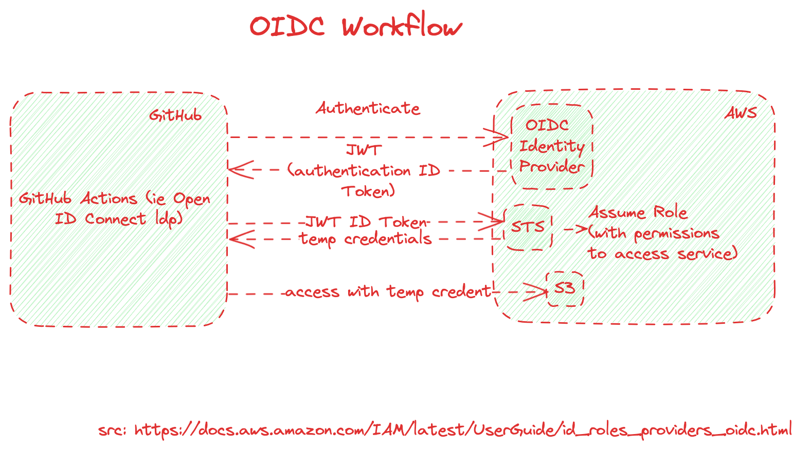
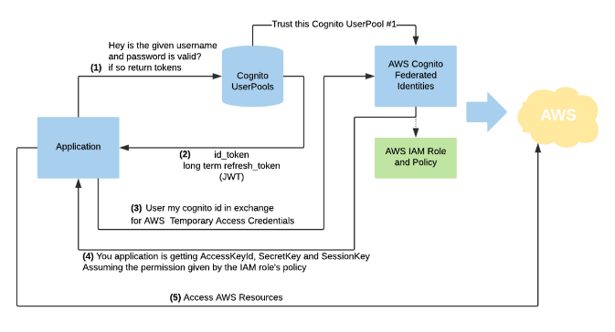

# OIDC Workflow

**IAM OIDC identity providers:** are entities in IAM that describe an **external identity provider (IdP) service** that supports the OpenID Connect (OIDC) standard, such as Google or Salesforce.

You use an IAM OIDC identity provider when you want to establish trust between an OIDC-compatible IdP and your AWS account.

# [DAVIS] Whats the difference between Identity provider and Service Providers

Things like user accounts are stored in **identity provider**.

The **service provider** is the application or service that's being offered.

# Example

# References

1.  [DAVIS] https://www.udemy.com/course/aws-iam-aws-organizations-aws-sso-aws-directory-service-federation/learn/lecture/23211346#overview
1. [EKS provisioning — VPC, OIDC, MNG, IAM by Yassine Essadraoui](https://medium.com/@yassine.essadraoui_78000/eks-provisioning-vpc-oidc-mng-iam-8d9cef7fcdcd)
1. [OpenID Connect (OIDC): — AWS EKS use case by Yassine Essadraoui](https://medium.com/@yassine.essadraoui_78000/openid-connect-oidc-aws-eks-use-case-a94af59be42b)
1. sub claims - https://docs.github.com/en/actions/deployment/security-hardening-your-deployments/about-security-hardening-with-openid-connect#example-subject-claims