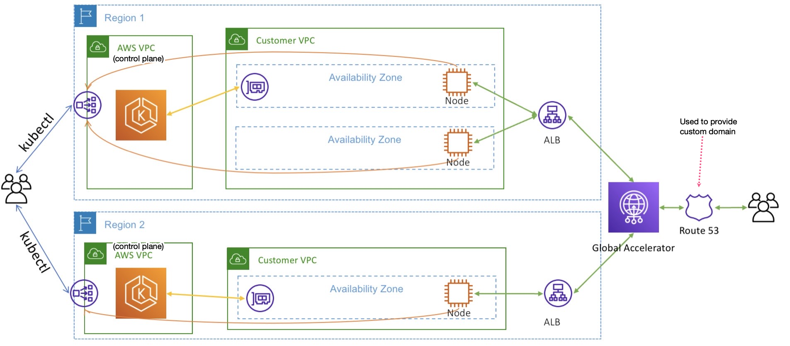

1. create cluster in 2 regions

```bash
eksctl create cluster --name multi-region-blog
```

2. Set env variables

```bash
export AWS_REGION_1=<<Primary AWS Region>>
export AWS_REGION_2=<<Secondary AWS Region>>
export EKS_CLUSTER_1=<<EKS cluster name in the primary AWS Region>>
export EKS_CLUSTER_2=<<EKS cluster name in the secondary AWS Region>>
export my_domain=<<example.com Your domain>>
export ACCOUNT_ID=$(aws sts get-caller-identity --query 'Account' --output text)
```

3. Install the AWS Load Balancer Controller in 2 regions

```bash
eksctl utils associate-iam-oidc-provider \
  --region $AWS_REGION_1 \
  --cluster $EKS_CLUSTER_1 \
  --approve

eksctl utils associate-iam-oidc-provider \
  --region $AWS_REGION_2 \
  --cluster $EKS_CLUSTER_2 \
  --approve
```

4. Download the IAM policy document for AWS Load Balancer Controller

```bash
curl https://raw.githubusercontent.com/kubernetes-sigs/aws-load-balancer-controller/main/docs/install/iam_policy.json > awslb-policy.json
```

5. Create an IAM Policy for ALB Controller

```bash
aws iam create-policy \
    --policy-name AWSLoadBalancerControllerIAMPolicy \
    --policy-document file://awslb-policy.json
```

6. Create an IAM role, and create a Kubernetes service account in both clusters:

```bash
eksctl create iamserviceaccount \
  --cluster $EKS_CLUSTER_1 \
  --namespace kube-system \
  --region $AWS_REGION_1 \
  --name aws-load-balancer-controller \
  --attach-policy-arn arn:aws:iam::${ACCOUNT_ID}:policy/AWSLoadBalancerControllerIAMPolicy \
  --override-existing-serviceaccounts \
  --approve

eksctl create iamserviceaccount \
  --cluster $EKS_CLUSTER_2 \
  --namespace kube-system \
  --region $AWS_REGION_2 \
  --name aws-load-balancer-controller \
  --attach-policy-arn arn:aws:iam::${ACCOUNT_ID}:policy/AWSLoadBalancerControllerIAMPolicy \
  --override-existing-serviceaccounts \
  --approve
```

7. Update your kubeconfig for Region1

```bash
aws eks update-kubeconfig \
  --name $EKS_CLUSTER_1 \
  --region $AWS_REGION_1
```

8. Install the controller using helm

```bash
helm repo add eks https://aws.github.io/eks-charts
kubectl apply -k "github.com/aws/eks-charts/stable/aws-load-balancer-controller//crds?ref=master"
helm upgrade -i aws-load-balancer-controller \
  eks/aws-load-balancer-controller \
  -n kube-system \
  --set clusterName=$EKS_CLUSTER_1 \
  --set serviceAccount.create=false \
  --set serviceAccount.name=aws-load-balancer-controller
```

9. Repeat for 2nd cluster

```bash
aws eks update-kubeconfig \
  --name $EKS_CLUSTER_2 \
  --region $AWS_REGION_2

kubectl apply -k "github.com/aws/eks-charts/stable/aws-load-balancer-controller//crds?ref=master"
helm upgrade -i aws-load-balancer-controller \
  eks/aws-load-balancer-controller \
  -n kube-system \
  --set clusterName=$EKS_CLUSTER_2 \
  --set serviceAccount.create=false \
  --set serviceAccount.name=aws-load-balancer-controller
```

# Deploy the sample application

1. Create the deployment file

```bash
cat > sample_application.yaml <<EOF
apiVersion: apps/v1
kind: Deployment
metadata:
  labels:
    app: py-az
  name: py-az
spec:
  replicas: 1
  selector:
    matchLabels:
      app: py-az
  template:
    metadata:
      labels:
        app: py-az
    spec:
      containers:
      - image: public.ecr.aws/b5x3e7x1/eks-py-az
        name: eks-py-az
        ports:
        - containerPort: 5000
          protocol: TCP
---
apiVersion: v1
kind: Service
metadata:
  annotations:
  labels:
    app: py-az
  name: py-az
spec:
  ports:
  - port: 80
    protocol: TCP
    targetPort: 5000
  type: NodePort
  selector:
    app: py-az
status:
  loadBalancer: {}
---
apiVersion: extensions/v1beta1
kind: Ingress
metadata:
  name: "py-az-ingress"
  annotations:
    kubernetes.io/ingress.class: alb
    alb.ingress.kubernetes.io/scheme: internet-facing
  labels:
    app: py-az
spec:
  rules:
    - host:
      http:
        paths:
          - path: /*
            backend:
              serviceName: "py-az"
              servicePort: 80
EOF
```

2. Apply

```bash
kubectl apply -f sample_application.yaml
```