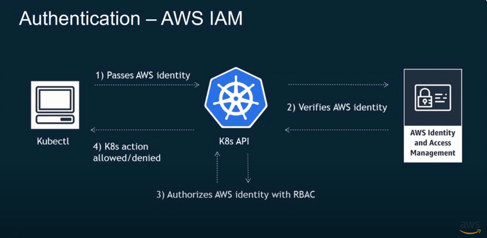

An **access entry** is a cluster identity—directly linked to an AWS IAM principal user or role—that is used to authenticate to an Amazon EKS cluster.

An Amazon EKS **access policy** authorizes an access entry to perform specific cluster actions

# Authentication in EKS uses IAM

RBAC is used for authorization

src: https://www.youtube.com/watch?v=4l4Kuds8O3s

# References

1. [A deep dive into simplified Amazon EKS access management controls by Sheetal Joshi, Rodrigo Bersa, and Mike Stefaniak](https://aws.amazon.com/blogs/containers/a-deep-dive-into-simplified-amazon-eks-access-management-controls/)
1. [Securing Your Amazon EKS Cluster - AWS Online Tech Talks By Paven Mistry](https://www.youtube.com/watch?v=4l4Kuds8O3s)