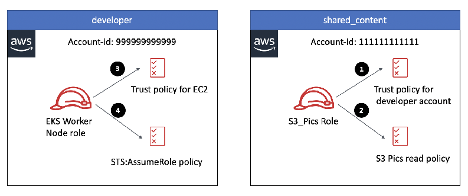

[Cross account IAM roles for Kubernetes service accounts by Amit Borulkar](https://aws.amazon.com/blogs/containers/cross-account-iam-roles-for-kubernetes-service-accounts/)

# Cross Acccoun access Prior to IRSA



Prior to IRSA, to access the pics bucket in shared_content account, we perform the following steps:

1. Create a `S3_Pics role` in shared_content account, which creates trust relationship between shared_content and developer account.

```json
// Trust Policy for S3_Pics Role
{
  "Version": "2012-10-17",
  "Statement": [
    {
      "Effect": "Allow",
      "Principal": {
        "AWS": "arn:aws:iam::DEVELOPER_ACCOUNT_ID:root"
      },
      "Action": "sts:AssumeRole"
    }
  ]
}
```

2. Attach a policy to S3_Pics role, which allows `ReadOnlyAccess` only access to the pics bucket.

```json
{
  "Version": "2012-10-17",
  "Statement": [
    {
      "Effect": "Allow",
      "Action": "s3:GetObject",
      "Resource": "arn:aws:s3:::pics-bucket/*"
    }
  ]
}
```

3. Attach an Amazon EC2 trust relationship policy to the Amazon EKS (EKS) worker node role in developer account.

```json
{
  "Version": "2012-10-17",
  "Statement": [
    {
      "Effect": "Allow",
      "Principal": {
        "Service": "ec2.amazonaws.com"
      },
      "Action": "sts:AssumeRole"
    }
  ]
}
```

4. Attach a policy to the EKS worker node role, which allows the EKS worker nodes to perform a `sts:AssumeRole` operation to assume `S3_Pics` role in Shared account.

```json
{
  "Version": "2012-10-17",
  "Statement": [
    {
      "Effect": "Allow",
      "Action": "sts:AssumeRole",
      "Resource": "arn:aws:iam::SHARED_CONTENT_ACCOUNT_ID:role/S3_Pics"
    }
  ]
}
```

# Drawbacks of this approach

One of the major drawbacks of this approach is that all the pods running on the EKS worker nodes have access to the pics bucket in the shared_content account. Additionally, since the Kubernetes scheduler might schedule pods on any of the worker nodes (unless you are using additional pod placement configuration), you would need to attach the policy to all the EKS worker nodes.