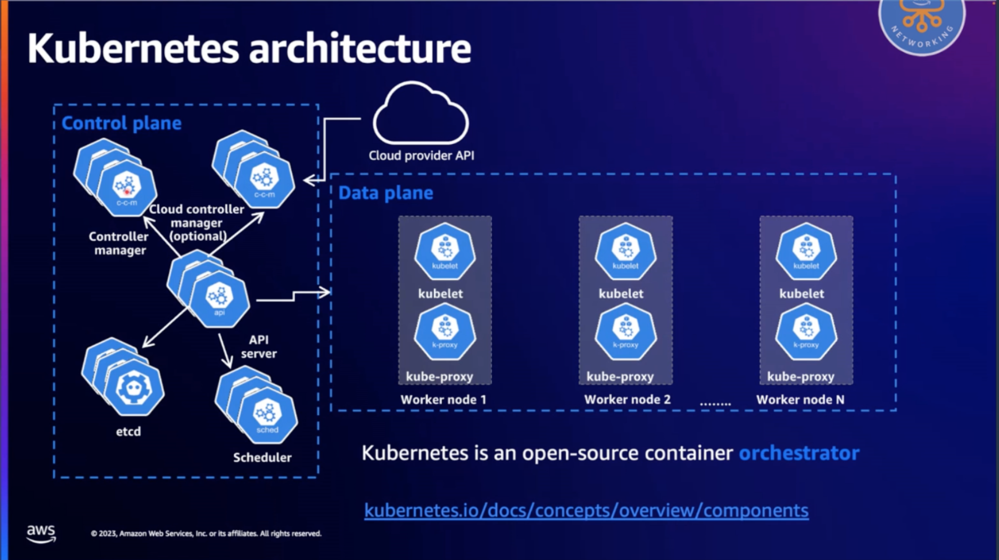
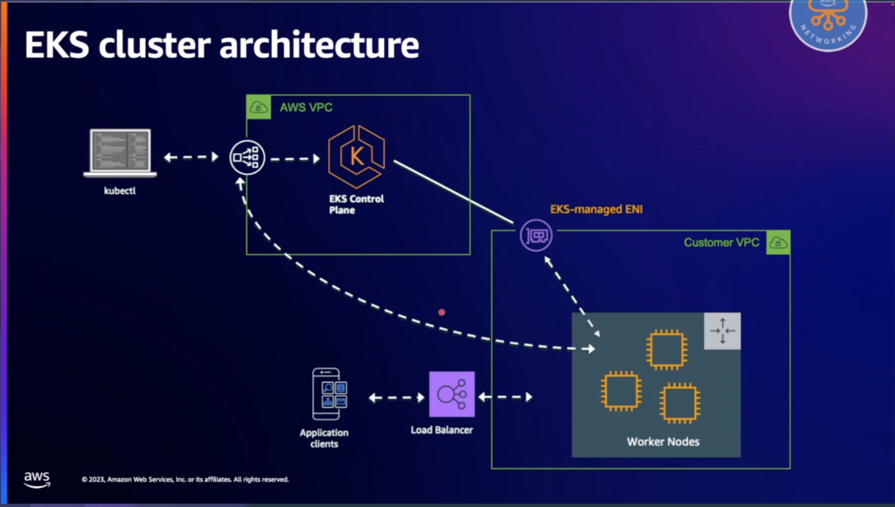
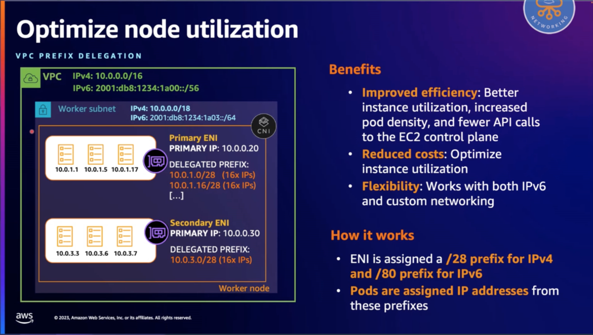
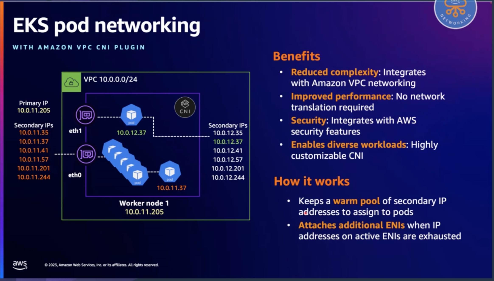
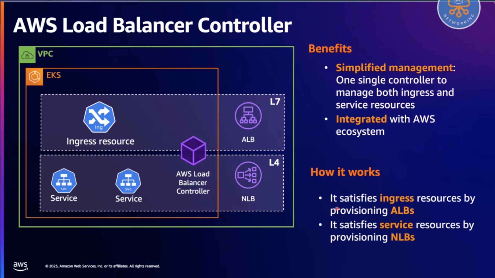
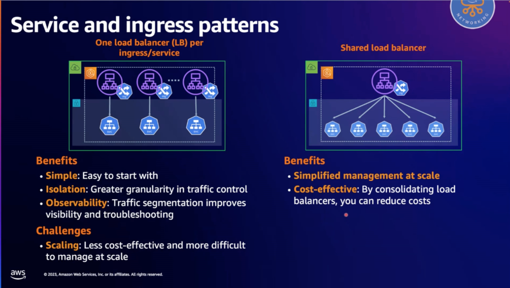
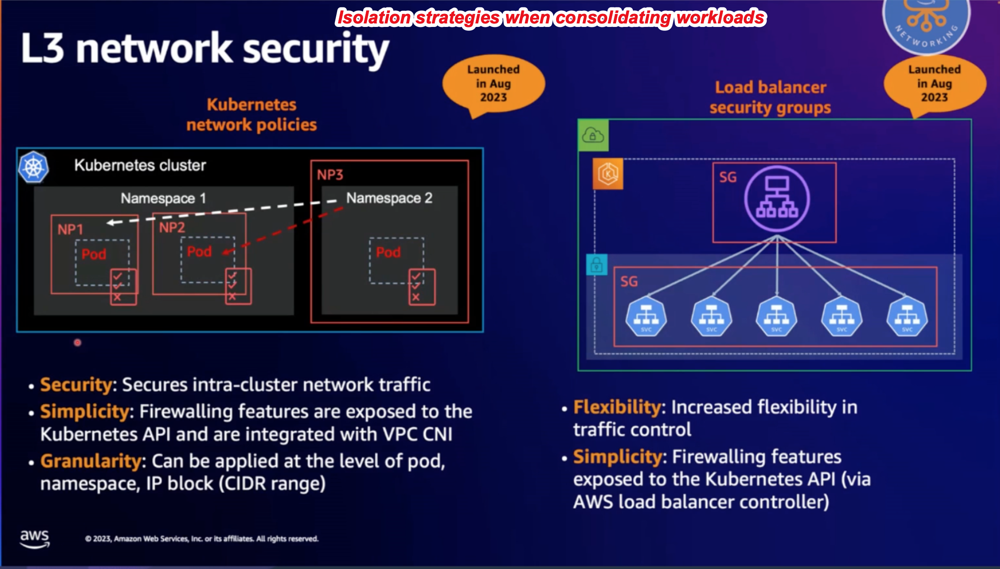
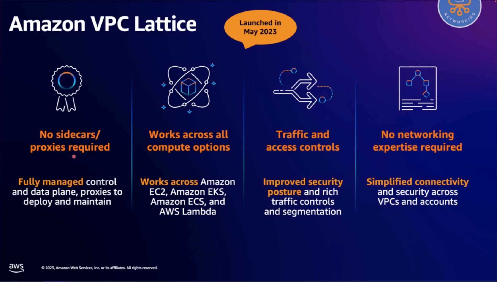
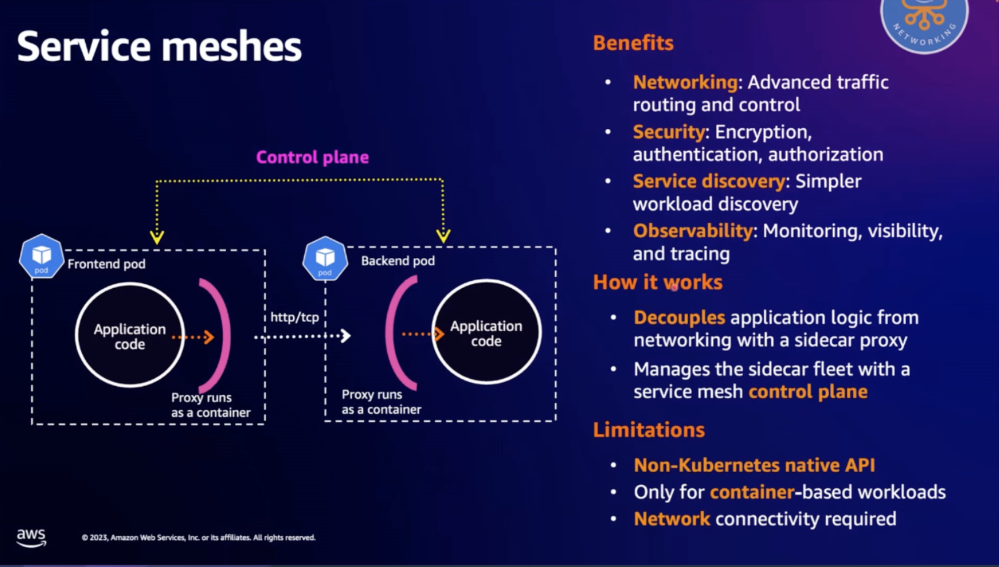

# References

1. https://www.theroutingloop.net/2024/02/08/chalk-talk_k8s.html
1. [The Routing Loop - Chalk Talk - Networking strategies for Kubernetes on AWS](https://www.twitch.tv/videos/2057125802?collection=HBANRY7lIxagXQ)
1. [The Routing Loop - Networking Strategies for Kubernetes on AWS - Part 2](https://www.twitch.tv/videos/2063623113)