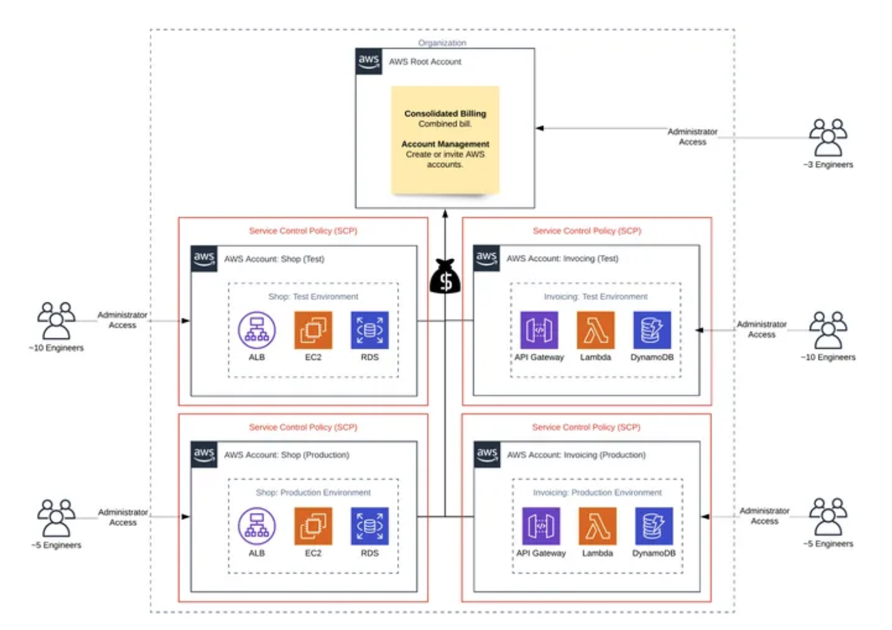

# Why do you need to create accounts?

An AWS account is a **container of AWS resources**. Using multiple AWS accounts is a best practice for scaling environments, as it **provides** a **natural billing boundary for costs, isolates resources for security, gives flexibility for individuals and teams, in addition to being adaptable for new business processes.**

# Organization

Organizations help to programmatically create new accounts and allocate resources, and simplify billing by setting up a single payment method for all accounts.

AWS Organizations is integrated with other AWS services so admins can define central configurations, security mechanisms, and resource sharing across accounts.

# References

1. https://jumpcloud.com/blog/aws-iam-vs-aws-sso