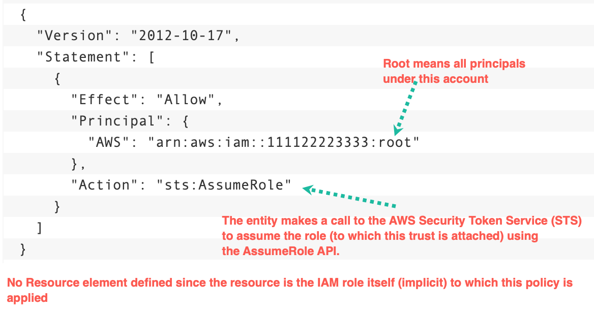
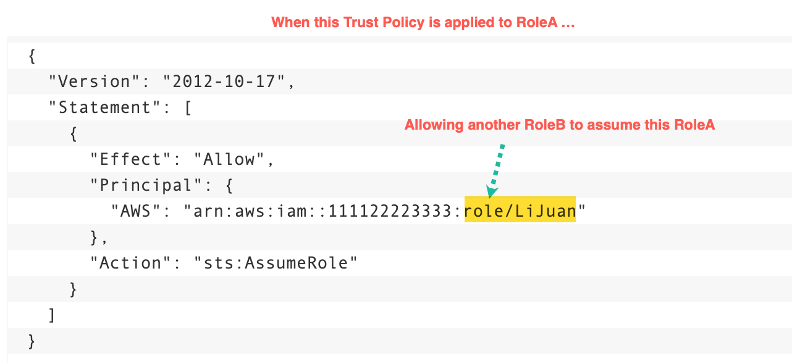
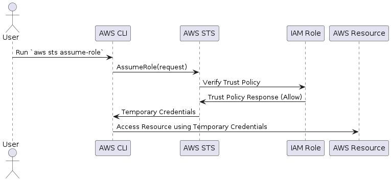

[How to use trust policies with IAM roles by Jonathan Jenkyn and Liam Wadman](https://aws.amazon.com/blogs/security/how-to-use-trust-policies-with-iam-roles/)
[AssumeRole with External-Id - 1-Minute AWS IAM Lesson](https://www.youtube.com/watch?v=DLVlW3dOJww)
1. [[**MY_NEXT**] How do I assume an IAM role using the AWS CLI?](https://repost.aws/knowledge-center/iam-assume-role-cli)

A trust policy is a specific type of **resource-based policy** for IAM roles

# AssumeRole

A common use case is when you need to provide access to a **role in account A** to assume a **role in Account B**.

To facilitate this, you add an entry in the role in account B’s trust policy that allows authenticated principals from account A to assume the role through the sts:AssumeRole API call





# The Role Assumption Process

src: https://blog.awsfundamentals.com/aws-iam-roles-terms-concepts-and-examples



2 necessary preconditions must be met for a principal to assume a role.

* the principal needs to have permission to use the **sts:AssumeRole action** for the specific role they want to assume.
* The role must have a trust policy that allows the principal to use it.

When an entity assumes a role, the AWS Security Token Service (STS) issues temporary security credentials which includes a session token.

```javascript {.line-numbers}
aws sts assume-role \
  --role-arn "arn:aws:iam::<ACCOUNT_ID>:role/<ROLE_NAME>"
  --role-session-name "MySession"
  --duration-seconds 84600
```

The output of assume-role

```javascript {.line-numbers}
{
  "Credentials": {
    "AccessKeyId": "ASIAxxxxxxxxxxxx",
    "SecretAccessKey": "2666f327xxxxxxxxxxxx",
    "SessionToken": "e8bcee6czxxxxxxx",
    "Expiration": "2023-03-18T15:37:11Z"
    },
    "AssumedRoleUser": {
      "AssumedRoleId": "AROAxxxxxxxxxxxx:MyRoleSession",
      "Arn": "arn:aws:sts::<ACCOUNT_ID>:assumed-role/<ROLE_NAME>/MySession"
    }
}
```

export the necessary environment variables

```javascript {.line-numbers}
export AWS_ACCESS_KEY_ID=ASIAxxxxxxxxxxxx
export AWS_SECRET_ACCESS_KEY=2666f327xxxxxxxxxxxx
export AWS_SESSION_TOKEN=e8bcee6czxxxxxxx
```

From now on, any AWS CLI commands you execute will employ the temporary credentials and permissions from the assumed role.