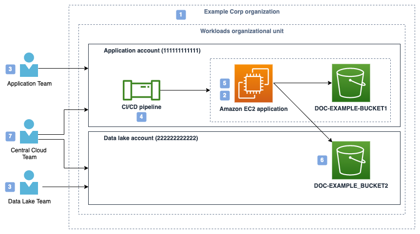

<h1>E2E - Policy Management in Organization</h1>

# 1. Objectives

1. How and when to use SCPs?
2. How different Teams like Cloud Central Team (from Management account) interacts with development (using application account) and data lake teams (using a different data lake account)
3. How CCT team gives itself ReadOnlyAccess in application account?
4. How CCT team gives limited and well controlled roles to application account using IAM Roles
5. How CCT team enforces Permission Boundaries in application account.

# 2. Architecture



Policy number | Policy description | Policy type | Policy owner | Attached to
--------------|--------------------|-------------|--------------|------------
1 | Enforce SSL and prevent member accounts from leaving the organization for all principals in the organization | Service control policy (SCP) | Central Cloud Team | Organization root
2 | Restrict maximum permissions for roles created by CI/CD pipeline | Permissions boundary | Central Cloud Team | All roles created by the pipeline (ApplicationRole)
3 | Scoped read-only policy | Identity-based policy | Central Cloud Team | DeveloperReadOnlyRole IAM role
4 | CI/CD pipeline policy | Identity-based policy | Central Cloud Team | CICDPipelineRole IAM role
5 | Policy used by running application to read and write to S3 buckets | Identity-based policy | Application Team | ApplicationRole on EC2 instance
6 | Bucket policy in data lake account that grants access to a role in application account | Resource-based policy | Data Lake Team | S3 Bucket in data lake account
7 | Broad read-only policy | Identity-based policy | Central Cloud Team | CentralCloudTeamReadonlyRole IAM role

# 3. Detailed walk-thru

1. [SCP] How to restrict accounts to use only HTTPs and prevent them from leaving the organization

Use SCP attached to AWS Organizations organization root

- Deny all requests that are not sent using SSL (TLS)

```json
// Policy 1: SCP attached to AWS Organizations organization root
{
    "Id": "ServiceControlPolicy",
    "Version": "2012-10-17",
    "Statement": [{
        "Sid": "DenyIfRequestIsNotUsingSSL",
        "Effect": "Deny",
        "Action": "*",
        "Resource": "*",
        "Condition": {
            "BoolIfExists": {
                "aws:SecureTransport": "false"
            }
        }
    }]
}
```

- prevent account of from leaving the organization

```json
// Policy 1 (Cont'd): SCP attached to AWS Organizations organization root
{
    "Id": "ServiceControlPolicy",
    "Version": "2012-10-17",
    "Statement": [
    {
        "Sid": "PreventLeavingTheOrganization",
        "Effect": "Deny",
        "Action": "organizations:LeaveOrganization",
        "Resource": "*"
    }]
}
```

- Central Cloud Team (CCT) wants to allow the Application Team to deploy their own IAM principals and policies for their applications
- The Central Cloud Team also wants to make sure that any principals created by the Application Team can only use AWS APIs that the Central Cloud Team has approved.
- the Application Team deploys to their production AWS environment through a continuous integration/continuous deployment (CI/CD) pipeline.
    -  The Central Cloud Team implements a control that requires that all IAM roles created by the pipeline **must have** a **permissions boundary attached**.

- Sample permission boundary (PB) that CCT attaches to the pipeline or even to the Application Team's role

```json
// Policy 2: Permissions boundary policy attached to IAM roles created by the CI/CD pipeline
{
    "Id": "PermissionsBoundaryPolicy",
    "Version": "2012-10-17",
    "Statement": [{
        "Effect": "Allow",
        "Action": [
            "s3:PutObject",
            "s3:GetObject",
            "sqs:ChangeMessageVisibility",
            "sqs:DeleteMessage",
            "sqs:ReceiveMessage",
            "sqs:SendMessage",
            "sqs:PurgeQueue",
            "sqs:GetQueueUrl",
            "logs:PutLogEvents"
         ],
        "Resource": "*"
    }]
}
```

As when access to new services are needed, the CCT team attaches them to the PB

# 4. How can the CCT enforce that above permission boundary are attached to the Roles created by Pipeline (or Application ream)

CCT creates 3 Roles in the Application Account.  These are managed by the CCT

1. A read-only role for the Central Cloud Team, with a process for temporary elevated access.
    - For this CCT creates `CentralCloudTeamReadonlyRole` with `IAMReadOnlyAccess` policy
    - If he needs to perform activities beyond ReadOnlyAccess he gets elevated access

2. A read-only role for members of the Application Team.
    - For this CCT creates `DeveloperReadOnlyRole`
    - To this Role following policy is attached to only operate on Amazon EC2, Amazon S3, Amazon SQS, AWS CloudFormation, and Amazon CloudWatch

```json
// Policy 3: Identity-based policy attached to a developer read-only role to support human access and troubleshooting

{
"Id": "DeveloperRoleBaselinePolicy",
"Version": "2012-10-17",
"Statement": [
    {
      "Effect": "Allow",
      "Action": [
          "cloudformation:Describe*",
              "cloudformation:Get*",
              "cloudformation:List*",
              "cloudwatch:Describe*",
              "cloudwatch:Get*",
              "cloudwatch:List*",
              "ec2:Describe*",
              "ec2:Get*",
              "ec2:List*",
              "ec2:Search*",
              "s3:Describe*",
              "s3:Get*",
              "s3:List*",
              "sqs:Get*",
              "sqs:List*",
              "logs:Describe*",
              "logs:FilterLogEvents",
              "logs:Get*",
              "logs:List*",
              "logs:StartQuery",
              "logs:StopQuery"
          ],
          "Resource": "*"
      }
    ]
}
```

3. A role for the CI/CD pipeline to use to deploy application resources.

- The CI/CD pipeline is allowed to create new IAM roles for use with the application, but those roles are limited to actions allowed by the permissions boundary
- The roles, policies, and EC2 instance profiles that the pipeline creates should also be restricted to specific role paths.
- By using role paths, enforce that the pipeline can only modify roles and policies or pass roles that it has created.
- allows the passing and creation of a limited set of service-linked roles (which are created in the path /aws-service-role/).

```json
// Policy 4: Identity-based policy attached to CI/CD pipeline role
{
    "Id": "CICDPipelineBaselinePolicy",
    "Version": "2012-10-17",
    "Statement": [
    {
      // General AWS Services Access: This grants broad permissions to manage various AWS services,
      // likely for deploying and managing infrastructure as part of a CI/CD pipeline.
        "Effect": "Allow",
        "Action": [
            "ec2:*",
            "sqs:*",
            "s3:*",
            "cloudwatch:*",
            "cloudformation:*",
            "logs:*",
            "autoscaling:*"
        ],
        "Resource": "*"
    },
    {
        // SSM Parameter Store Access: Allows the retrieval of specific system parameters,
        // which could be used for configuration management or deployment
        "Effect": "Allow",
        "Action": "ssm:GetParameter*",
        "Resource": "arn:aws:ssm:*::parameter/aws/service/*"
    },
    {
        // IAM Role Management: Allows creation and management of roles, but only under
        // strict conditions ensuring a permissions boundary is applied
        "Effect": "Allow",
        "Action": [
            "iam:CreateRole",
            "iam:PutRolePolicy",
            "iam:DeleteRolePolicy"
        ],
        "Resource": "arn:aws:iam::111111111111:role/application-roles/*",
        "Condition": {
            "ArnEquals": {
                "iam:PermissionsBoundary": "arn:aws:iam::111111111111:policy/PermissionsBoundary"
            }
        }
    },
    {
        // Attaching and Detaching Role Policies:  Grants the ability to manage which policies are
        // attached to roles, ensuring that only specific policies can be attached
        "Effect": "Allow",
        "Action": [
            "iam:AttachRolePolicy",
            "iam:DetachRolePolicy"
        ],
        "Resource": "arn:aws:iam::111111111111:role/application-roles/*", // Roles under the application-roles/ path
        "Condition": {
            "ArnEquals": {
                "iam:PermissionsBoundary": "arn:aws:iam::111111111111:policy/PermissionsBoundary"
            },
            "ArnLike": { // Limited to attaching/detaching specific policies within
                        // the application-role-policies/ path
                "iam:PolicyARN": "arn:aws:iam::111111111111:policy/application-role-policies/*"
            }
        }
    },
    {
        // Additional IAM Role Operations: Provides further management capabilities for roles
        // created under the application-roles/ path
        "Effect": "Allow",
        "Action": [
            "iam:DeleteRole",
            "iam:TagRole",
            "iam:UntagRole",
            "iam:GetRole",
            "iam:GetRolePolicy"
        ],
        "Resource": "arn:aws:iam::111111111111:role/application-roles/*"
    },
    {
        //IAM Policy Management: Allows full control over IAM policies within the specified path
        "Effect": "Allow",
        "Action": [
            "iam:CreatePolicy",
            "iam:DeletePolicy",
            "iam:CreatePolicyVersion",
            "iam:DeletePolicyVersion",
            "iam:GetPolicy",
            "iam:TagPolicy",
            "iam:UntagPolicy",
            "iam:SetDefaultPolicyVersion",
            "iam:ListPolicyVersions"
         ],
        "Resource": "arn:aws:iam::111111111111:policy/application-role-policies/*"
    },
    {
        // Instance Profile Management: Enables management of instance profiles, likely used
        // to attach roles to EC2 instances.
        "Effect": "Allow",
        "Action": [
            "iam:CreateInstanceProfile",
            "iam:AddRoleToInstanceProfile",
            "iam:RemoveRoleFromInstanceProfile",
            "iam:DeleteInstanceProfile"
        ],
        "Resource": "arn:aws:iam::111111111111:instance-profile/application-instance-profiles/*"
    },
    {
        // IAM PassRole Permission: Allows passing specific roles to services or instances,
        // which is essential for automation processes
        "Effect": "Allow",
        "Action": "iam:PassRole",
        "Resource": [
            "arn:aws:iam::111111111111:role/application-roles/*",
            "arn:aws:iam::111111111111:role/aws-service-role/autoscaling.amazonaws.com/AWSServiceRoleForAutoScaling*"
        ]
    },
    {
        // Service-Linked Role Management: Enables the creation and deletion of service-linked roles,
        // specifically for Auto Scaling.
        "Effect": "Allow",
        "Action": "iam:CreateServiceLinkedRole",
        "Resource": "arn:aws:iam::111111111111:role/aws-service-role/*",
        "Condition": {
            "StringEquals": {
                "iam:AWSServiceName": "autoscaling.amazonaws.com"
            }
        }
    },
    {
        "Effect": "Allow",
        "Action": [
            "iam:DeleteServiceLinkedRole",
            "iam:GetServiceLinkedRoleDeletionStatus"
        ],
        "Resource": "arn:aws:iam::111111111111:role/aws-service-role/autoscaling.amazonaws.com/AWSServiceRoleForAutoScaling*"
    },
    {
       // IAM Role Listing and Retrieval: Allows listing of all roles and retrieval of specific role details
        "Effect": "Allow",
        "Action": "iam:ListRoles",
        "Resource": "*"
    },
    {
        "Effect": "Allow",
        "Action": "iam:GetRole",
        "Resource": [
            "arn:aws:iam::111111111111:role/application-roles/*",
            "arn:aws:iam::111111111111:role/aws-service-role/*"
        ]
    }]
}
```

4. How permission boundary restricts an Identity-based policy

The following permission boundary only allows PutObject and GetObject on the S3 bucket.  The identity policy therefore cannot have an action that lists the bucket, for example.

```json
// PermissionsBoundaryPolicy
{
    "Id": "PermissionsBoundaryPolicy"
    "Version": "2012-10-17",
    "Statement": [{
        "Effect": "Allow",
        "Action": [
            "s3:PutObject",
            "s3:GetObject",
            "sqs:ChangeMessageVisibility",
            "sqs:DeleteMessage",
            "sqs:ReceiveMessage",
            "sqs:SendMessage",
            "sqs:PurgeQueue",
            "sqs:GetQueueUrl",
            "logs:PutLogEvents"
         ],
        "Resource": "*"
    }]
}
```

Identity policy limited to Gets and Puts

```json
{
  "Version": "2012-10-17",
  "Statement": [
    {
      "Effect": "Allow",
      "Action": [
        "s3:PutObject",
        "s3:GetObject"
      ],
      "Resource": "arn:aws:s3:::DOC-EXAMPLE-BUCKET1/*"
    },
    {
      "Effect": "Allow",
      "Action": [
        "s3:GetObject"
      ],
      "Resource": "arn:aws:s3:::DOC-EXAMPLE-BUCKET2/*"
    }
  ]
}

```

# 5. Steps

* Create Permission boundary

```json
aws iam create-policy \
    --policy-name application-role-policies/PermissionsBoundaryPolicy \
    --policy-document '{
        "Version": "2012-10-17",
        "Statement": [
            {
                "Effect": "Allow",
                "Action": [
                    "s3:PutObject",
                    "s3:GetObject",
                    "sqs:ChangeMessageVisibility",
                    "sqs:DeleteMessage",
                    "sqs:ReceiveMessage",
                    "sqs:SendMessage",
                    "sqs:PurgeQueue",
                    "sqs:GetQueueUrl",
                    "logs:PutLogEvents"
                ],
                "Resource": "*"
            }
        ]
    }'
```

* Create Identity Policy

```json
aws iam create-policy \
    --policy-name application-role-policies/IdentityPolicy \
    --policy-document '{
        "Version": "2012-10-17",
        "Statement": [
            {
                "Effect": "Allow",
                "Action": [
                    "s3:PutObject",
                    "s3:GetObject"
                ],
                "Resource": "arn:aws:s3:::DOC-EXAMPLE-BUCKET1/*"
            },
            {
                "Effect": "Allow",
                "Action": [
                    "s3:GetObject"
                ],
                "Resource": "arn:aws:s3:::DOC-EXAMPLE-BUCKET2/*"
            }
        ]
    }'
```

* Create Role

```bash
aws iam create-role \
    --role-name application-roles/ExampleRole \
    --assume-role-policy-document '{
        "Version": "2012-10-17",
        "Statement": [
            {
                "Effect": "Allow",
                "Principal": {
                    "Service": "ec2.amazonaws.com"
                },
                "Action": "sts:AssumeRole"
            }
        ]
    }'
```

* Attach Identity policy to the role

```bash
aws iam attach-role-policy \
    --role-name application-roles/ExampleRole \
    --policy-arn arn:aws:iam::111111111111:policy/application-role-policies/IdentityPolicy
```

* Apply the Permissions Boundary to the Role

```bash
aws iam put-role-permissions-boundary \
    --role-name application-roles/ExampleRole \
    --permissions-boundary arn:aws:iam::111111111111:policy/application-role-policies/PermissionsBoundaryPolicy
```

5. Resource-based policy attached to S3 bucket in external data lake account (222222222222)

> **Important:** For an application in the same account as the bucket access can be granted by either an identity-based policy or a resource-based policy

```json
{
    "Version": "2012-10-17",
    "Statement": [{
        "Principal": {
            "AWS": "arn:aws:iam::111111111111:role/application-roles/ApplicationRole" // Role from Application Account
        },
        "Effect": "Allow",
        "Action": [
            "s3:GetObject"
        ],
        "Resource": "arn:aws:s3:::DOC-EXAMPLE-BUCKET2/*" // Bucket in DataLakeAccount
    }]
}
```


# 6. Sources

1. [Managing temporary elevated access to your AWS environment by James Greenwood, Bikash Behera, and Kevin Higgins](https://aws.amazon.com/blogs/security/managing-temporary-elevated-access-to-your-aws-environment/)
1. [Temporary elevated access management with IAM Identity Center by Taiwo Awoyinfa, James Greenwood, and Varvara Semenova](https://aws.amazon.com/blogs/security/temporary-elevated-access-management-with-iam-identity-center/)