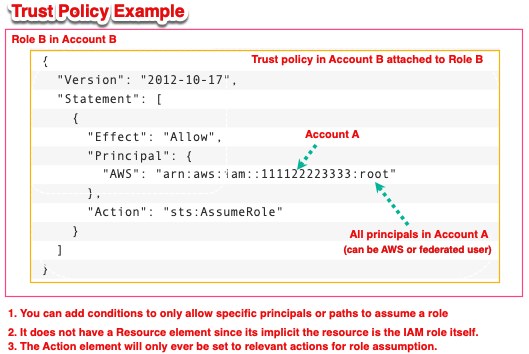
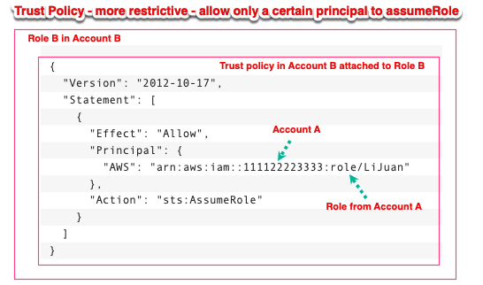
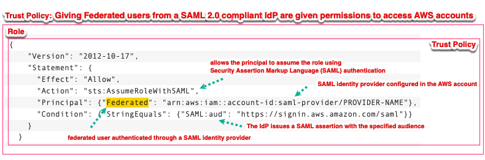
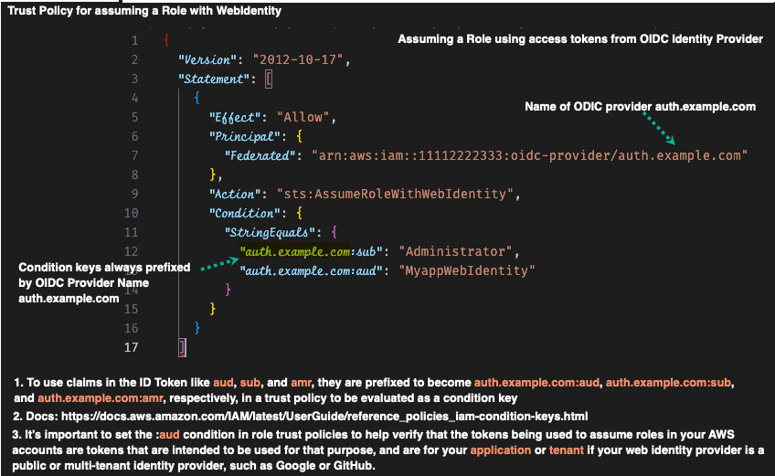
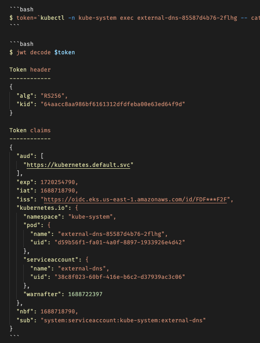

[How to use trust policies with IAM roles by Jonathan Jenkyn and Liam Wadman](https://aws.amazon.com/blogs/security/how-to-use-trust-policies-with-iam-roles/)

# Scenarios for Role Usage

1. An AWS service or resource accesses another AWS resource in your account

Example: Allow EC2 instances to call AWS services on your behalf

- Trust Policy

```json
{
  "Version": "2012-10-17",
  "Statement": [
    {
      "Effect": "Allow",
      "Principal": {
        "Service": "ec2.amazonaws.com"
      },
      "Action": "sts:AssumeRole"
    }
  ]
}
```

- Identity (permissions) policy

```json
{
  "Version": "2012-10-17",
  "Statement": [
    {
      "Effect": "Allow",
      "Action": [
        "s3:GetObject",
        "s3:PutObject"
      ],
      "Resource": "arn:aws:s3:::my-bucket/*"
    }
  ]
}
```

- Attach the Role to an EC2 Instance:

After attaching above trust and permissions policy to a custom Role (MyEC2S3AccessRole), you can attach the role to ec2 instance as follows

* When launching a new EC2 instance, you can attach the role during the instance configuration step.
* For existing instances, you can attach the role through the Actions menu by choosing Instance Settings and then **Attach/Replace IAM Role**.

2. An AWS service generates AWS credentials to be used by devices running outside AWS –
AWS IAM Roles Anywhere, AWS IoT Core, and AWS Systems Manager hybrid instances can deliver role session credentials to applications, devices, and servers that don’t run on AWS.

3. An AWS account accesses another AWS account - cross-account role pattern
It allows human or machine IAM principals from one AWS account to assume this role and act on resources within a second AWS account. A role is assumed to enable this behavior when the resource in the target account doesn’t have a resource-based policy that could be used to grant cross-account access.

# Scenario 1: Provide access to all principals in account A to assume a role in Account B



To facilitate this, you add an entry in the role in account B’s trust policy that allows authenticated principals from account A to assume the role through the sts:AssumeRole API call.

# Scenario 2: Limit access to a certain role in Account A to assume a role in Account B



# Scenario 3: Assuming a Role using SAML identity federation



The mapping of which enterprise users get which roles is established within the directory used by the SAML 2.0 IdP and is placed inside the **signed SAML assertion** by the IdP.

## [ChatGPT] Context and Use Case

## Use Case

This trust policy is typically used in scenarios where an organization uses an external identity provider (IdP) that supports SAML 2.0 to manage user identities and provide single sign-on (SSO) capabilities. Commonly, this is part of a federated authentication setup where users log in to an organizational portal and get redirected to AWS without needing separate AWS credentials.

## Example Scenario

1. Identity Provider Configuration:

* An organization has an IdP (like Active Directory Federation Services, Okta, or another SAML-compliant IdP).
* The IdP is configured to issue SAML assertions for authenticated users.

2. AWS Configuration:

* The SAML identity provider is created in AWS IAM, generating the ARN `arn:aws:iam::account-id:saml-provider/PROVIDER-NAME`.
* An IAM role is created with the above trust policy allowing users authenticated via the IdP to assume this role.

3. User Authentication:

* A user logs into the organizational portal and gets authenticated by the IdP.
* The IdP issues a SAML assertion with the specified audience (`https://signin.aws.amazon.com/saml`).
* The user uses this SAML assertion to assume the specified IAM role in AWS.

# Scenario 4: Assuming a Role by OIDC Identity Provider using access



An a typical (and unrelated) access token will look as follows:

