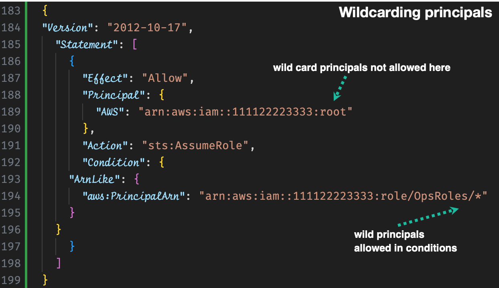

[How to use trust policies with IAM roles by Jonathan Jenkyn and Liam Wadman](https://aws.amazon.com/blogs/security/how-to-use-trust-policies-with-iam-roles/)

# Scenarios for Role Usage

1. An AWS service or resource accesses another AWS resource in your account

Example: Allow EC2 instances to call AWS services on your behalf

- Trust Policy

```json
{
  "Version": "2012-10-17",
  "Statement": [
    {
      "Effect": "Allow",
      "Principal": {
        "Service": "ec2.amazonaws.com"
      },
      "Action": "sts:AssumeRole"
    }
  ]
}
```

- Identity (permissions) policy

```json
{
  "Version": "2012-10-17",
  "Statement": [
    {
      "Effect": "Allow",
      "Action": [
        "s3:GetObject",
        "s3:PutObject"
      ],
      "Resource": "arn:aws:s3:::my-bucket/*"
    }
  ]
}
```

- Attach the Role to an EC2 Instance:

After attaching above trust and permissions policy to a custom Role (MyEC2S3AccessRole), you can attach the role to ec2 instance as follows

* When launching a new EC2 instance, you can attach the role during the instance configuration step.
* For existing instances, you can attach the role through the Actions menu by choosing Instance Settings and then **Attach/Replace IAM Role**.

2. An AWS service generates AWS credentials to be used by devices running outside AWS –
AWS IAM Roles Anywhere, AWS IoT Core, and AWS Systems Manager hybrid instances can deliver role session credentials to applications, devices, and servers that don’t run on AWS.

3. An AWS account accesses another AWS account - cross-account role pattern
It allows human or machine IAM principals from one AWS account to assume this role and act on resources within a second AWS account. A role is assumed to enable this behavior when the resource in the target account doesn’t have a resource-based policy that could be used to grant cross-account access.

# Scenario 1: Provide access to all principals in account A to assume a role in Account B


To facilitate this, you add an entry in the role in account B’s trust policy that allows authenticated principals from account A to assume the role through the sts:AssumeRole API call.

# Scenario 2: Limit access to a certain role in Account A to assume a role in Account B


# Scenario 3: Assuming a Role using SAML identity federation


The mapping of which enterprise users get which roles is established within the directory used by the SAML 2.0 IdP and is placed inside the **signed SAML assertion** by the IdP.

## [ChatGPT] Context and Use Case

## Use Case

This trust policy is typically used in scenarios where an organization uses an external identity provider (IdP) that supports SAML 2.0 to manage user identities and provide single sign-on (SSO) capabilities. Commonly, this is part of a federated authentication setup where users log in to an organizational portal and get redirected to AWS without needing separate AWS credentials.

## Example Scenario

1. Identity Provider Configuration:

* An organization has an IdP (like Active Directory Federation Services, Okta, or another SAML-compliant IdP).
* The IdP is configured to issue SAML assertions for authenticated users.

2. AWS Configuration:

* The SAML identity provider is created in AWS IAM, generating the ARN `arn:aws:iam::account-id:saml-provider/PROVIDER-NAME`.
* An IAM role is created with the above trust policy allowing users authenticated via the IdP to assume this role.

3. User Authentication:

* A user logs into the organizational portal and gets authenticated by the IdP.
* The IdP issues a SAML assertion with the specified audience (`https://signin.aws.amazon.com/saml`).
* The user uses this SAML assertion to assume the specified IAM role in AWS.

# Scenario 4: Assuming a Role by OIDC Identity Provider using access


An a typical (and unrelated) access token will look as follows:


...
...

# Scenario 8: Limiting role assumption to only principals within your organization

Following policy denies assumption of this role except by AWS services or by principals that are a member of the o-abcd12efg1 organization. This statement can be broadly applied to prevent someone outside your AWS organization from assuming your roles.

```json
{
  "Version": "2012-10-17",
  "Statement": [
    {
      "Effect": "Deny",
      "Principal": {
        "AWS": "*"
      },
      "Action": "sts:AssumeRole",
      "Condition": {
        "StringNotEquals": { // denies access to this role by a principal that DOESN’T
                          // belong to a member account of the specified organization o-abcd12efg1
          "aws:PrincipalOrgID": "o-abcd12efg1"
        },
        "Bool": {
          "aws:PrincipalIsAWSService": "false" // This DENY rule DOESNT impact AWS service. But you
                                           // also need an explicit ALLOW separately if you want
                                           // the AWS service to assume this Role.
        }
      }
    }
  ]
}
```

Note: Use `aws:PrincipalOrgPaths` condition key to limit role assumption to **member accounts** within a specific OU of an organization

# Scenaio 9: capture role session id in cloudtrail

When using federated users from `SAML2.0 or Web Identity/OpenID Connect`, you want to relate IAM role activity to corporate identity.  This helps track the user activity thru' cloud trail logs.

The `SourceIdentity attribute` also follows that role session if it assumes another role

```json
{
    "Version": "2012-10-17",
    "Statement": {
      "Effect": "Allow",
      "Action": ["sts:AssumeRoleWithSAML","sts:SetSourceIdentity"],
      "Principal": {"Federated": "arn:aws:iam::111122223333:saml-provider/PROVIDER-NAME"},
      "Condition": {"StringEquals": {"SAML:aud": "https://signin.aws.amazon.com/saml"}}
    }
  }
```

More: [How to relate IAM role activity to corporate identity by Tracy Pierce ](https://aws.amazon.com/blogs/security/how-to-relate-iam-role-activity-to-corporate-identity/)

- What you need to also do if the first role needs to assume second role

In order for a role session that has a SourceIdentity set to assume a second role, it must also have the `sts:SetSourceIdentity` entitlement in that second role’s trust policy. If it doesn’t, the first role won’t be able to assume the second role.

# Scenaior 10: Setting tags on role sessions

Session tags are key-value pair attributes that you pass when you assume an IAM role or federate a user in AWS STS

Tag values that are set when a role is assumed have precedence over tag values that are attached to the role.

These can be used in IAM and resource policy authorization decisions

The ability to tag a role session must be granted in a role’s trust policy using the `sts:TagSession permission`

you can use conditions and condition keys to restrict which tags can be set to which values.

allows a principal from account 111122223333 to assume the role and requires that the three session tags for Project, CostCenter and Department are set

You can use Deny statements with the sts:TagSession operation to restrict certain tags from being set. In the

# scenario: How to handle wild card principals



The following policy allows a role from account 111122223333 in the **path OpsRoles** to assume it.

```json
{
"Version": "2012-10-17",
  "Statement": [
    {
      "Effect": "Allow",
      "Principal": {
        "AWS": "arn:aws:iam::111122223333:root"
      },
      "Action": "sts:AssumeRole",
      "Condition": {
    "ArnLike": {
      "aws:PrincipalArn": "arn:aws:iam::111122223333:role/OpsRoles/*"
    }
  }
    }
  ]
}
```

# scenario: Using multiple statements

Following allows ExampleRole to assume a role and tag the session, but only from the network range `203.0.113.0/24` while forbidding that the `Admin tag` be set:

```json
{
    "Version": "2012-10-17",
    "Statement": [
        {
            "Effect": "Allow",
            "Principal": {
                "AWS": [
                    "arn:aws:iam::111122223333:role/ExampleRole"
                ]
            },
            "Action": [
                "sts:AssumeRole",
                "sts:TagSession"
            ],
            "Condition": {
                "IpAddress": {
                    "aws:SourceIp": "203.0.113.0/24"
                }
            }
        },
        {
            "Effect": "Deny",
            "Action": "sts:TagSession",
            "Principal": {
                "AWS": "*"
            },
            "Condition": {
                "Null": {
                    "aws:RequestTag/Admin": false
                }
            }
        }
    ]
}
```

# Best practice

Although it’s possible to use multiple statements, it’s a best practice that you don’t use roles for unrelated purposes, and that you don’t share roles across different AWS services. It’s also a best practice to use different IAM roles for different use cases and AWS services, and to avoid situations where different principals have access to the same IAM role.

# Role chaining

When a role assumes another role, it’s called role chaining. Sessions created by role chaining have a maximum lifetime of 1 hour regardless of the maximum session length that a role is configured to allow.

Roles that are assumed by other means are not considered role chaining and are not subject to this restriction.

Read more - my-github/study-guide-repo/amazon/aws-iam-VISIT.md#Role Chaining