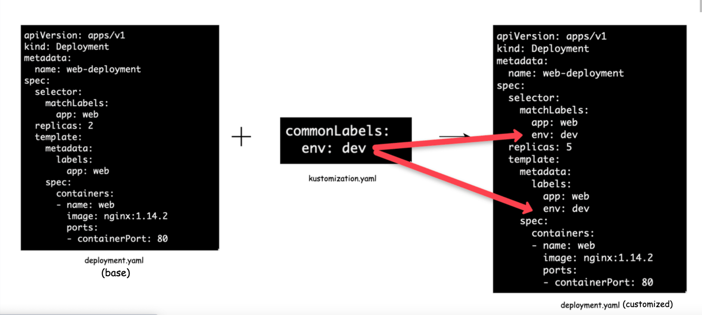
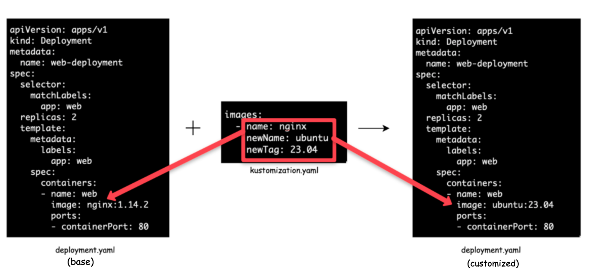

kubectl kustomize --help

kustomization.yaml: This file contains a list of all of the Kubernetes resources (YAML files) that should be managed by Kustomize

# Transformers

* **commonLabel** – It adds a label to all Kubernetes resources
* **namePrefix** – It adds a common prefix to all resource names
* **nameSuffix** – It adds a common suffix to all resource names
* **Namespace** – It adds a common namespace to all resources
* **commonAnnotations** – It adds an annotation to all resources

## CommonLabel

## Image Transformer

# References

1. https://devopscube.com/kustomize-tutorial/
1. https://github.com/techiescamp/kustomize