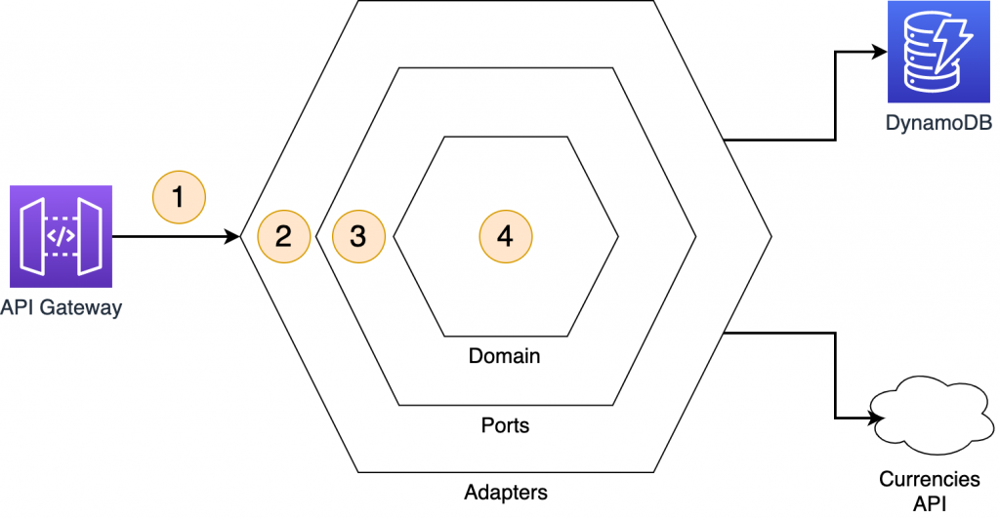

# 1. Different architectures

1. **Hex Architecture**
2. The **Onion Architecture**, based on the Inversion of Control principle (IoC).
3. The **Clean Architecture**, which provides a more opinionated approach on how to structure domain logic via entities and use cases.

# 2. Different layers in Hex Arcchitecture


1. **Domain logic**: Represents the task that the application should perform, abstracting any interaction with the external world.
2. **Ports**: Provide a way for the primary actors (on the left) to interact with the application, via the domain logic. The domain logic also uses ports for interacting with secondary actors (on the right) when needed.
3. **Adapters**: A design pattern for transforming one interface into another interface. They wrap the logic for interacting with a primary or secondary actor.
4. **Primary actors**: Users of the system such as a webhook, a UI request, or a test script.
5. **Secondary actors**: used by the application, these services are either a Repository (for example, a database) or a Recipient (such as a message queue).

# 3. Hexagonal architecture with Lambda functions



1. A client makes a request to the API Gateway endpoint, which invokes the Lambda function.
2. The primary adapter receives the request. It captures the stock ID and pass it to the port:

```js
exports.lambdaHandler = async (event) => {
    try{
	// retrieve the stockID from the request
        const stockID = event.pathParameters.StockID;
	// pass the stockID to the port
        const response = await getStocksRequest(stockID);
        return response
    }
};
```

3. The port is an interface for communicating with the domain logic. It enforces the separation between an adapter and the domain logic. With this approach, you can change and test the infrastructure and domain logic in isolation without impacting another part of the code base:

```js
const retrieveStock = async (stockID) => {
    try{
	//use the port “stock” to access the domain logic
        const stockWithCurrencies = await stock.retrieveStockValues(stockID)
        return stockWithCurrencies;
    }
}
```

4. The port passing the stock ID invokes the domain logic entry point. The domain logic fetches the stock value from a DynamoDB table, then it requests the exchange rates. It returns the computed values to the primary adapter via the port. The domain logic always uses a port to interact with an adapter because the ports are the interfaces with the external world:

```js
const CURRENCIES = [“USD”, “CAD”, “AUD”]
const retrieveStockValues = async (stockID) => {
try {
//retrieve the stock value from DynamoDB using a port
        const stockValue = await Repository.getStockData(stockID);
//fetch the currencies value using a port
        const currencyList = await Currency.getCurrenciesData(CURRENCIES);
//calculate the stock value in different currencies
        const stockWithCurrencies = {
            stock: stockValue.STOCK_ID,
            values: {
                "EUR": stockValue.VALUE
            }
        };
        for(const currency in currencyList.rates){
            stockWithCurrencies.values[currency] =  (stockValue.VALUE * currencyList.rates[currency]).toFixed(2)
        }
// return the final computation to the port
        return stockWithCurrencies;
    }
}
```

# 4. domain logic interacts with the DynamoDB table:


1. The domain logic uses the Repository port for interacting with the database. There is not a direct connection between the domain and the adapter:

```js
const getStockData = async (stockID) => {
    try{
//the domain logic pass the request to fetch the stock ID value to this port
        const data = await getStockValue(stockID);
        return data.Item;
    }
}
```

2. The secondary adapter encapsulates the logic for reading an item from a DynamoDB table. All the logic for interacting with DynamoDB is encapsulated in this module:

```js
const getStockValue = async (stockID) => {
    let params = {
        TableName : DB_TABLE,
        Key:{
            'STOCK_ID': stockID
        }
    }
    try {
        const stockData = await documentClient.get(params).promise()
        return stockData
    }
}
```

# 5. The domain logic uses an adapter for fetching the exchange rates from the third-party service


1. Currencies API interactionThe second operation in the business logic is retrieving the currency exchange rates. The domain logic requests the operation via a port that proxies the request to the adapter:

```js
const getCurrenciesData = async (currencies) => {
    try{
        const data = await getCurrencies(currencies);
        return data
    }
}
```

2. The currencies service adapter fetches the data from a third-party endpoint and returns the result to the domain logic.

```js
const getCurrencies = async (currencies) => {
    try{
        const res = await axios.get(`http://api.mycurrency.io?symbols=${currencies.toString()}`)
        return res.data
    }
}
```

# 6. References

1. [Developing evolutionary architecture with AWS Lambda by Luca Mezzalira](https://aws.amazon.com/blogs/compute/developing-evolutionary-architecture-with-aws-lambda/)
1. [Effectively Running Java On Serverless By Vipin Kumar](https://serverlessland.com/content/service/lambda/guides/effectively-running-java-on-serverless/hexagonal)
1. [AWS re:Invent 2021 - Evolutionary AWS Lambda functions with hexagonal architecture [REPEAT]](https://www.youtube.com/watch?v=kRFg6fkVChQ)
1. [AWS Prescriptive Guidance > Building hexagonal architectures on AWS](https://docs.aws.amazon.com/prescriptive-guidance/latest/hexagonal-architectures/welcome.html)