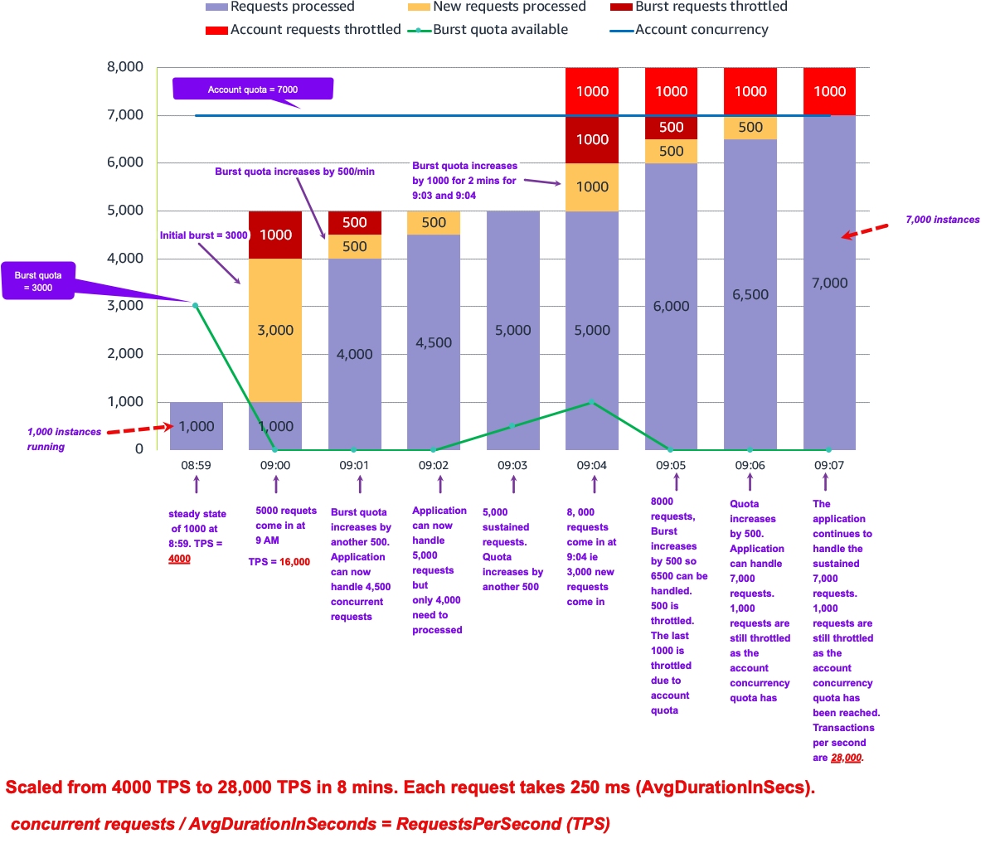

https://aws.amazon.com/blogs/compute/understanding-aws-lambda-scaling-and-throughput/

# What is Transactions per second?

**Formula**: AvgDurationInSeconds / concurrent requests = TPS

- If the function takes 2 seconds to run and if Lambda concurrency = 10, during the initial second, transactions per second is 0. However, **averaged over time**, transactions per second is 5. This if Lambda concurrency = 10
- If the function takes 500 ms and the Lambda concurrency (ie concurrent requests) equals 10 then transactions per second ie 20. 10 /.5 = 20

# Number of concurrent requests

**Formula**: RequestsPerSecond (TPS) x AvgDurationInSeconds = concurrent requests

- If a Lambda function takes an average 500 ms to run, at 100 requests per second, the number of concurrent requests is 50
    `100 requests/second x 0.5 sec = 50 concurrent requests`
- If you half the function duration to 250 ms and the number of requests per second doubles to 200 requests/second, the number of concurrent requests remains the same
    `200 requests/second x 0.250 sec = 50 concurrent requests`

# Scaling quotas

2 types - Account concurrency quota, burst concurrency quota.

1. **Account concurrency**: it is the maximum concurrency in a particular Region. This is shared across all functions in an account. The default Regional concurrency quota starts at 1,000, which you can increase with a service ticket.

2. **Burst concurrency**: quota provides an initial burst of traffic, between 500 and 3000 per minute, depending on the Region. This is also shared across all function in an account.

3. How does scaling occur after the initial burst?

After this initial burst, functions can scale by another 500 concurrent invocations per minute for all Regions. If you reach the maximum number of concurrent requests, further requests are throttled.

4. What happens when it hits the throttling limit?

For synchronous invocations, Lambda returns a throttling error (429) to the caller, which must retry the request. With asynchronous and event source mapping invokes, Lambda automatically retries the requests

see: https://docs.aws.amazon.com/lambda/latest/dg/invocation-retries.html

# CloudWatch Metrics

1. ConcurrentExecutions

# Concurrency vs Transactions

1. Concurrency at any time T is analogous to # of Threads running at T
2. Transactions per sec is analogous requests processed per second

# Burst concurrency quota vs Account concurrency quota

1. **Burst concurrency quota of 3000 (in us-east)**.
- This is the amount of lambdas that can go from 0 to 3000.  This 3000 is shared across all functions in an account.
- After initial burst, your function can scaleby an additional 500 instances each minute.
- This cannot be increased
2. **Account concurrency quota (for a region):**
- This is Max concurrency in a given region across all functions in an account (default = 1000 per region)
- This can be increased

# Example scenario

1. **08:59:** The application already has a steady stream of requests, using 1,000 concurrent execution environments. Each Lambda invocation takes 250 ms, so transactions per second are 4,000.

```bash
RequestsPerSecond (TPS) x AvgDurationInSeconds = concurrent requests
concurrent requests / AvgDurationInSeconds = RequestsPerSecond (TPS)
1000 / .25 = 4000
```

2. **09:00:** There is a large spike in traffic at **5,000 sustained requests**. 1000 requests use the existing execution environments. Lambda uses the **3,000 available burst concurrency** to create new environments to handle the additional load. **1,000 requests are throttled** as there is not enough burst concurrency to handle all 5,000 requests. Transactions per second are 16,000.

```bash
RequestsPerSecond (TPS) x AvgDurationInSeconds = concurrent requests
concurrent requests / AvgDurationInSeconds = RequestsPerSecond (TPS)
4,000 / .25 = 16,000
```



# Scaling with SQS

1. Lambda functions that subscribe to an SQS queue can scale up to five times faster for queues that see a spike in message backlog, adding up to **300 concurrent executions per minute**, and **scaling up to a maximum of 1,250 concurrent executions**

2. The new improved scaling rates are automatically **applied to all AWS accounts** using Lambda and SQS as an event source. There is no explicit action that you must take, and there’s **no additional cost**

# [NOTES] Max and Reserved concurrenct


src: https://aws.amazon.com/blogs/compute/introducing-faster-polling-scale-up-for-aws-lambda-functions-configured-with-amazon-sqs/

1.  **Reserved concurrency** is the **maximum concurrency that you want to allocate to a function**. When a function has reserved concurrency allocated, no other functions can use that concurrency.

2. **Throttling**: When an SQS event source is attempting to scale up concurrent Lambda invocations, but the function has already reached the threshold defined by the reserved concurrency, the Lambda service throttles further function invocations.

3. What happens a throttling limit is reached?
Depending on the queue configuration, the throttled messages are returned to the queue for retrying, expire based on the retention policy, or sent to a dead-letter queue (DLQ) or on-failure destination.

4. The **maximum concurrency** setting allows you to control concurrency **at the event source level**. It allows you to define the maximum number of concurrent invocations the event source attempts to send to the Lambda function

5. Can use both of them simultaneously

Reserved concurrency and maximum concurrency are complementary capabilities, and can be used together

6. Purpose of max concurrency and reserved concurrency

Maximum concurrency can help to prevent overwhelming downstream systems and throttled invocations. Reserved concurrency helps to ensure available concurrency for the function.

# Encryption

Use **server-side encryption (SSE)** to store sensitive data in encrypted SQS queues. With SSE, your messages are always stored in encrypted form, and SQS only decrypts them for sending to an authorized consumer. SSE protects the contents of messages in queues using SQS-managed encryption keys (**SSE-SQS**) or keys managed in the AWS Key Management Service (**SSE-KMS**).

src: https://aws.amazon.com/blogs/compute/introducing-faster-polling-scale-up-for-aws-lambda-functions-configured-with-amazon-sqs/

# Cloud Watch Metrics / Operational metrics

Monitor function **Invocations** and **Duration** to understand throughput. **Throttles** show throttled invocations.

1. **ConcurrentExecutions**: tracks the total number of execution environments that are processing events. Ensure this doesn’t reach your account concurrency to avoid account throttling. Use the metric for individual functions to see which are using account concurrency, and also ensure reserved concurrency is not too high. For example, a function may have a reserved concurrency of 2000, but is only using 10.

1. **UnreservedConcurrentExecutions**: show the number of function invocations without reserved concurrency. This is your available account concurrency buffer

1. **ProvisionedConcurrencyUtilization**: o ensure you are not paying for Provisioned Concurrency that you are not using. The metric shows the percentage of allocated Provisioned Concurrency in use.

1. **ProvisionedConcurrencySpilloverInvocations**: show function invocations using standard concurrency, above the configured Provisioned Concurrency value. This may show that you need to increase Provisioned Concurrency.

1. **ClaimedAccountConcurrency**: to track overall account concurrency utilization and monitor when your account is reaching your account limit. This metric is the sum of UnreservedConcurrentExecution and allocated concurrency (reserved, provisioned)

# References

1. [Understanding AWS Lambda scaling and throughput by Julian Wood ](https://aws.amazon.com/blogs/compute/understanding-aws-lambda-scaling-and-throughput/)