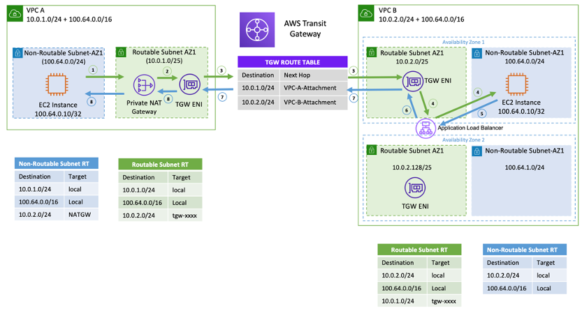

[Building a Scalable and Secure Multi-VPC AWS Network Infrastructure -> Private Nat Gateways](https://docs.aws.amazon.com/whitepapers/latest/building-scalable-secure-multi-vpc-network-infrastructure/private-nat-gateway.html)

# Working example

1. [How to solve Private IP exhaustion with Private NAT Solution by SaiJeevan Devireddy and Chandini Penmetsa](https://aws.amazon.com/blogs/networking-and-content-delivery/how-to-solve-private-ip-exhaustion-with-private-nat-solution/)

# Other References

2. [Leveraging CNI custom networking alongside security groups for pods in Amazon EKS by Bin Liu and Haofei Feng](https://aws.amazon.com/blogs/containers/leveraging-cni-custom-networking-alongside-security-groups-for-pods-in-amazon-eks/)