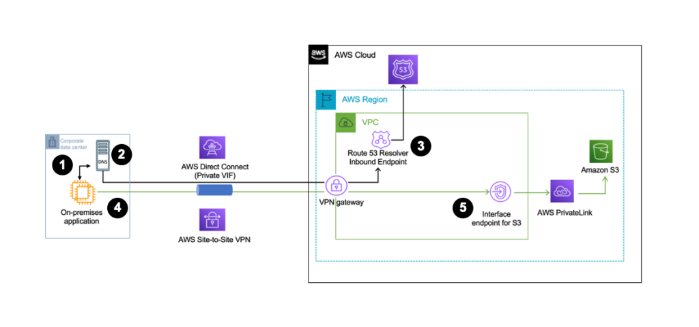

1. On-premises client initiates a DNS query targeted to a regional S3 bucket.
2. The on-premises DNS server forwards this query to the respective Route 53 resolver inbound endpoint associated to the same VPC that has the S3 Interface VPC endpoint via the Site-to-Site VPN or DX connection.
3. The Route 53 resolver endpoint forwards this query to the Route 53 hosted zone managed by AWS which returns the IP addresses of the S3 Interface VPC endpoints in the DNS response.
4. On-premises client then initiates the connection to the S3 interface VPC endpoint.
5. S3 interface endpoints forwards the client query over AWS PrivateLink towards the S3 bucket specified in client’s query.

# DNS Name creation

When you **enable private DNS** for an S3 interface VPC endpoint, AWS creates a private hosted zone and associates it with the VPC. This hosted zone includes the resource records for interface VPC endpoint with private IPs for each of the following Amazon S3 DNS names:

* Regional Bucket (e.g., s3.<Region>.amazonaws.com)
* Control (e.g., s3-control.<Region>.amazonaws.com)
* Access Point (e.g., s3-accesspoint.<Region>.amazonaws.com)

## TODO: What's the difference between s3-control and s3-accesspoint

# Difference between ENI and Interface Endpoint?

Interface Endpoint is an ENI with an IP address

# DNS Names

A Regional DNS name includes a unique VPC endpoint ID, a service identifier, the AWS Region, and vpce.amazonaws.com in its name. For example, for VPC endpoint ID vpce-1a2b3c4d, the DNS name generated might be similar to vpce-1a2b3c4d-5e6f.s3.us-east-1.vpce.amazonaws.com.

A Zonal DNS name includes the Availability Zone—for example, vpce-1a2b3c4d-5e6f-us-east-1a.s3.us-east-1.vpce.amazonaws.com. You might use this option if your architecture isolates Availability Zones. For example, you could use it for fault containment or to reduce Regional data transfer costs.

https://docs.aws.amazon.com/AmazonS3/latest/userguide/privatelink-interface-endpoints.html#accessing-s3-interface-endpoints

# References

1. https://aws.amazon.com/blogs/storage/introducing-private-dns-support-for-amazon-s3-with-aws-privatelink/