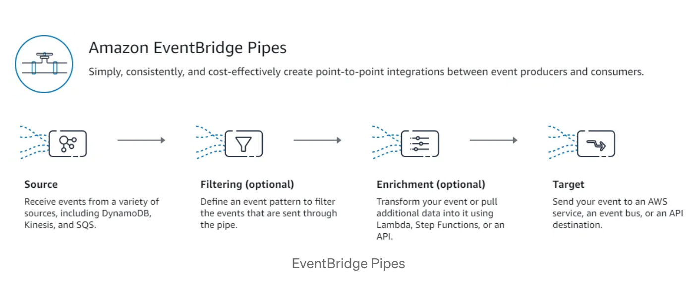
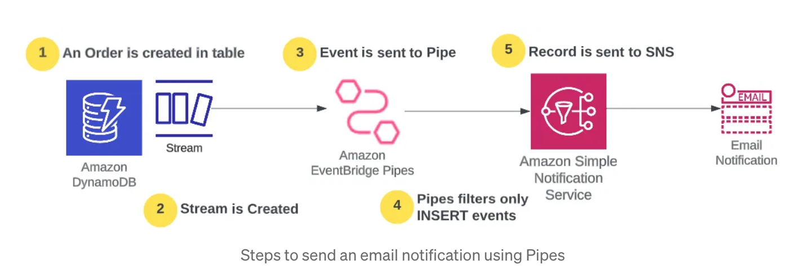

<h1>EventBridge Pipes</h1>

# 1. Architecture

# 2. How to filter

# 3. References

1. [Filter and Enrich all your events with EventBridge Pipes](https://medium.com/ama-tech-blog/filter-and-enrich-all-your-events-with-eventbridge-pipes-7b48b4eb0f4b)