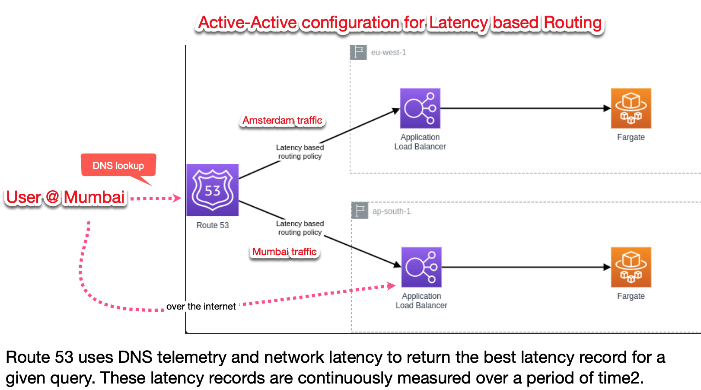

1. How does Latency based routing differ from geolocation-based routing policies?

Although both policies might direct a user in Amsterdam to eu-west-1, they prioritize different criteria. Consider a scenario where compliance mandates data storage in specific regions. Geolocation-based routing ensures adherence to such requirements, unlike latency-based routing, which relies solely on past latency measurements.

Latency-based routing dynamically adjusts routing based on recent latency measurements. Consequently, a request routed to us-east-1 this week might be directed to eu-west-1 the next.

# References

https://www.bschaatsbergen.com/latency-based-routing-in-aws#fnref1
https://www.youtube.com/watch?v=daJ2bmw_css