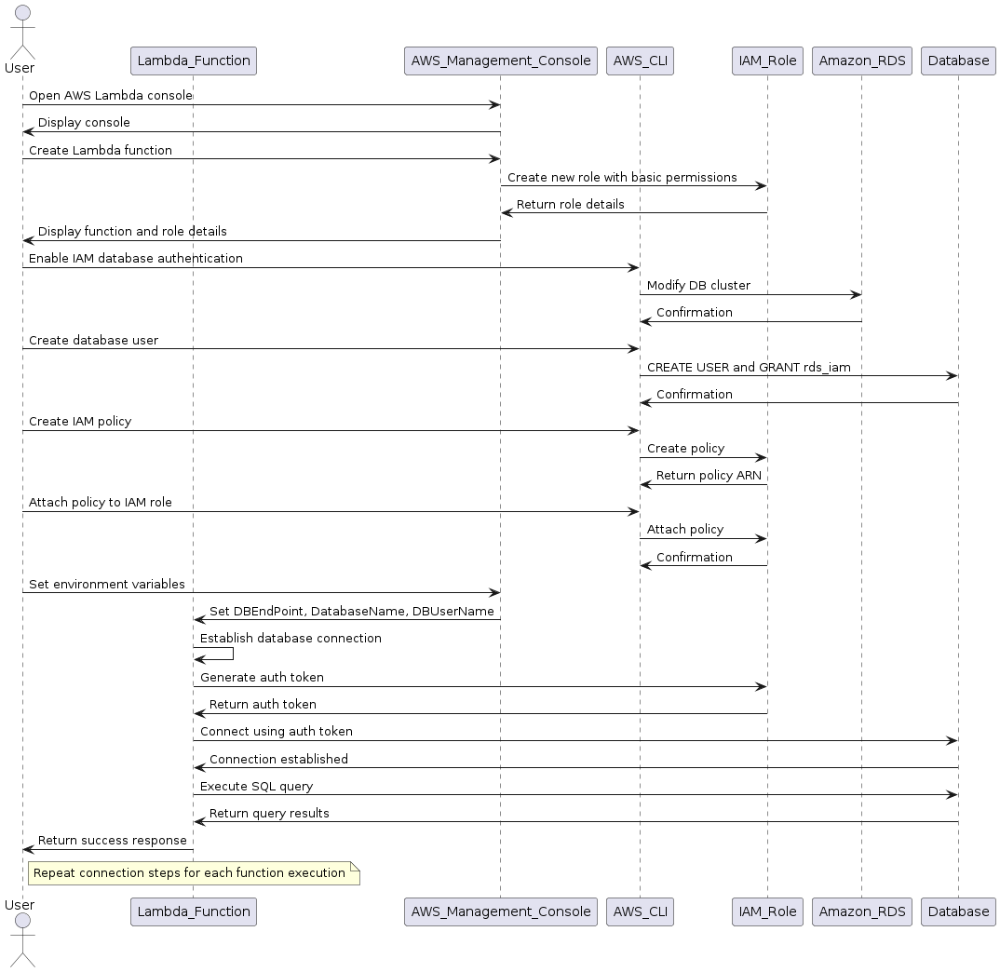
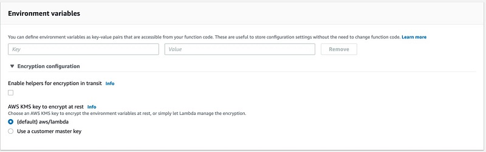

[IAM role-based authentication to Amazon Aurora from serverless applications by Mahesh Balumuri](https://aws.amazon.com/blogs/database/iam-role-based-authentication-to-amazon-aurora-from-serverless-applications/)



1. Enable IAM database authentication in the DB cluster

```bash
# aws rds modify-db-cluster \
#   --db-cluster-identifier <cluster-identifier> \
#   --enable-iam-database-authentication \
#   --apply-immediately

aws rds modify-db-cluster \
  --db-cluster-identifier mysql-demo \
  --enable-iam-database-authentication \
  --apply-immediately

```

# 1. PostgreSQL

1. PostgreSQL: Grant rds_iam privilege to the user

```bash
# CREATE USER <db_user_name> WITH LOGIN;
# GRANT rds_iam TO <db_user_name>;

CREATE USER  demouser WITH LOGIN;
GRANT rds_iam TO demouser;
```

# 2. MySQL

1. MySQL: Grant privileges as follows

```bash
# CREATE USER < db_user_name> IDENTIFIED WITH AWSAuthenticationPlugin as 'RDS';
# GRANT ALL PRIVILEGES ON <dbname>.* TO '<db_user_name>’ @'%';

CREATE USER demouser IDENTIFIED WITH AWSAuthenticationPlugin as 'RDS';
GRANT ALL PRIVILEGES ON demodb.* TO 'demouser’ @'%';
FLUSH PRIVILEGES;
```

# 3. IAM

1. Create Permission policy

Create Permission policy which allows the `demouser` to access the database using IAM database authentication

```json
// {
//     "Version": "2012-10-17",
//     "Statement": [
//         {
//             "Effect": "Allow",
//             "Action": [
//                 "rds-db:connect"
//             ],
//             "Resource": [
//                 // DbiResourceId: The DB instance identifier, or * to allow all the database instances in the region of the account
//                 // db_user_name: The user that has been created in the database. Mention a specific user, or * to
//                 // allow IAM authentication for all users in the database
//                 "arn:aws:rds-db:<region>:<account-id>:dbuser:<DbiResourceId>/<db_user_name>"
//             ]
//         }
//     ]
// }
```

```bash
aws iam create-policy --policy-name my-policy --policy-document '{
    "Version": "2012-10-17",
    "Statement": [
        {
            "Effect": "Allow",
            "Action": [
                "rds-db:connect"
            ],
            "Resource": [
                "arn:aws:rds-db:us-east-1:123456789012:dbuser:*/demouser"
            ]
        }
    ]
}'
```

1. Now attach this policy to the IAM role associated with the Lambda function

```bash
# role_name: IAM role associated with the Lambda function (for example, demo-function-role-ipqlab4h).
# policy_arn: ARN of IAM policy created for IAM database authentication (for example  “arn:aws:iam::123456789012:policy/my-policy”).
# aws iam attach-role-policy --role-name <role_name> --policy-arn <policy_arn>

aws iam attach-role-policy \
  --role-name demo-function-role-ipqlab4h \
  --policy-arn <policy_arn> arn:aws:iam::123456789012:policy/my-policy
```

# 4. Lambda

1. Set the following Enviorment variables for Lambda



* **DBEndPoint**: The DB instance endpoint (for example, ab9c3efgh31k.us-east-1.rds.amazonaws.com).
* **DatabaseName**: The name of the database.
* **DBUserName**: The user name created in the previous steps (for example, demouser).

1. To encrypt the network traffic, use the RDS-provided root SSL certificate, such as this example. You must include this SSL certificate in your deployment package.

# 5. Accessing postgres

1. To access the Amazon Aurora PostgreSQL database from your Lambda function, you must include the pg8000 (PostgreSQL Driver) library as part of your deployment package.

1. Lambda function

```py
import boto3
import pg8000.dbapi
import os
import ssl
import logging

logger = logging.getLogger()

# declare the global connection object to use during warm starting
# to reuse connections that were established during a previous invocation.
connection = None

def get_connection():
    """
        Method to establish the connection.
    """
    try:
        logger.info ("Connecting to database")
        # Create a low-level client with the service name for rds
        client = boto3.client("rds")
        # Read the environment variables to get DB EndPoint
        DBEndPoint = os.environ.get("DBEndPoint")
        # Read the environment variables to get the Database name
        DatabaseName = os.environ.get("DatabaseName")
        # Read the environment variables to get the Database username which has access to database.
        DBUserName = os.environ.get("DBUserName")
        # ssl context information
        ssl_context = ssl.create_default_context()
        ssl_context.verify_mode = ssl.CERT_REQUIRED
        # update the certificate filename based on the one which is packaged with lambda function.
        ssl_context.load_verify_locations('us-east-1-bundle.pem')
        # Generates an auth token used to connect to a db with IAM credentials.
        password = client.generate_db_auth_token(
            DBHostname=DBEndPoint, Port=5432, DBUsername=DBUserName
        )
        # Establishes the connection with the server using the token generated as password
        conn = pg8000.dbapi.connect(
            host=DBEndPoint,
            user=DBUserName,
            database=DatabaseName,
            password=password,
            ssl_context=ssl_context
        )
        return conn
    except Exception as e:
        logger.error ("While connecting failed due to :{0}".format(str(e)))
        return None

def lambda_handler(event, context):
    global connection
    try:
        if connection is None:
            connection = get_connection()
        if connection is None:
            return {"status": "Error", "message": "Failed"}
        logger.info ("instantiating the cursor from connection")
        # Instantiate the cursor object
        cursor = connection.cursor()
        # Query to be executed
        query = "SELECT CURRENT_DATABASE()"
        # execute the query / command in the connected database
        cursor.execute(query)
        # Get the column names
        columns = [str(desc[0]) for desc in cursor.description]
        results = []
        # create the rows of dict from the result set.
        for res in cursor:
            results.append(dict(zip(columns, res)))
        cursor.close()
        # result to return
        response = {"status": "Success", "results": results}
        return response
    except Exception as e:
        try:
            connection.close()
        except Exception as e:
            connection = None
            logger.error ("Failed due to :{0}".format(str(e)))
        return {"status": "Error", "message": "Something went wrong. Try again"}

```

# 6. Accessing MYSQL

1. To access Amazon Aurora MySQL database from your Lambda function, you must include mysql-connector-python (MySQL Driver) library as part of your deployment package.

1. Lambda function

```py
import os
import boto3
from mysql import connector
from mysql.connector import Error
import logging

logger = logging.getLogger()

# declare the global connection object to use during warm starting
# to reuse connections that were established during a previous invocation.
connection = None

def get_connection():
    """
        Method to establish the connection.
    """
    try:
        logger.info ("Connecting to database")
        # Create a low-level client with the service name for rds
        client = boto3.client("rds")
        # Read the environment variables to get DB EndPoint
        DBEndPoint = os.environ.get("DBEndPoint")
        # Read the environment variables to get the Database name
        DatabaseName = os.environ.get("DatabaseName")
        # Read the environment variables to get the Database username which has access to database.
        DBUserName = os.environ.get("DBUserName")
        # Generates an auth token used to connect to a db with IAM credentials.
        password = client.generate_db_auth_token(
            DBHostname=DBEndPoint, Port=3306, DBUsername=DBUserName
        )
        # Establishes the connection with the server using the token generated as password
        conn = connector.connect(
            host=DBEndPoint,
            database=DatabaseName,
            user=DBUserName,
            password=password,
            auth_plugin="mysql_clear_password",
            ssl_ca="us-east-1-bundle.pem",
        )
        return conn
    except Exception as e:
        logger.error ("While connecting failed due to :{0}".format(str(e)))
        return None

def lambda_handler(event, context):
    global connection
    try:
        if connection is None:
            connection = get_connection()
        if connection is None:
            return {"status": "Error", "message": "Failed"}
        logger.info ("instantiating the cursor from connection")
        # Instantiate the cursor object
        # Instantiate the cursor object with dictionary as true to return the rows as dictionaries
        cursor = connection.cursor(dictionary=True)
        # execute the query / command in the connected database
        cursor.execute("select database() as database_name")
        # Retreive the next row of query result set.
        record = cursor.fetchone()
        # Return the results
        response = {"status": "Success", "results": record}
        return response
    except Exception as e:
        try:
            connection.close()
        except Exception as e:
            connection = None
        logger.error ("Failed due to :{0}".format(str(e)))
        return {"status": "Error", "message": "Something went wrong. Try again"}
```