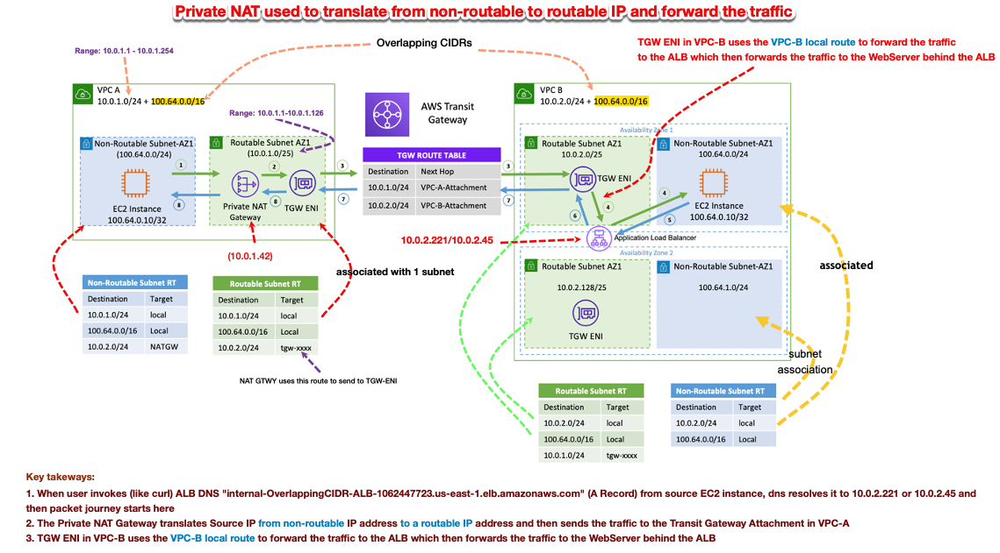
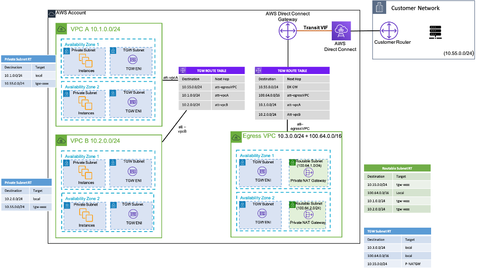

<h1>Private Nat Gateways</h1>

# Topics to work on

1. Where in CFN did you specify "ALB is placed in the routable subnets in VPC-B and the back-end instances in the non-routable subnets in VPC-B"?
2. Where in CFN did you specify "Private NAT Gateway is created in the routable subnets in VPC-A"
3. How did you tell TGW "A Transit Gateway is created with two attachments, in routable subnets of both VPC-A and VPC-B"
4. How to use private Nat gateway with on-prem
see `https://docs.aws.amazon.com/whitepapers/latest/building-scalable-secure-multi-vpc-network-infrastructure/private-nat-gateway.html`
5. Disect the CFN template. See where the S3 Gateway EP was being created

# Why do we need Private Nat Gateways

Teams often work independently and they might create a new VPC for a project, which may have overlapping classless inter-domain routing (CIDR) blocks. For integration, they might want to enable communication between networks with overlapping CIDRs, which is not achievable through features such as VPC peering and Transit Gateway. A private NAT gateway can help with this use case. Private NAT gateway uses a unique private IP address to perform network address translation for the overlapping source IP address, and a unique destination IP address that load balances the destination overlapping IP address. You can route traffic from your private NAT gateway to other VPCs or on-premises network using Transit Gateway or virtual private gateway.

# Private Nat Gateways targeting ALB


# Packet flow from SourceInstance-VPC-A to the WebServer

**1. Step 1:** The “SourceInstance-VPC-A” will do a DNS lookup on the ALB DNS name to get the destination IP (Destination IP: 10.0.2.x/32). The “Non-Routable Subnet-RT“ in VPC-A is configured to route the traffic destined for 10.0.2.0/24 to the Private NAT Gateway.

# Testing

```bash
h-4.2$ curl internal-OverlappingCIDR-ALB-1062447723.us-east-1.elb.amazonaws.com
Great! If you are seeing this message, you were able to reach the destination website with overlapping IP address from the SourceInstance-VPC-A
```

# Demo

In this demo, we have two non-routable (overlapping CIDRs, 100.64.0.0/16) subnets in VPC A and B. To establish connection between them, you can add a secondary non-overlapping / routable CIDRs (routable subnets, `10.0.1.0/24` and `10.0.2.0/24`) to VPC A and B, respectively. A private NAT gateway is added to the routable subnet in VPC A with an IP address of `10.0.1.42`. Private NAT gateway performs source network address translation on requests from instance in non-routable subnet of VPC A (`100.64.0.10`) as `10.0.1.42`, the ENI of the Private NAT Gateway. Now traffic can be pointed to a routable IP address assigned to the Application Load Balancer (ALB) in VPC B (10.0.2.221 / 10.0.2.45), which has a target of `100.64.0.20` - ie webserver. Traffic is routed via Transit Gateway. Return traffic is processed by the private NAT gateway back to the original EC2 instance requesting the connection.


# References

1. [Building a Scalable and Secure Multi-VPC AWS Network Infrastructure -> Private Nat Gateways](https://docs.aws.amazon.com/whitepapers/latest/building-scalable-secure-multi-vpc-network-infrastructure/private-nat-gateway.html)



# Working example

1. [How to solve Private IP exhaustion with Private NAT Solution by SaiJeevan Devireddy and Chandini Penmetsa](https://aws.amazon.com/blogs/networking-and-content-delivery/how-to-solve-private-ip-exhaustion-with-private-nat-solution/)

# Other References

2. [Leveraging CNI custom networking alongside security groups for pods in Amazon EKS by Bin Liu and Haofei Feng](https://aws.amazon.com/blogs/containers/leveraging-cni-custom-networking-alongside-security-groups-for-pods-in-amazon-eks/)

# [TODO] Use case 2



The private NAT gateway can also be used when your on-premises network restricts access to approved IPs.

see `https://docs.aws.amazon.com/whitepapers/latest/building-scalable-secure-multi-vpc-network-infrastructure/private-nat-gateway.html`