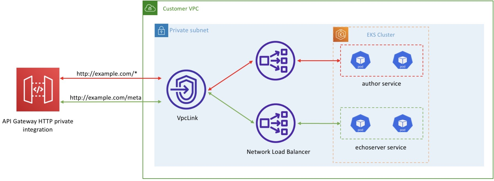

[Integrate Amazon API Gateway with Amazon EKS by Re Alvarez-Parmar and Vikram Venkataraman](https://aws.amazon.com/blogs/containers/integrate-amazon-api-gateway-with-amazon-eks/)



# Demo

1. Setup ENVs

```bash
export AGW_AWS_REGION=ap-south-1 <-- Change this to match your region
export AGW_ACCOUNT_ID=$(aws sts get-caller-identity --query 'Account' --output text)
export AGW_EKS_CLUSTER_NAME=eks-ack-apigw
```

2. Create cluster

```bash
eksctl create cluster \
  --name $AGW_EKS_CLUSTER_NAME \
  --region $AGW_AWS_REGION \
  --managed
```

3. Deploy the AWS Load Balancer Controller

```bash
## Associate OIDC provider
eksctl utils associate-iam-oidc-provider \
  --region $AGW_AWS_REGION \
  --cluster $AGW_EKS_CLUSTER_NAME \
  --approve

## Download the IAM policy document
curl -S https://raw.githubusercontent.com/kubernetes-sigs/aws-load-balancer-controller/v2.2.0/docs/install/iam_policy.json -o iam-policy.json

## Create an IAM policy
aws iam create-policy \
  --policy-name AWSLoadBalancerControllerIAMPolicy-APIGWDEMO \
  --policy-document file://iam-policy.json 2> /dev/null

## Create a service account
eksctl create iamserviceaccount \
  --cluster=$AGW_EKS_CLUSTER_NAME \
  --region $AGW_AWS_REGION \
  --namespace=kube-system \
  --name=aws-load-balancer-controller \
  --override-existing-serviceaccounts \
  --attach-policy-arn=arn:aws:iam::${AGW_ACCOUNT_ID}:policy/AWSLoadBalancerControllerIAMPolicy-APIGWDEMO \
  --approve

## Get EKS cluster VPC ID
export AGW_VPC_ID=$(aws eks describe-cluster \
  --name $AGW_EKS_CLUSTER_NAME \
  --region $AGW_AWS_REGION  \
  --query "cluster.resourcesVpcConfig.vpcId" \
  --output text)

helm repo add eks https://aws.github.io/eks-charts && helm repo update
kubectl apply -k "github.com/aws/eks-charts/stable/aws-load-balancer-controller//crds?ref=master"
helm install aws-load-balancer-controller \
  eks/aws-load-balancer-controller \
  --namespace kube-system \
  --set clusterName=$AGW_EKS_CLUSTER_NAME \
  --set serviceAccount.create=false \
  --set serviceAccount.name=aws-load-balancer-controller \
  --set vpcId=$AGW_VPC_ID\
  --set region=$AGW_AWS_REGION
```

4. Deploy the ACK Controller for API Gateway

- Create a service account for ACK:

```bash
curl -O https://raw.githubusercontent.com/aws-samples/amazon-apigateway-ingress-controller-blog/Mainline/apigw-ingress-controller-blog/ack-iam-policy.json

aws iam create-policy \
  --policy-name ACKIAMPolicy \
  --policy-document file://ack-iam-policy.json

eksctl create iamserviceaccount \
  --attach-policy-arn=arn:aws:iam::${AGW_ACCOUNT_ID}:policy/ACKIAMPolicy \
  --cluster=$AGW_EKS_CLUSTER_NAME \
  --namespace=kube-system \
  --name=ack-apigatewayv2-controller \
  --override-existing-serviceaccounts \
  --region $AGW_AWS_REGION \
  --approve
```

- Install ACK using Helm

```bash
export HELM_EXPERIMENTAL_OCI=1
export SERVICE=apigatewayv2
export RELEASE_VERSION=v0.0.2
export CHART_REPO=oci://public.ecr.aws/aws-controllers-k8s
export CHART_REF="$CHART_REPO/$SERVICE --version $RELEASE_VERSION"

helm chart pull $CHART_REF

# Install ACK

# Please note that the ECR Public Endpoints are available in "us-east-1"
# and "us-west-2". The region value in this command does not need to be
# updated to the region where you are planning to deploy the resources.
# https://docs.aws.amazon.com/general/latest/gr/ecr-public.html#ecr-public-region
aws ecr-public get-login-password --region us-east-1 | helm registry login --username AWS --password-stdin public.ecr.aws

# The region value in this command should reflect the region where you
# are planning to deploy the resources.
helm install \
  --namespace kube-system \
  ack-$SERVICE-controller \
  $CHART_REPO/$SERVICE-chart \
  --version=$RELEASE_VERSION \
  --set=aws.region=$AGW_AWS_REGION
```

5. Deploy sample applications

We’ll deploy two sample applications and create two corresponding Kubernetes services. The **authorservice** service responds with a list of books. The **echoserver** service echoes request metadata. Each of these services will have an associated NLB. Each NLB’s listener will correspond to a resource path in API Gateway.

```bash
kubectl apply -f https://github.com/aws-samples/amazon-apigateway-ingress-controller-blog/raw/Mainline/apigw-ingress-controller-blog/echoserver.yml

kubectl apply -f https://github.com/aws-samples/amazon-apigateway-ingress-controller-blog/raw/Mainline/apigw-ingress-controller-blog/author-deployment.yml
```

**NOTE**: You can also use a single NLB to expose both applications by creating multiple listeners on the same NLB, and binding target groups associated with the listeners with Kubernetes services as explained here - https://kubernetes-sigs.github.io/aws-load-balancer-controller/v2.1/guide/targetgroupbinding/targetgroupbinding/