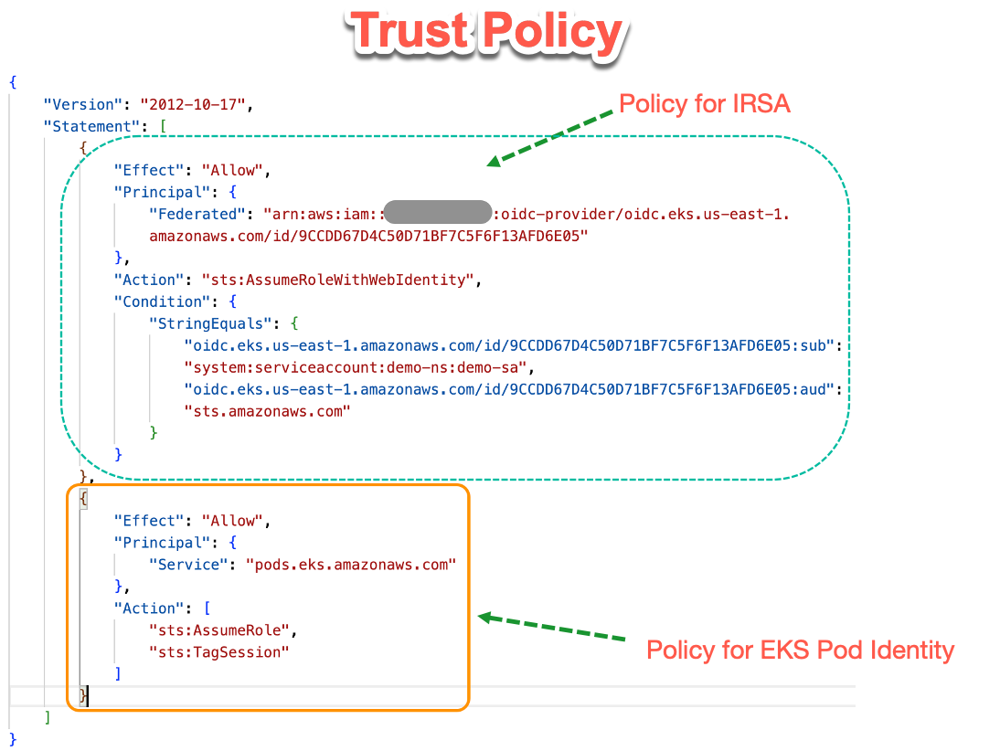
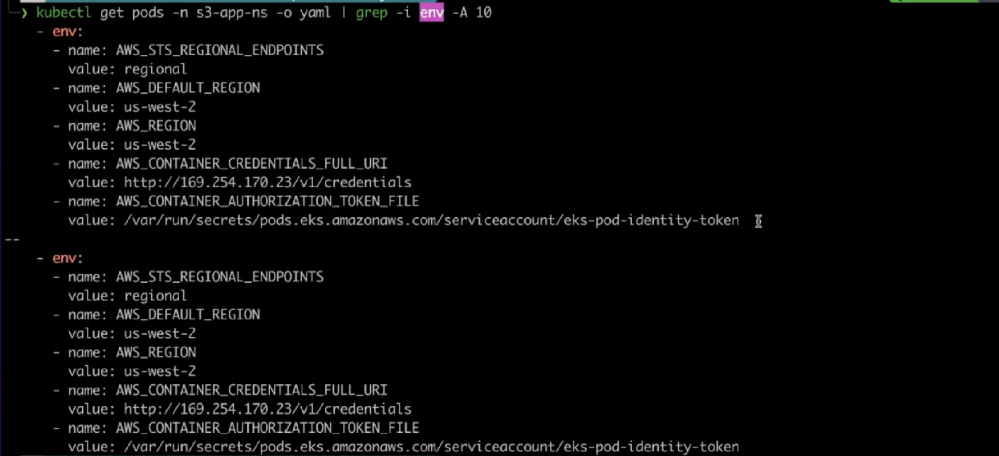
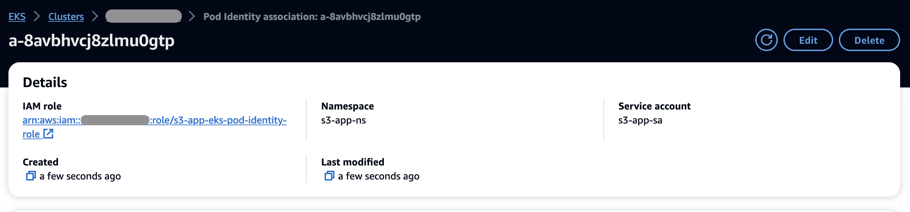
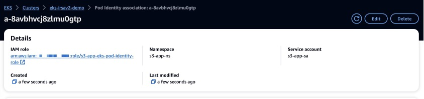

# 1. Drawbacks of IRSA

1. Requires IAM admin permissions for Identity provider (IdP) configuration
2. Requires bookkeeping of IAM role trust policies to cluster lifecycle
3. Trust policy size and IdP limits
4. Multi-step - wait on cluster creation

# 2. Main difference in trust policy



# 3. EKS Pod Identity Architecture


1. Amazon EKS cluster / IAM administrator creates an IAM role that can be assumed by the newly introduced EKS Service principal `pods.eks.amazonaws.com`. The trust policy for the IAM role would look like the policy shown below. Optionally, you can restrict the use of the role to certain EKS clusters by using a conditional string as shown in the following.

```json
{
    "Version": "2012-10-17",
    "Statement": [
        {
            "Effect": "Allow",
            "Principal": {
                "Service": "pods.eks.amazonaws.com"
            },
            "Action": [
                "sts:AssumeRole",
                "sts:TagSession"
            ],
            "Condition": {
                "StringEquals": {
                          "aws:SourceAccount": "my-account-number"
                	    },
                       "ArnEquals": {
                  	       "aws:SourceArn": "arn-of-my-eks-cluster"
                	   }
                 }
           }
	]
}
```

2. After the AWS IAM role creation, Amazon EKS cluster administrator creates an association between the IAM role and Kubernetes service account. You can create this association using the new CreatePodIdentityAssociation API. We will take a look at all the EKS Pod Identity APIs later in the post.

3. After the AWS IAM role is associated with the service account, any newly created pods using that service account will be intercepted by the EKS Pod Identity **webhook**. This webhook runs on the Amazon EKS cluster’s control plane, and is fully managed by EKS. The webhook mutates the pod spec as shown below with the bolded environment variables. All AWS Software Development Kits (SDKs) have a series of places (or sources) that it checks in order to find valid credentials to use, to make a request to an AWS service. After credentials are found, the search is stopped. This systematic search is called the **credential provider chain**. For EKS Pod Identity, we leverage the HTTP credential provider mechanism that is already built into AWS SDKs and CLI to retrieve credentials from an HTTP endpoint specified in the environment variable **AWS_CONTAINER_CREDENTIALS_FULL_URI**. This endpoint is served by the EKS Pod Identity Agent running on the worker node. The location to the projected JWT token that is used to exchange for IAM credentials is specified in the environment variable **AWS_CONTAINER_AUTHORIZATION_TOKEN_FILE**.

```yaml
...
...
    env:
    - name: AWS_STS_REGIONAL_ENDPOINTS
      value: regional
    - name: AWS_DEFAULT_REGION
      value: us-west-2
    - name: AWS_REGION
      value: us-west-2
    - name: AWS_CONTAINER_CREDENTIALS_FULL_URI
      value: http://169.254.170.23/v1/credentials  # This endpoint is served by the EKS Pod Identity Agent running on the worker node
    - name: AWS_CONTAINER_AUTHORIZATION_TOKEN_FILE
      value: /var/run/secrets/pods.eks.amazonaws.com/serviceaccount/eks-pod-identity-token # The location of the projected JWT token
   ...
    volumeMounts:
    - mountPath: /var/run/secrets/pods.eks.amazonaws.com/serviceaccount
      name: eks-pod-identity-token
      readOnly: true
  volumes:
  - name: eks-pod-identity-token
    projected:
      defaultMode: 420
      sources:
      - serviceAccountToken:
          audience: pods.eks.amazonaws.com
          expirationSeconds: 86400
          path: eks-pod-identity-token
```



4. AWS SDK/CLI calls the Amazon EKS Pod Identity Agent endpoint to retrieve the temporary IAM credentials. EKS Pod Identity Agent runs as a DaemonSet pod on every eligible worker node. This agent is made available to you as an EKS Add-on and is a pre-requisite to use EKS Pod Identity feature.

- The EKS Pod Identity agent will do SigV4 signing and make a call to the new EKS Auth API `AssumeRoleForPodIdentity` to exchange the projected token for temporary IAM credentials, which are then made available to the pod.
- EKS Auth API (`AssumeRoleForPodIdentity`) decodes the JWT token and validates the role associations with the service account. After successful validation, EKS Auth API will return the temporary AWS credentials. It will also set session tags such as `kubernetes-namespace`, `kubernetes-service-account`, `eks-cluster-arn`, `eks-cluster-name`, `kubernetes-pod-name`, `kubernetes-pod-uid`.

5. AWS SDKs will use the vended temporary credentials to access other AWS resources.

**NOTE:** Amazon EKS Pod Identity agent runs in host network mode and gets its permissions from the `arn:aws:iam::aws:policy/AmazonEKSWorkerNodePolicy` managed policy that is attached to the worker nodes.

# 4. Demo

1. Step up the environment

```bash
export AWS_REGION=us-east-1 #Replace with your AWS Region
export AWS_ACCOUNT=111122223333 #Replace with your AWS Account number
export CLUSTER_NAME=eks-pod-identity-demo #Replace with your EKS cluster name
```

2. Create cluster

```bash
cat << EOF > cluster.yaml
apiVersion: eksctl.io/v1alpha5
kind: ClusterConfig
metadata:
  name: ${CLUSTER_NAME}
  region: ${AWS_REGION}
  version: "1.28"

addons:
  - name: vpc-cni
  - name: coredns
  - name: kube-proxy
  - name: eks-pod-identity-agent

managedNodeGroups:
  - name: ${CLUSTER_NAME}-mng
    instanceType: m6a.large
    privateNetworking: true
    minSize: 2
    desiredCapacity: 2
    maxSize: 5
EOF

eksctl create cluster -f cluster.yaml
```

# 5. eks-pod-identity-agent addon

3. Create cluster along with addon as follows

```bash
eksctl create addon --config-file=cluster.yaml
```

Or you can manually create the addon post cluster creation

```bash
eksctl create addon --name eks-pod-identity-agent --version 1.0.0
```

4. Verify the addon has been created

```bash
eksctl get addon \
  --cluster ${CLUSTER_NAME} \
  --region ${AWS_REGION} \
  --name eks-pod-identity-agent \
  -o json
```

**Output:**

```json
[
    {
        "Name": "eks-pod-identity-agent",
        "Version": "v1.0.0-eksbuild.1",
        "NewerVersion": "",
        "IAMRole": "",
        "Status": "ACTIVE",
        "ConfigurationValues": "",
        "Issues": null
    }
]
```

5. Verify eks-pod-identity-agent are running as daemonSets

```bash
# kubectl get ds -A
kubectl get pods -n kube-system -l app.kubernetes.io/instance=eks-pod-identity-agent

NAME                           		READY   STATUS    RESTARTS   	AGE
eks-pod-identity-agent-tkxb4   		1/1     Running   0          	79m
eks-pod-identity-agent-zq9k2   		1/1    	Running   0          	79m
```

6. Verify the addon creation in the console as well



# 6. Demo 1: Access S3 bucket from a POD

## 6.1. Associate Role to Service Account

1. create the `IAM role s3-app-eks-pod-identity-role`, assign `AmazonS3ReadOnlyAccess permission policy` to it, and associate it with `service account s3-app-sa` in `s3-app-ns namespace`.

```bash
eksctl create podidentityassociation \
--cluster $CLUSTER_NAME \
--namespace s3-app-ns \
--service-account-name s3-app-sa \
--role-name s3-app-eks-pod-identity-role \
--permission-policy-arns arn:aws:iam::aws:policy/AmazonS3ReadOnlyAccess \
--region $AWS_REGION
```

**Note:** Its possible to associate the IAM role with multiple service accounts across namespaces within a cluster, or across EKS clusters within an AWS Account

2. Verify the association in the console



## 6.2. Deploy the pod

3. Create manifest `s3-app.yaml`

This manifest defines a Kubernetes setup including a namespace, service account, deployment, and service for an application that interacts with S3.

Port 5000 on container is mapped to port 80 externally.

```yaml
apiVersion: v1
kind: Namespace
metadata:
 name: s3-app-ns
---
apiVersion: v1
kind: ServiceAccount
metadata:
 name: s3-app-sa
 namespace: s3-app-ns
automountServiceAccountToken: false # prevent the SA token from being automatically mounted into pods that use this service account
---
apiVersion: apps/v1
kind: Deployment
metadata: # Contains metadata about the deployment.
  labels:
    app: s3-app-deployment
  name: s3-app-deployment
  namespace: s3-app-ns
spec:
  replicas: 2
  selector:
    matchLabels:
      app: s3-app-deployment
  template:
    metadata:
      labels:
        app: s3-app-deployment
    spec:
      serviceAccountName: s3-app-sa
      containers:
      - name: s3-app
        image: public.ecr.aws/e9a3v2u0/flask-s3-app:v1
        securityContext:
          runAsNonRoot: true # Ensures the container runs as a non-root user
          allowPrivilegeEscalation: false # Prevents privilege escalation, set to false
          runAsUser: 1 # Specifies the user ID to run the container as, set to 1
        ports:
        - containerPort: 5000 # Exposes port 5000 on the container
          protocol: TCP
---
apiVersion: v1
kind: Service
metadata:
  labels:
    app: s3-app-deployment
  name: s3-app-svc
  namespace: s3-app-ns
  annotations: # Additional metadata
    service.beta.kubernetes.io/aws-load-balancer-scheme: "internet-facing" # Specifies the load balancer scheme as internet-facing
    service.beta.kubernetes.io/aws-load-balancer-type: "nlb" # Specifies the load balancer type as nlb (Network Load Balancer).
spec:
  ports:
  - port: 80 # Exposes port 80 externally.
    protocol: TCP
    targetPort: 5000 # The port on the container, 5000.
  selector:
    app: s3-app-deployment
  type: LoadBalancer # creates an external load balancer.
---
```

4. Apply

```bash
kubectl apply -f s3-app.yaml
```

**Output**

```bash
namespace/s3-app-ns created
serviceaccount/s3-app-sa created
deployment.apps/s3-app-deployment created
service/s3-app-svc created
```

5. Verify pods are running

```bash
kubectl get all -n s3-app-ns
```

**Output**

```bash
NAME                                          READY   	STATUS       RESTARTS   AGE
pod/s3-app-deployment-79c7c5c696-nrfsb        1/1       Running      0          29s
pod/s3-app-deployment-79c7c5c696-rt562        1/1       Running      0          22s

NAME                       TYPE           CLUSTER-IP     EXTERNAL-IP                                                                                            PORT(S)        AGE
service/s3-app-svc         LoadBalancer   172.20.10.54   a3c4874577a65486aa23c5508ee3c3f7-1a804a21e2f25d95.elb.us-west-2.amazonaws.com    						80:31118/TCP   5s

NAME                                READY   UP-TO-DATE     AVAILABLE   AGE
deployment.apps/s3-app-deployment   2/2     2              2           42m

NAME                                                    DESIRED   CURRENT   READY   AGE
replicaset.apps/s3-app-deployment-79c7c5c696            2         2         2       29s
```

Other commands

```bash
kubectl get svc -n s3-app-ns

kubectl get ep s3-svc-app -n s3-app-ns
```

6. Get LB URL

```bash
export LB_URL=$(kubectl get svc -n s3-app-ns s3-app-svc -o jsonpath='{.status.loadBalancer.ingress[0].hostname}')
```

7. Get the list of bucket names thru' the pod

```bash
curl http://$LB_URL/list-buckets
[ LIST OF BUCKETS ]
```

## 6.3. Verify `AssumeRoleForPodIdentity` is getting called

`eks-pod-identity-agent` makes this call when the AWS SDK request for temporary IAM credentials.

The following can be seen in AWS CloudTrail event for the **AssumeRoleForPodIdentity**

```json
{
....
    "eventSource": "eks-auth.amazonaws.com",
    "eventName": "AssumeRoleForPodIdentity",
    "awsRegion": "us-west-2",
    "userAgent": "aws-sdk-go-v2/1.21.2 os/linux lang/go#1.19.13 md/GOOS#linux md/GOARCH#amd64 api/eksauth#1.0.0-zeta.e49712bf27d5",
    "eventType": "AwsApiCall",
    "managementEvent": true,
    "eventCategory": "Management",
.....
}
```

# 7. Demo 2: Access Two Secrets from different Namespaces using Session Tags

Deploy an awscli application in two different namespaces using different service accounts. Both service accounts are associated to same AWS IAM role, which would allow access to AWS Secrets Manager secrets based on their `kubernetes-namespace` and `eks-cluster-name` session tags

1. Create `aws-secretmgr-policy.json`

```json
{
    "Version": "2012-10-17",
    "Statement": [
        {
            "Sid": "AuthorizetoGetSecretValue",
            "Effect": "Allow",
            "Action": [
                "secretsmanager:GetSecretValue",
                "secretsmanager:DescribeSecret"
            ],
            "Resource": "*",
            "Condition": {
                "StringEquals": {
                    // The kubernetes-namespace tag on the Secrets Manager resource must match
                    // the kubernetes-namespace tag on the principal (SESSION TAGS)
                    "secretsmanager:ResourceTag/kubernetes-namespace": "${aws:PrincipalTag/kubernetes-namespace}",
                    // The eks-cluster-name tag on the Secrets Manager resource must match the
                    // eks-cluster-name tag on the principal  (SESSION TAGS)
                    "secretsmanager:ResourceTag/eks-cluster-name": "${aws:PrincipalTag/eks-cluster-name}"
                }
            }
        }
    ]
}
```

2. creating a custom IAM policy with `aws-secretmgr-policy.json`

```bash
export SECRETMGR_APP_POLICY_ARN=$(aws iam create-policy --policy-name sm-pod-identity-demo \
--policy-document file://aws-secretmgr-policy.json \
--output text --query 'Policy.Arn')
```

3. Create two AWS Secrets Manager secrets, one tagged with `kubernetes-namespace=dev-ns` and the other `kubernetes-namespace=qa-ns`

```bash
aws secretsmanager create-secret \
  --region $AWS_REGION \
  --name dev-secret \
  --tags Key=kubernetes-namespace,Value=dev-ns Key=eks-cluster-name,Value=$CLUSTER_NAME \
  --secret-string "This is super secret in dev ns"

aws secretsmanager create-secret \
  --region $AWS_REGION --name qa-secret \
  --tags Key=kubernetes-namespace,Value=qa-ns Key=eks-cluster-name,Value=$CLUSTER_NAME \
  --secret-string "This is super secret in qa ns"
```

4. Create the AWS IAM role with the custom IAM policy created above and associate it with two service accounts (**secretmgr-app-sa**) in **dev-ns** and **qa-ns** namespaces.

```bash
eksctl create podidentityassociation \
--cluster $CLUSTER_NAME \
--namespace dev-ns \
--service-account-name secretmgr-app-sa \
--role-name secretmgr-app-eks-pod-identity-role \
--permission-policy-arns $SECRETMGR_APP_POLICY_ARN \
--region $AWS_REGION

eksctl create podidentityassociation \
--cluster $CLUSTER_NAME \
--namespace qa-ns \
--service-account-name secretmgr-app-sa \
--role-arn "arn:aws:iam::${AWS_ACCOUNT}:role/secretmgr-app-eks-pod-identity-role" \
--region $AWS_REGION
```

5. Create 2 namespaces

```bash
kubectl create ns dev-ns
kubectl create ns qa-ns
```

6. create `secretmgr-app-pod.yaml` for `awscli` pod deployment. Associate with ServiceAccount.

```yaml
apiVersion: v1
kind: ServiceAccount
metadata:
 name: secretmgr-app-sa
automountServiceAccountToken: false
---
apiVersion: v1
kind: Pod
metadata:
  name: secretmgr-app-pod
spec:
  serviceAccount: secretmgr-app-sa
  containers:
  - name: awscli-container
    image: public.ecr.aws/aws-cli/aws-cli:2.15.0
    securityContext:
      runAsNonRoot: true
      allowPrivilegeEscalation: false
      runAsUser: 1
    command: [ "/bin/bash", "-c", "--" ]
    args: [ "while true; do sleep 30; done;" ]
---

```

7. Deploy secret manager pod into 2 namespaces

```bash
kubectl apply -f secretmgr-app-pod.yaml -n dev-ns
kubectl apply -f secretmgr-app-pod.yaml -n qa-ns
```

8. test the secrets manager access

```bash
kubectl exec -it -n dev-ns secretmgr-app-pod -- aws secretsmanager get-secret-value --secret-id dev-secret --region $AWS_REGION --query 'SecretString'
> "This is super secret in dev ns"

kubectl exec -it -n qa-ns secretmgr-app-pod -- aws secretsmanager get-secret-value --secret-id qa-secret --region $AWS_REGION --query 'SecretString'
> "This is super secret in qa ns"

kubectl exec -it -n dev-ns secretmgr-app-pod -- aws secretsmanager get-secret-value --secret-id qa-secret --region $AWS_REGION --query 'SecretString'
> An error occurred (AccessDeniedException) when calling the GetSecretValue operation: User: arn:aws:sts::123456789012:assumed-role/secretmgr-app-eks-pod-identity-role/eks-eks-pod-identity-secretmgr--b3b1e9d7-4521-4764-8f63-0928a6e6546b is not authorized to perform: secretsmanager:GetSecretValue on resource: qa-secret because no identity-based policy allows the secretsmanager:GetSecretValue action

kubectl exec -it -n qa-ns secretmgr-app-pod -- aws secretsmanager get-secret-value --secret-id dev-secret --region $AWS_REGION --query 'SecretString'
> An error occurred (AccessDeniedException) when calling the GetSecretValue operation: User: arn:aws:sts::123456789012:assumed-role/secretmgr-app-eks-pod-identity-role/eks-eks-pod-identity-secretmgr--24690dab-4c88-462f-89cc-3b77432e51ba is not authorized to perform: secretsmanager:GetSecretValue on resource: dev-secret because no identity-based policy allows the secretsmanager:GetSecretValue action
```

9. In cloud trail, Verify session tags passed

```json
...
    "requestParameters": {
        "roleArn": "arn:aws:iam::123456789012:role/secretmgr-app-eks-pod-identity-role",
        "roleSessionName": "eks-eks-pod-identity-secretmgr--24690dab-4c88-462f-89cc-3b77432e51ba",
        "durationSeconds": 21600,
        "tags": [
            {
                "key": "eks-cluster-arn",
                "value": "arn:aws:eks:us-west-2:123456789012:cluster/eks-pod-identity-demo"
            },
            {
                "key": "eks-cluster-name",
                "value": "eks-pod-identity-demo"
            },
            {
                "key": "kubernetes-namespace",
                "value": "qa-ns"
            },
            {
                "key": "kubernetes-service-account",
                "value": "secretmgr-app-sa"
            },
            {
                "key": "kubernetes-pod-name",
                "value": "secretmgr-app-pod"
            },
            {
                "key": "kubernetes-pod-uid",
                "value": "57f4d0fa-7493-46d6-b914-7586d325e49e"
            }
        ],
        "transitiveTagKeys": [
            "eks-cluster-arn",
            "eks-cluster-name",
            "kubernetes-namespace",
            "kubernetes-service-account",
            "kubernetes-pod-name",
            "kubernetes-pod-uid"
        ]
    }
...
```

# 8. Demo 3: How to perform cross account access with Amazon EKS Pod identity

## 8.1. Approach 1: Resource-based policy access

Both IAM Role and application exists in Account A and appropriate resource policy is attached to resources in Account B to allow access to application IAM role


**More details:** https://docs.aws.amazon.com/IAM/latest/UserGuide/access_policies-cross-account-resource-access.html#access_policies-cross-account-using-resource-based-policies

## 8.2. Approach 2: Role chaining in the application

Account B creates an IAM role with the appropriate permission policies and creates a trust relationship that allows AssumeRole permission to Account A. In Account A, an IAM role is created with AssumeRole permission to assume the IAM Role in Account B, and associated with your k8s pod. When the pod receives temporary IAM credentials from EKS Pod Identity, your application can perform STS AssumeRole action to assume the IAM Role in Account B and access the cross-account resources


## 8.3. Approach 3: Role chaining using AWS Config

1. AWS SDK will automatically parse the config file (`~/.aws/config`) and retrieve the credentials for the destination role
2. The contents of config file are as follows:

```bash
# Content of the AWS Config file
[profile account_b_role]
source_profile = account_a_role
role_arn=arn:aws:iam::444455556666:role/account-b-role

[profile account_a_role]
credential_process = /eks-credential-processrole.sh
```

3. Content of eks-credential-processrole.sh

```bash
# Content of the eks-credential-processrole.sh
curl -H "Authorization: $(cat $AWS_CONTAINER_AUTHORIZATION_TOKEN_FILE)" $AWS_CONTAINER_CREDENTIALS_FULL_URI | jq -c '{AccessKeyId: .AccessKeyId, SecretAccessKey: .SecretAccessKey, SessionToken: .Token, Expiration: .Expiration, Version: 1}'
```

4. You specify the **AWS_CONFIG_FILE** and **AWS_PROFILE** env vars in your pod spec

```yaml
# Snippet of the PodSpec
containers:
  - name: container-name
    image: container-image:version
    env:
    - name: AWS_CONFIG_FILE
      value: path-to-customer-provided-aws-config-file
    - name: AWS_PROFILE
      value: account_b_role
```

**Note**: Pod identity webhook does not override if the env vars already exists in the pod spec ie Pod identity webhook will not inject them

5. Make sure **curl**, **jq** utilities are avilable within the container image.

# 9. Comparing IRSA with Pod Identity

IRSA | EKS Pod Identity
-----|-----------------
Role extensibility | You have to update the IAM role’s trust policy with the new EKS cluster OIDC provider endpoint each time you want to use the role in a new cluster. | You have to setup the role one time, to establish trust with the newly introduced EKS service principal “pods.eks.amazonaws.com”. After this one-time step, you don’t need to update the role’s trust policy each time it is used in a new cluster.
Account scalability | EKS cluster has an OpenID Connect (OIDC) issuer URL associated with it. To use IRSA, a unique OpenID connect provider needs to be created in IAM for each EKS cluster. IAM OIDC provider has a default global limit of 100 per AWS account. Keep this limit in consideration as you grow the number of EKS clusters per account. | EKS Pod Identity doesn’t require users to setup IAM OIDC provider, so this limit doesn’t apply.
Role scalability | In IRSA, you define the trust relationship between an IAM role and service account in the role’s trust policy. By default, the length of trust policy size is 2048. This means that you can typically define four trust relationships in a single policy. While you can get the trust policy length limit increased, you are typically limited to a maximum of eight trust relationships within a single policy. | EKS Pod Identity doesn’t require users to define trust relationship between IAM role and service account in IAM trust policy, so this limit doesn’t apply.
Role reusability | IAM role session tags are not supported. | IAM credentials supplied by EKS Pod Identity include support for role session tags. Role session tags enable administrators to author a single IAM role that can be used with multiple service accounts, with different effective permissions, by allowing access to AWS resources based on tags attached to them.
Cluster readiness | IAM roles used in IRSA need to wait for the cluster to be in a “Ready” state, to get the cluster’s OpenID Connect Provider URL to complete the IAM role trust policy configuration | IAM roles used in Pod identity can be created ahead of time.
Environments supported | IRSA can be used in EKS, EKS-A, ROSA, self-managed Kubernetes clusters on Amazon EC2 | EKS Pod Identity is purpose built for EKS.
Supported EKS versions | All supported EKS versions | EKS version 1.24 and above. See EKS user guide for details.
Cross account access | Cross account here refers to the scenario where your EKS cluster is in one AWS account and the AWS resources that are being accessed by your applications is in another AWS account. In IRSA, you can configure cross account IAM permissions either by creating an IAM identity provider in the account your AWS resources live or by using chained AssumeRole operation. See EKS user guide on IRSA Cross-account IAM permissions for details. | EKS Pod Identity supports cross account access through resource policies and chained AssumeRole operation. See the previous section “How to perform cross account access with EKS Pod Identity” for details.
Mapping inventory | You can find the mapping of IAM roles to service accounts by parsing individual IAM role’s trust policy or by inspecting the annotations added to service accounts. | EKS Pod Identity offers a new ListPodIdentityAssociations API to centrally see the mapping of roles to service accounts.

# 10. Clean up

```bash
# Delete EKS cluster resources
eksctl delete cluster -f cluster.yaml

# Delete AWS Secrets Manager Secrets
aws secretsmanager delete-secret --region $AWS_REGION --secret-id dev-secret
aws secretsmanager delete-secret --region $AWS_REGION --secret-id qa-secret

# Delete IAM Resources
aws iam detach-role-policy --role-name secretmgr-app-eks-pod-identity-role --policy-arn $SECRETMGR_APP_POLICY_ARN
aws iam delete-role --role-name secretmgr-app-eks-pod-identity-role
aws iam delete-policy --policy-arn $SECRETMGR_APP_POLICY_ARN

aws iam detach-role-policy --role-name s3-app-eks-pod-identity-role --policy-arn arn:aws:iam::aws:policy/AmazonS3ReadOnlyAccess
aws iam delete-role --role-name s3-app-eks-pod-identity-role
```

# 11. More References

1. https://aws.amazon.com/blogs/containers/cross-account-iam-roles-for-kubernetes-service-accounts/