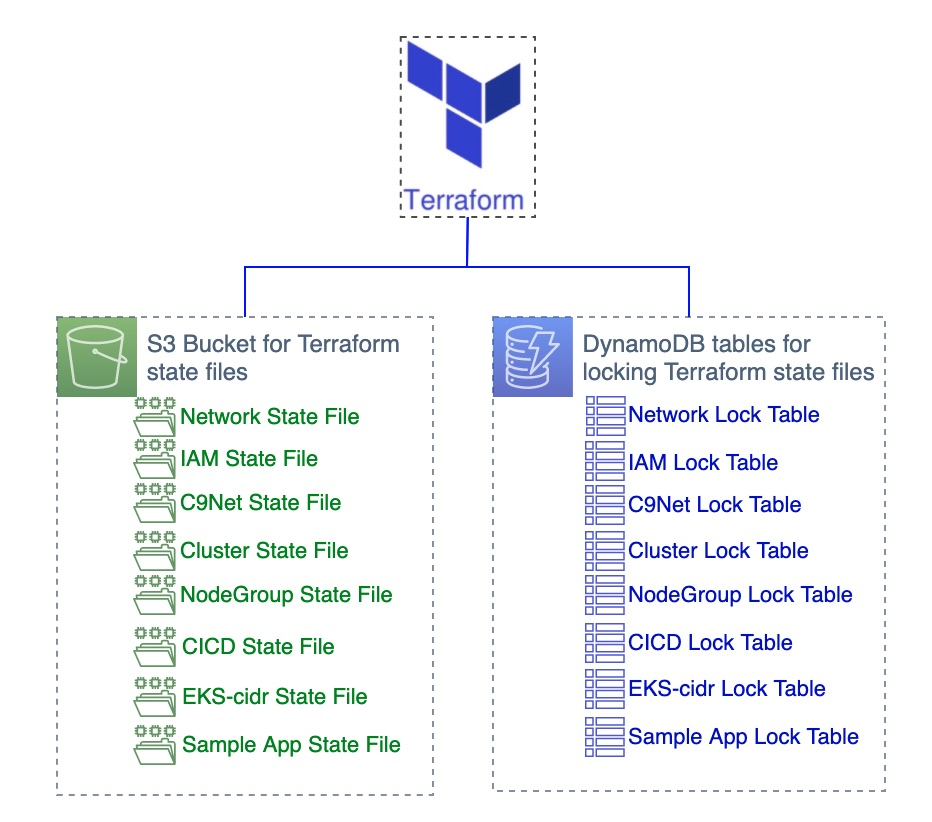
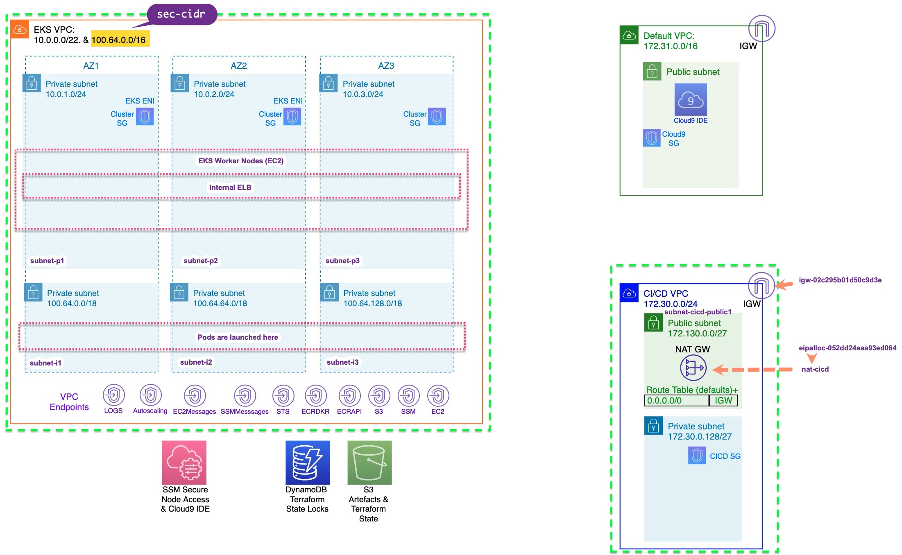

<h1>5. Creating a private EKS Cluster with Terraform</h1>

# 1. Initializing the Terraform state bucket and DynamoDB lock tables

Files are in `/Volumes/Lexar/git-repos/aws-repo/my-aws-workshops/terraform/2-eks-terraform-workshop/course-code/tf-setup`



```bash
cd ~/environment/tfekscode/tf-setup

# The command will create a hidden directory in your file system called ".terraform" and it will download all
# the resource providers that are needed, for our environment this includes the aws, external and null providers
terraform init

terraform validate

terraform plan -out tfplan

terraform apply tfplan
```

# 2. Setting up the VPC, Subnets, Security Groups and VPC Endpoints

We build EKS VPC and CI/CD VPC. Files are in `/Volumes/Lexar/git-repos/aws-repo/my-aws-workshops/terraform/2-eks-terraform-workshop/course-code/net`



Following created

* A VPC (**vpc-cluster.tf**): Creates **cluster** VPC with CIDR range "**10.0.0.0/22**". Range of 1022 IPs **10.0.0.0 - 10.0.3.255**. See https://www.calculator.net/ip-subnet-calculator.html
* A secondary VPC CIDR block (**aws_vpc_ipv4_cidr_block_association__vpc-cidr-assoc.tf**): Creates secondary CIDR (**100.64.0.0/16**) ie **65,536** usable IPs and associates with **cluster** VPC for pods consumption
* Various VPE Endpoints (**vpce.tf**): Creates
  - aws_vpc_endpoint.vpce-autoscaling
  - aws_vpc_endpoint.vpce-ec2
  - aws_vpc_endpoint.vpce-vpce-ec2messages
  - aws_vpc_endpoint.vpce-ecr-api
  - aws_vpc_endpoint.vpce-ecr-dkr
  - aws_vpc_endpoint.vpce-ec2
  - aws_vpc_endpoint.vpce-logs
  - aws_vpc_endpoint.vpce-s3
  - aws_vpc_endpoint.vpce-ssm
  - aws_vpc_endpoint.vpce-ssm-messages
  - aws_vpc_endpoint.vpce-sts
  - aws_vpc_endpoint.vpce-eks
  - aws_vpc_endpoint.vpce-grafana
* Subnets (**subnets-eks.tf**): creates
  - subnet-p1, subnet-p2, subnet-p3 & subnet-i1,subnet-i2, subnet-i3
* Route Tables (**aws_route_table__rtb-*.tf**).
* Route Table Associations (**aws_route_table_association__rtbassoc.tf***): associates RT to Subnets
    - rtbassoc-i1
    - rtbassoc-i2
    - rtbassoc-i3
    - rtbassoc-p1
    - rtbassoc-p2
    - rtbassoc-p3
* Security Groups:
    - **aws_security_group__allnodes-sg.tf:** For communication between all nodes in the cluster. No ingress or egress rules are defined. Therefore, by default, it denies all inbound and outbound traffic.
    - **aws_security_group__cluster-sg.tf**: For communication between the control plane and worker nodegroups. No ingress or egress rules are defined. Therefore, by default, it denies all inbound and outbound traffic.

* NAT Gateway (**aws_nat_gateway__eks-cicd.tf**).

There are also Terraform files to setup the VPC and subnets used by CodeBuild part of the CICD pipeline

* The VPC (**aws_vpc__eks-cicd.tf**) and it's associated:
- Subnets (**aws_subnet__eks-cicd.tf***).
- Security groups (**aws_security_group__sg-eks-cicd.tf**).
- Route tables (**aws_route_table__private1.tf** & **aws_route_table__public1.tf**).
- Route Table Associations (**aws_route_table_association__private1.tf** & **aws_route_table_association__public1.tf**).
- Internet Gateway (**aws_internet_gateway__eks-cicd.tf**).
- A NAT Gateway (**aws_eip__eipalloc-cicd-natgw.tf**).

```bash
cd ~/environment/tfekscode/net

terraform init


terraform validate

terraform plan -out tfplan
terraform show -no-color tfplan > tfplan.txt

terraform apply tfplan
```

# 3. Using Terraform to create the IAM Roles and Policies for EKS

Files are in `/Volumes/Lexar/git-repos/aws-repo/my-aws-workshops/terraform/2-eks-terraform-workshop/course-code/iam`

Following files used:

* A Cluster Service Role (**aws_iam_role__cluster-ServiceRole.tf**)
* A Node Group Service Role (**aws_iam_role__nodegroup-NodeInstanceRole.tf**)
* Various policy definitions that EKS needs eg: (**aws_iam_role_policy__nodegroup-NodeInstanceRole-PolicyAutoScaling.tf**)
* Policy attachments to the cluster and node group roles eg: (**aws_iam_role_policy_attachment__cluster-ServiceRole-AmazonEKSClusterPolicy.tf**)

```bash
cd ~/environment/tfekscode/iam

terraform init -upgrade
terraform validate

terraform plan -out tfplan
terraform show -no-color tfplan > tfplan.txt
```

1. aws_iam_role__nodegroup-NodeInstanceRole.tf: `ec2.amazonaws.com` can assumeRole `eks-nodegroup-ng-ma-NodeInstanceRole`

# 5. [TODO] Linking the Cloud9 IDE & CI/CD VPC to the EKS Network

```bash
cd ~/environment/tfekscode/c9net

terraform init -upgrade
terraform validate

terraform plan -out tfplan
terraform show -no-color tfplan > tfplan.txt
```

[TODO] Document all Terraform files - https://catalog.us-east-1.prod.workshops.aws/workshops/afee4679-89af-408b-8108-44f5b1065cc7/en-US/500-eks-terraform-workshop/550-c9net/tf-files

1. backend-c9net.tf: specifies the location of the backend Terraform state file on S3 and the dynamoDB table used for the state file locking. Also the Terraform version requirements.

# 6. [TODO] Deploy the CICD Infrastructure

Following resources created:

* A CodeCommit repository
* A CodeBuild service for running build and deploy operations
* A CodePipeline implementation to orchestrate the triggering of the CodeBuild
* A pull through cache for public.ecr.aws
* Policies and Roles for CodePipeline and CodeBuild
* A git user for the CodeCommit repo

```bash
cd ~/environment/tfekscode/cicd

terraform init

terraform validate
terraform plan -out tfplan
terraform show -no-color tfplan > tfplan.txt

terraform apply tfplan
```

Files

1. data-cicdvpc.tf:
