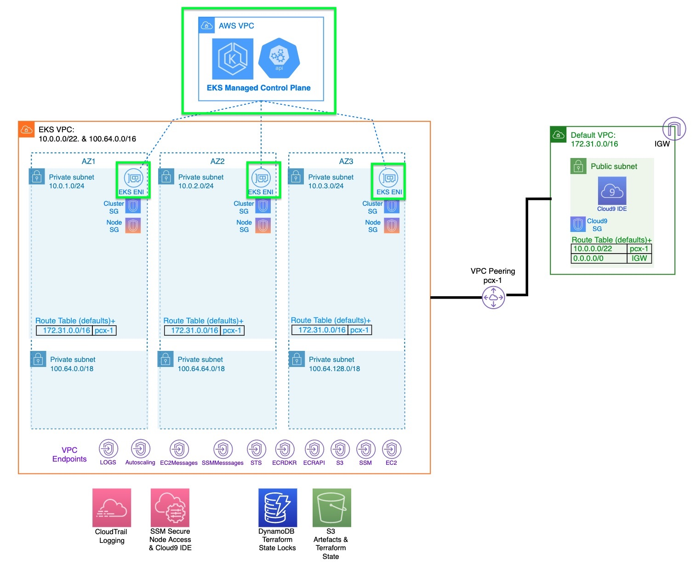

<h1>5.7-EKS control Plane creation</h1>



```bash
cd ~/environment/tfekscode/cluster

terraform init
terraform validate

terraform plan -out tfplan
terraform show -no-color tfplan > tfplan.txt
terraform apply tfplan
```

# Files

1. auth.sh
2. aws_eks-addons.tf
3. aws_eks_cluster__cluster.tf
4. aws_eks_idp.tf
5. backend-cluster.tf
6. cluster-sg-rule.tf
7. cni.json
8. data-aws.tf
9. data-kms.tf
10. data-params-iam.tf
11. data-params-net.tf
12. data-params-setup.tf
13. null_resource.tf
14. ssm-params-cluster.tf
15. test.sh
16. vars-main.tf

1. aws_iam_openid_connect_provider.tf.sav