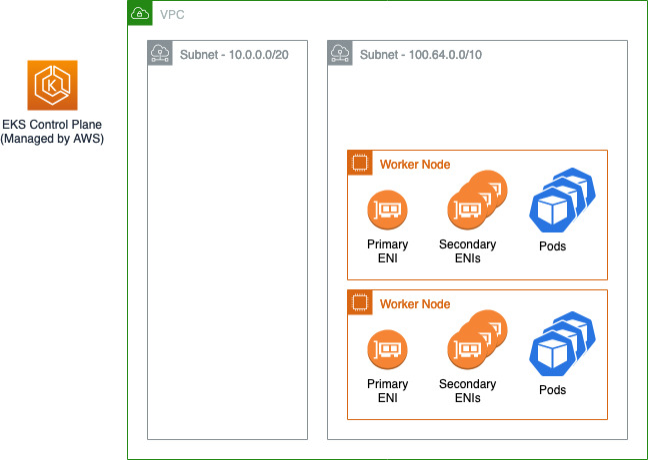

This guide demos the following architecture



# Step 1: Create VPC

```javascript {.line-numbers}
export CLUSTER_NAME=eks-cluster
export KEY_NAME=2023iamadmin
```

```bash
aws cloudformation create-stack --stack-name $CLUSTER_NAME-vpc \
      --template-body file://eks-vpc.yaml \
      --parameters \
ParameterKey=EnvironmentName,ParameterValue=$CLUSTER_NAME
```

# Step 2: create the Amazon EKS control plane using CFN

```javascript {.line-numbers}
export VPC_ID=$(aws cloudformation describe-stacks --stack-name $CLUSTER_NAME-vpc --query 'Stacks[0].Outputs[?OutputKey==`VPC`].OutputValue' --output text)

export SUBNETS_IDS=$(aws cloudformation describe-stacks --stack-name $CLUSTER_NAME-vpc --query 'Stacks[0].Outputs[?OutputKey==`PrivateSubnets`].OutputValue' --output text)

aws cloudformation create-stack --stack-name $CLUSTER_NAME-control-plane \
    --template-body file://eks-control-plane.yaml \
    --capabilities CAPABILITY_NAMED_IAM \
    --parameters \
    ParameterKey=Name,ParameterValue=$CLUSTER_NAME \
    ParameterKey=Vpc,ParameterValue=$VPC_ID \
'ParameterKey=Subnets,ParameterValue="'"$SUBNETS_IDS"'"'
```

# Step 3: create the kubeconfig file for your cluster

```javascript {.line-numbers}
aws eks update-kubeconfig --name $CLUSTER_NAME
```

# Step 4: create the data plane

```javascript {.line-numbers}
export CLUSTER_SG=$(aws eks describe-cluster --name $CLUSTER_NAME --query 'cluster.resourcesVpcConfig.clusterSecurityGroupId')

export ADDITIONAL_SG=$(aws eks describe-cluster --name $CLUSTER_NAME --query 'cluster.resourcesVpcConfig.securityGroupIds[0]')

aws cloudformation create-stack --stack-name $CLUSTER_NAME-data-plane \
  --template-body file://eks-data-plane.yaml \
  --capabilities CAPABILITY_NAMED_IAM \
  --parameters \
  ParameterKey=ClusterControlPlaneSecurityGroup,ParameterValue=$CLUSTER_SG \
  ParameterKey=ClusterName,ParameterValue=$CLUSTER_NAME \
  ParameterKey=NodeGroupName,ParameterValue=$CLUSTER_NAME-nodegroup \
  ParameterKey=KeyName,ParameterValue=$KEY_NAME \
  ParameterKey=VpcId,ParameterValue=$VPC_ID \
  'ParameterKey=Subnets,ParameterValue="'"$SUBNETS_IDS"'"' \
  ParameterKey=ProvidedSecurityGroup,ParameterValue=$ADDITIONAL_SG
```

- Ensure all Nodes are up

```javascript {.line-numbers}
kubectl get nodes --watch
```

# Step 5: deploy a demo application

```javascript {.line-numbers}
kubectl create -f deployment.yaml
kubectl get Pods --all-namespaces
kubectl get service -o wide
```

# Step 6: attach a new 100.64.0.0/16 CIDR block to the VPC

```javascript {.line-numbers}
export NGW1=$(aws cloudformation describe-stacks --stack-name $CLUSTER_NAME-vpc --query 'Stacks[0].Outputs[?OutputKey==`NatGateway1`].OutputValue' --output text)

export NGW2=$(aws cloudformation describe-stacks --stack-name $CLUSTER_NAME-vpc --query 'Stacks[0].Outputs[?OutputKey==`NatGateway2`].OutputValue' --output text) export NGW3=$(aws cloudformation describe-stacks --stack-name $CLUSTER_NAME-vpc --query 'Stacks[0].Outputs[?OutputKey==`NatGateway3`].OutputValue' --output text)

aws cloudformation create-stack --stack-name $CLUSTER_NAME-vpc-secondary \
  --template-body file://eks-vpc-secondary.yaml \
  --parameters \ ParameterKey=EnvironmentName,ParameterValue=$CLUSTER_NAME \
  ParameterKey=VpcId,ParameterValue=$VPC_ID \
  ParameterKey=NatGateway1,ParameterValue=$NGW1 \
  ParameterKey=NatGateway2,ParameterValue=$NGW2 \
  ParameterKey=NatGateway3,ParameterValue=$NGW3
```

# Step 7: Deploy the second set of managed worker nodes on the new subnets (100.64.[0,16,32].0/20 series)

```javascript {.line-numbers}
export SECONDARY_SUBNETS_IDS=$(aws cloudformation describe-stacks --stack-name $CLUSTER_NAME-vpc-secondary --query 'Stacks[0].Outputs[?OutputKey==`PrivateSubnets`].OutputValue' --output text)

aws cloudformation create-stack --stack-name $CLUSTER_NAME-data-plane-secondary \
    --template-body file://eks-data-plane.yaml \
    --capabilities CAPABILITY_NAMED_IAM \
    --parameters \
    ParameterKey=ClusterControlPlaneSecurityGroup,ParameterValue=$CLUSTER_SG \
    ParameterKey=ClusterName,ParameterValue=$CLUSTER_NAME \
    ParameterKey=NodeGroupName,ParameterValue=$CLUSTER_NAME-nodegroup-secondary \
    ParameterKey=KeyName,ParameterValue=$KEY_NAME \
    ParameterKey=VpcId,ParameterValue=$VPC_ID \
    'ParameterKey=Subnets,ParameterValue="'"$SECONDARY_SUBNETS_IDS"'"' \
    ParameterKey=ProvidedSecurityGroup,ParameterValue=$ADDITIONAL_SG
```

- wait for the nodes to come up

```javascript {.line-numbers}
kubectl get nodes --watch
```

# Step 8: Shift pods from worker nodes on subnets using 10.0.0.0/16 CIDR block to worker nodes on 100.64.0.0/16 CIDR block

1. Cordon all the nodes running on 10.0.0.0/16 CIDR block

This command stops scheduling any new pods to these worker nodes

```javascript {.line-numbers}
kubectl get nodes --no-headers=true | awk '/ip-10-0/{print $1}' | xargs kubectl cordon
```

2. drain all the nodes running on 10.0.0.0/16 CIDR block

```javascript {.line-numbers}
# ignore-daemonset: drain nodes with daemonsets
# delete-local-data: delete any pods that utilize an emptyDir volume
kubectl get nodes --no-headers=true | awk '/ip-10-0/{print $1}' | xargs kubectl drain --force --ignore-daemonsets --delete-local-data
```

3. endpoint is now running on 100.64.0.0/16 CIDR block; Get the endpoint address

```javascript {.line-numbers}
kubectl get service -o wide
```