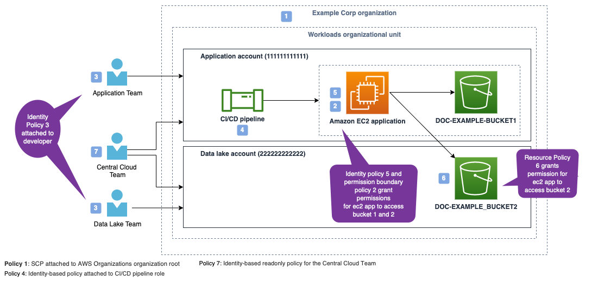
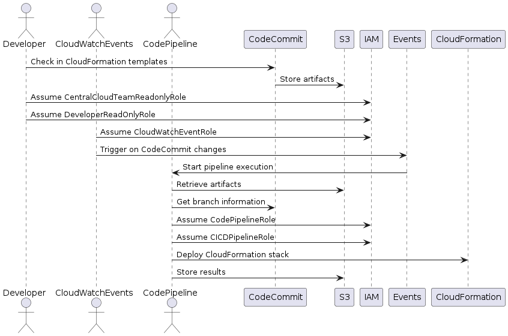

<h1>[IAM policy types: How and when to use them by Matt Luttrell and Josh Joy ](https://aws.amazon.com/blogs/security/iam-policy-types-how-and-when-to-use-them/)</h1>



# 1. Securiy Control Policy (SCP)

The primary function of SCPs is to enforce **security invariants** across AWS accounts and OUs in an organization

Examples: you can use an SCP to prevent member accounts from leaving your organization or to enforce that AWS resources can only be deployed to certain Regions.

# 2. Permissions boundaries

you set the maximum permissions that an identity-based policy can grant to an IAM principal. When you set a permissions boundary for a principal, the principal can perform only the actions that are allowed by both its identity-based policies and its permissions boundaries

When used: A permissions boundary is typically used to delegate the creation of IAM principals. Delegation enables other individuals in your accounts to create new IAM principals, but limits the permissions that can be granted to the new IAM principals.

# 3. Identity-based policies

Identity-based policies are policy documents that you attach to a principal (roles, users, and groups of users) to control what actions a principal can perform, on which resources, and under what conditions

Different types of Identity-based policies
- **AWS managed policies**: can use it as a starting point for building your own identity-based policies that are specific to your organization
- **customer managed policies**: Customer managed policies are reusable identity-based policies that can be attached to multiple identities
- **inline policies**: They are attached to a **single** principal. Use inline-policies when you want to create least-privilege permissions that are specific to a particular principal.

# 4. Resource-based policies

1. These are attached to resources like S3.
2. These policies grant the specified principal permission to perform specific actions on that resource and define under what conditions this permission applies.
3. **Resource-based policies** are **inline policies**.
4. You typically don't use Resource based policy for workloads that DONT span across accounts. For those workloads you use Identity-based policies
5. Exceptions to above Rule - For **KMS** and **IAM role trust policies** - both of these resources must have a resource-based policy even when the principal and the KMS key or IAM role are in the same account

## 4.1. Common use-cases

1. [Granting cross-account access to your AWS resource](https://docs.aws.amazon.com/IAM/latest/UserGuide/reference_policies_evaluation-logic-cross-account.html)
2. Granting an AWS service access to your resource when the AWS service uses an AWS service principal. For example, when using AWS CloudTrail, you must [explicitly grant the CloudTrail service principal access to write files to an Amazon S3 bucket](https://docs.aws.amazon.com/awscloudtrail/latest/userguide/create-s3-bucket-policy-for-cloudtrail.html).
3. [Applying broad access guardrails to your AWS resources](https://aws.amazon.com/blogs/security/iam-makes-it-easier-to-manage-permissions-for-aws-services-accessing-resources/)
4. An explicit deny in an IAM policy always overrides an allow - Applying an additional layer of protection for resources that store sensitive data, such as **AWS Secrets Manager secrets** or an **S3 bucket with sensitive data**. You can use a resource-based policy to deny access to IAM principals that shouldn’t have access to sensitive data, even if granted access by an identity-based policy.

# 5. Demo

## 5.1. Central Cloud Team (CCT): SCP Policy applied by Central Cloud Team

1. All AWS API calls must be encrypted in transit.
2. Accounts can’t leave the organization on their own.

The Central Cloud Team chooses to implement these **security invariants** using SCPs and applies the SCPs to the root of the organization

**Policy 1:** Attach following **SCP policy** to **AWS Organizations organization root**

```json
{
    "Id": "ServiceControlPolicy",
    "Version": "2012-10-17",
    "Statement": [
    {  // All AWS API calls must be encrypted in transit
        "Sid": "DenyIfRequestIsNotUsingSSL",
        "Effect": "Deny",
        "Action": "*",
        "Resource": "*",
        "Condition": {
            "BoolIfExists": {
                "aws:SecureTransport": "false"
            }
        }
    },
    {  // Accounts can’t leave the organization on their own
        "Sid": "PreventLeavingTheOrganization",
        "Effect": "Deny",
        "Action": "organizations:LeaveOrganization",
        "Resource": "*"
    }]
}
```

## 5.2. Central Cloud Team (CCT) : Permissions boundary policies defined by Central Team

1. When are these useful?
The Central Cloud Team wants to make sure that they don’t become a bottleneck for the Application Team. They want to allow the Application Team to deploy their own IAM principals and policies for their applications. The Central Cloud Team also wants to make sure that any principals created by the Application Team can only use AWS APIs that the Central Cloud Team has approved.

2. What can a Central team control thru's the permissions boundary?

- It can limit only certain actions to be performed by the applications team on S3 or SQS
- For example, they can read and write data (for example, writing an object to an S3 bucket or reading a message from an SQS queue) and but cannot modify infrastructure (for example, creating an S3 bucket or deleting an SQS queue)

## 5.3. Application Team (AT)

1. They will deploy their code using pipelines and not outside of pipeline.
1. The pipeline itself has broad access to create AWS resources needed to run applications, including permissions to create additional IAM roles.  However, its limited to what the permission boundaries allows them to do

**Policy 2:** An example of Permissions boundary policy attached to IAM roles created by the CI/CD pipeline

```json

    "Id": "PermissionsBoundaryPolicy",
    "Version": "2012-10-17",
    "Statement": [{
        "Effect": "Allow",
        "Action": [
            "s3:PutObject",
            "s3:GetObject",
            "sqs:ChangeMessageVisibility",
            "sqs:DeleteMessage",
            "sqs:ReceiveMessage",
            "sqs:SendMessage",
            "sqs:PurgeQueue",
            "sqs:GetQueueUrl",
            "logs:PutLogEvents"
         ],
        "Resource": "*"
    }]
}
```

## Roles created and managed by Central Cloud Team (CCT)

Following baseline roles are owned, managed, and deployed by the Central Cloud Team:

1. A role for the CI/CD pipeline to use to deploy application resources.
- The CI/CD pipeline is allowed to create new IAM roles for use with the application, but those roles are limited to only the actions allowed by the permissions boundary (see above)
- The roles, policies, and EC2 instance profiles that the pipeline creates should also be restricted to specific `role paths`
1. A read-only role for the Central Cloud Team, with a process for temporary elevated access: Central Cloud Team is given a default read-only role (`CentralCloudTeamReadonlyRole`) that has `AWS managed ReadOnlyAccess policy`. If they then need to perform an action not covered by this policy they will follow a `temporary elevated access process`
1. A read-only role (`DeveloperReadOnlyRole`) for members of the Application Team - for analysis and troubleshooting. Examples could be read-only access to Amazon EC2, Amazon S3, Amazon SQS, AWS CloudFormation, and Amazon CloudWatch

**Policy 3:** An example of **Identity-based policy** attached to a **developer read-only role - DeveloperReadOnlyRole** to support human access and troubleshooting

```json
{
    "Id": "DeveloperRoleBaselinePolicy",
    "Version": "2012-10-17",
    "Statement": [
        {
            "Effect": "Allow",
            "Action": [
                "cloudformation:Describe*",
                "cloudformation:Get*",
                "cloudformation:List*",
                "cloudwatch:Describe*",
                "cloudwatch:Get*",
                "cloudwatch:List*",
                "ec2:Describe*",
                "ec2:Get*",
                "ec2:List*",
                "ec2:Search*",
                "s3:Describe*",
                "s3:Get*",
                "s3:List*",
                "sqs:Get*",
                "sqs:List*",
                "logs:Describe*",
                "logs:FilterLogEvents",
                "logs:Get*",
                "logs:List*",
                "logs:StartQuery",
                "logs:StopQuery"
            ],
            "Resource": "*"
        }
    ]
}
```

**Policy 4:** An example **Identity policy** you attach to `CI/CD pipeline Role`

```json
{
    "Id": "CICDPipelineBaselinePolicy",
    "Version": "2012-10-17",
    "Statement": [
      {  // General Permissions Statement
        "Effect": "Allow",
        "Action": [   // Allows all actions (*) for services such as EC2, SQS, S3, CloudWatch, CloudFormation, Logs, and Auto Scaling
            "ec2:*",
            "sqs:*",
            "s3:*",
            "cloudwatch:*",
            "cloudformation:*",
            "logs:*",
            "autoscaling:*"
        ],
        "Resource": "*" // These permissions apply to all resources.
    },
    {   // SSM Parameter Store Permissions
        "Effect": "Allow",
        "Action": "ssm:GetParameter*", // Allows the retrieval of parameters (GetParameter*) from AWS Systems Manager (SSM) Parameter Store
        "Resource": "arn:aws:ssm:*::parameter/aws/service/*" // specific to parameters under aws/service/*
    },
    {  // IAM Role Management Permissions
        "Effect": "Allow",
        "Action": [  // Allows creation, policy attachment, and policy deletion for roles
            "iam:CreateRole",
            "iam:PutRolePolicy",
            "iam:DeleteRolePolicy"
        ],
        "Resource": "arn:aws:iam::111111111111:role/application-roles/*",
        "Condition": {
            "ArnEquals": { // Enforces a permissions boundary to be set to a specific policy (PermissionsBoundary)
                "iam:PermissionsBoundary": "arn:aws:iam::111111111111:policy/PermissionsBoundary"
            }
        }
    },
    {  // IAM Role Policy Attachment Permissions
        "Effect": "Allow",
        "Action": [  // Allows attaching and detaching policies to roles.
            "iam:AttachRolePolicy",
            "iam:DetachRolePolicy"
        ],
        "Resource": "arn:aws:iam::111111111111:role/application-roles/*", // Applies to roles under the `application-roles` path (see https://docs.aws.amazon.com/IAM/latest/UserGuide/reference_identifiers.html#identifiers-friendly-names)
        "Condition": { // permissions boundary condition and additional condition matching specific policy ARNs
            "ArnEquals": {
                "iam:PermissionsBoundary": "arn:aws:iam::111111111111:policy/PermissionsBoundary"
            },
            "ArnLike": {
                "iam:PolicyARN": "arn:aws:iam::111111111111:policy/application-role-policies/*"
            }
        }
    },
    {  // IAM Role Detailed Management Permissions
        "Effect": "Allow",
        "Action": [  // Allows deleting, tagging, untagging, and retrieving roles and role policies.
            "iam:DeleteRole",
            "iam:TagRole",
            "iam:UntagRole",
            "iam:GetRole",
            "iam:GetRolePolicy"
        ],
        "Resource": "arn:aws:iam::111111111111:role/application-roles/*" // Applies to roles under the application-roles path.
    },

    {  // IAM Policy Management Permissions
        "Effect": "Allow",
        "Action": [ // Full management of IAM policies including creation, deletion, versioning, and tagging.
            "iam:CreatePolicy",
            "iam:DeletePolicy",
            "iam:CreatePolicyVersion",
            "iam:DeletePolicyVersion",
            "iam:GetPolicy",
            "iam:TagPolicy",
            "iam:UntagPolicy",
            "iam:SetDefaultPolicyVersion",
            "iam:ListPolicyVersions"
         ],
        "Resource": "arn:aws:iam::111111111111:policy/application-role-policies/*" // Applies to policies under the application-role-policies path.
    },
    { // Instance Profile Management Permissions
        "Effect": "Allow",
        "Action": [ // Allows managing instance profiles and associating roles with them
            "iam:CreateInstanceProfile",
            "iam:AddRoleToInstanceProfile",
            "iam:RemoveRoleFromInstanceProfile",
            "iam:DeleteInstanceProfile"
        ],
        "Resource": "arn:aws:iam::111111111111:instance-profile/application-instance-profiles/*" // Applies to instance profiles under the application-instance-profiles path
    },
    { // Role Passing Permissions
        "Effect": "Allow",
        "Action": "iam:PassRole", // Allows passing roles to services.
        "Resource": [ // Applies to specified roles under application-roles and a specific Auto Scaling service role
            "arn:aws:iam::111111111111:role/application-roles/*",
            "arn:aws:iam::111111111111:role/aws-service-role/autoscaling.amazonaws.com/AWSServiceRoleForAutoScaling*"
        ]
    },
    {  // Service-Linked Role Creation
        "Effect": "Allow",
        "Action": "iam:CreateServiceLinkedRole", // Allows creating service-linked roles
        "Resource": "arn:aws:iam::111111111111:role/aws-service-role/*", // Applies to roles under `aws-service-role`
        "Condition": { // Only for the Auto Scaling service (autoscaling.amazonaws.com)
            "StringEquals": {
                "iam:AWSServiceName": "autoscaling.amazonaws.com"
            }
        }
    },
    { // Service-Linked Role Deletion
        "Effect": "Allow",
        "Action": [  // Allows deleting service-linked roles and checking deletion status.
            "iam:DeleteServiceLinkedRole",
            "iam:GetServiceLinkedRoleDeletionStatus"
        ],
        "Resource": "arn:aws:iam::111111111111:role/aws-service-role/autoscaling.amazonaws.com/AWSServiceRoleForAutoScaling*" // Specific to the Auto Scaling service role
    },
    {  // List Roles Permission
        "Effect": "Allow",
        "Action": "iam:ListRoles", // Allows listing all IAM roles.
        "Resource": "*" // All resources (*)
    },
    {  // Get Role Details Permission
        "Effect": "Allow",
        "Action": "iam:GetRole", // Allows retrieving details about specified roles.
        "Resource": [ // Specific to roles under application-roles and aws-service-role
            "arn:aws:iam::111111111111:role/application-roles/*",
            "arn:aws:iam::111111111111:role/aws-service-role/*"
        ]
    }]
}
```

# Application Team creates a new Role for accessing S3 bucket

1. This Role is created thru' the CI/CD pipeline
2. This is the role that the application running on the EC2 instance will use to get and put objects from the S3 buckets.
3. However, because the CI/CD pipeline can only create roles that have the permissions boundary policy attached, **Policy 5** cannot grant more access than the permissions boundary policy (**policy 2**) allows

**Policy 5:** `Identity-based policy` bound by permissions boundary and attached to the application’s EC2 instance

```json
{
  "Id": "ApplicationRolePolicy",
  "Version": "2012-10-17",
  "Statement": [
      {
        "Effect": "Allow",
        "Action": [
            "s3:PutObject",
            "s3:GetObject"
        ],
        "Resource": "arn:aws:s3:::DOC-EXAMPLE-BUCKET1/*"
      },
      {
        "Effect": "Allow",
        "Action": [
            "s3:GetObject"
        ],
        "Resource": "arn:aws:s3:::DOC-EXAMPLE-BUCKET2/*"
      }
    ]
}
```

This Role created by CI/CD pipeline will also have following permissions boundary policy (**Policy 2**) attached

```json
{
    "Id": "PermissionsBoundaryPolicy"
    "Version": "2012-10-17",
    "Statement": [{
        "Effect": "Allow",
        "Action": [
            "s3:PutObject",
            "s3:GetObject",
            "sqs:ChangeMessageVisibility",
            "sqs:DeleteMessage",
            "sqs:ReceiveMessage",
            "sqs:SendMessage",
            "sqs:PurgeQueue",
            "sqs:GetQueueUrl",
            "logs:PutLogEvents"
         ],
        "Resource": "*"
    }]
}
```

Because the permission boundary policy allows putting objects into S3 bucket, the identify policy will take effect

## Resource Based policy for the bucket

**Application Account (111111111111)** needs to access the S3 bucket in **Data lake account (222222222222)**

**Policy 6:** Resource-based policy attached to S3 bucket in external **data lake account (222222222222)**

This policy is **owned** by **Data lake account (222222222222)**

```json
{
    "Version": "2012-10-17",
    "Statement": [{
        "Principal": {
            "AWS": "arn:aws:iam::111111111111:role/application-roles/ApplicationRole"
        },
        "Effect": "Allow",
        "Action": [
            "s3:GetObject"
        ],
        "Resource": "arn:aws:s3:::DOC-EXAMPLE-BUCKET2/*"
    }]
}
```

**S3 Access within an Account**: Access can be granted by either an identity-based policy or a resource-based policy when access is within the same AWS account.

**S3 Access between accounts**: Both the identity-based policy and resource-based policy must grant access to an action on the S3 bucket for access to be allowed in a cross-account scenario.

# Demo workflow



1. Developer Actions:

    * Developer checks in CloudFormation templates into the CodeCommit repository.
    * Artifacts are stored in the S3 bucket.
    * Developer assumes the CentralCloudTeamReadonlyRole and DeveloperReadOnlyRole for read-only access.

2. CloudWatch Events:

    * CloudWatch Events assume the CloudWatchEventRole.
    * Trigger on specific changes in the CodeCommit repository.
    * Events trigger a pipeline execution in CodePipeline.

3. CodePipeline Actions:

    * Retrieves artifacts from the S3 bucket.
    * Gets branch information from CodeCommit.
    * Assumes the CodePipelineRole and CICDPipelineRole to perform necessary actions.
    * Deploys the CloudFormation stack.
    * Stores the deployment results back in the S3 bucket.